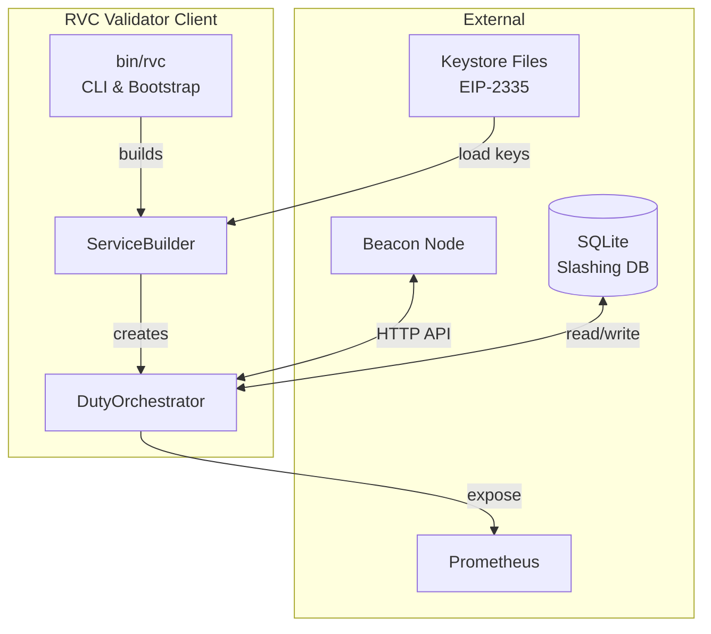
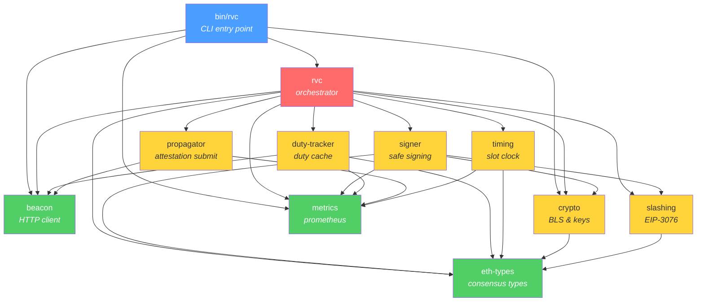
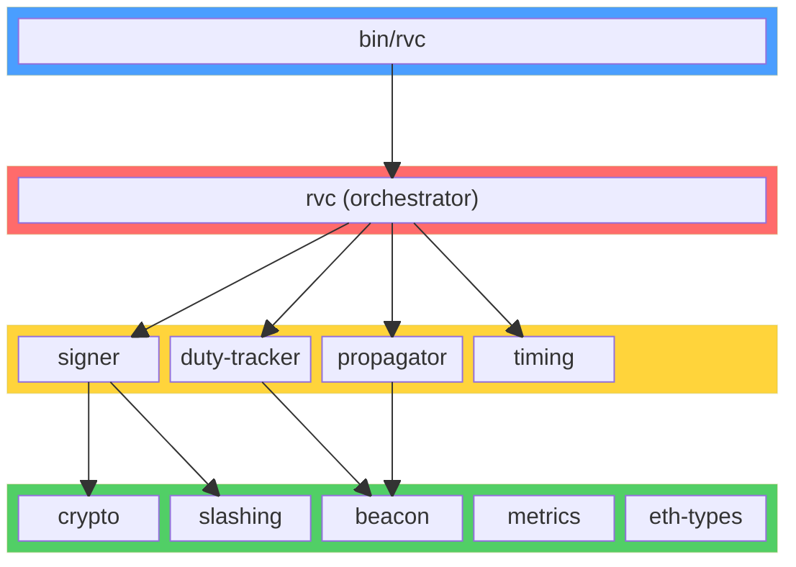
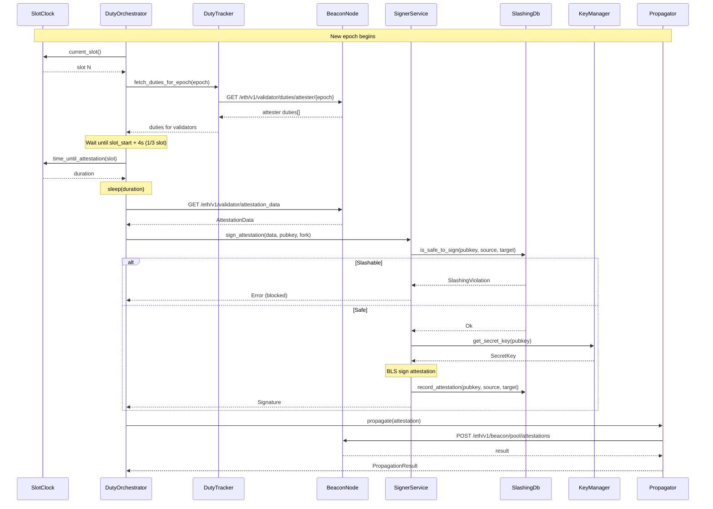
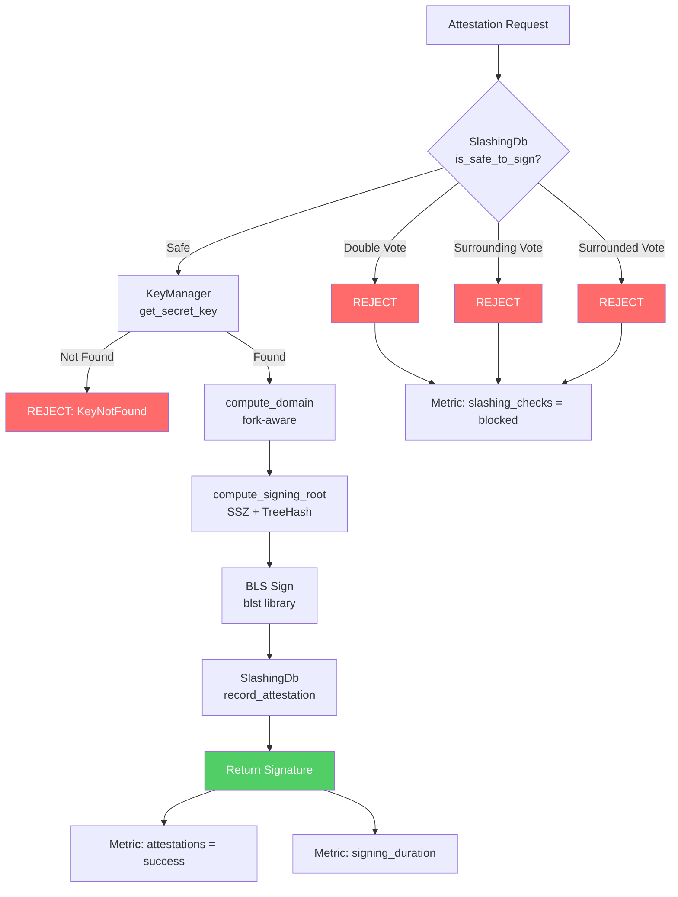
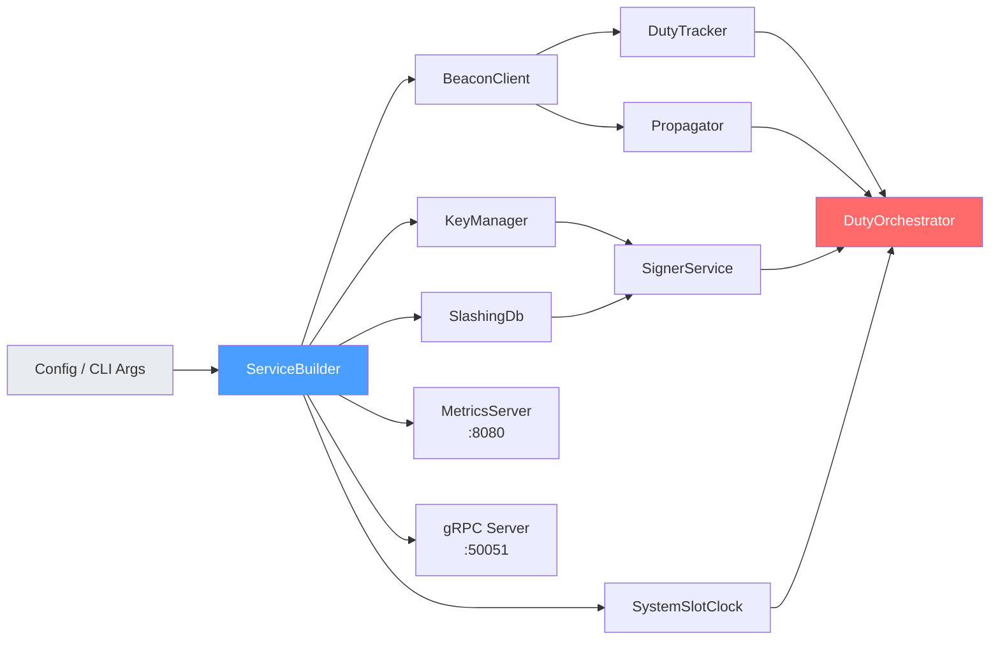

# Architecture

RVC is a Rust-based Ethereum Validator Client built as a modular workspace of 11 crates. It handles the core validator responsibilities: fetching duties from a beacon node, signing attestations with BLS keys, enforcing slashing protection, and propagating signed attestations back to the network.

## System Overview

## Crate Dependency Graph

**Layer colors:**
- **Blue** — Binary entry point
- **Red** — Core orchestrator (depends on all internal crates)
- **Yellow** — Mid-level crates (domain logic)
- **Green** — Leaf crates (no internal dependencies)

## Crate Layer Diagram

## Attestation Lifecycle

## Signing Flow Detail

## Service Construction

## Workspace Crates

### `bin/rvc` — CLI Entry Point

Binary crate. Parses CLI arguments (via `clap`), loads TOML configuration, initializes logging, builds all services via `ServiceBuilder`, and runs the `DutyOrchestrator`. Manages graceful shutdown on SIGTERM/SIGINT and exposes health status through the metrics server.

### `crates/rvc` — Core Orchestrator

Central coordination crate. Contains:

- **`DutyOrchestrator<C, S>`** — Main loop that fetches duties per epoch, waits for appropriate slot timing, signs attestations, and propagates them. Generic over `SlotClock` and `AttestationSubmitter` for testability.
- **`ServiceBuilder`** — Factory that constructs all services (BeaconClient, KeyManager, SlashingDb, SignerService, Propagator, DutyTracker, SlotClock) from a `Config`.
- **`Config`** / **`Network`** — Configuration types with network presets (Mainnet, Goerli, Sepolia, Holesky, Custom).
- **gRPC DutyTracker service** — Exposes a `Healthz` RPC via tonic.

### `crates/beacon` — Beacon Node HTTP Client

Async HTTP client for the Ethereum Beacon Node API. Provides methods for fetching attester duties, attestation data, validator info, and submitting attestations. Includes configurable retry logic with exponential backoff.

Key type: `BeaconClient` with `BeaconClientConfig` (timeout, max retries, backoff).

### `crates/eth-types` — Ethereum Consensus Types

Pure data types with SSZ encoding/decoding and tree hashing. Defines `Slot`, `Epoch`, `Root`, `Domain`, `AttestationData`, `Checkpoint`, `Fork`, `ForkData`, `SigningData`, and consensus constants (`SLOTS_PER_EPOCH = 32`, `SECONDS_PER_SLOT = 12`).

No business logic. No internal dependencies.

### `crates/crypto` — BLS Cryptography & Key Management

Wraps the `blst` library for BLS12-381 operations:

- **`SecretKey`** / **`PublicKey`** / **`Signature`** — BLS types with `Zeroize` on drop for secure key handling.
- **`sign_attestation()`** — Computes signing domain (fork-aware), signing root, and BLS signature.
- **`KeyManager`** — Loads EIP-2335 keystores from a directory, stores keys in a `HashMap<[u8; 48], SecretKey>` keyed by public key bytes.
- **`Keystore`** — EIP-2335 keystore decryption (PBKDF2 / scrypt + AES-128-CTR).
- **`DecryptionAttemptTracker`** — Rate-limits decryption attempts to prevent brute force.

Exposes a `test-utils` feature for cross-crate test helpers.

### `crates/slashing` — Slashing Protection (EIP-3076)

SQLite-backed slashing protection database. Enforces three rules before allowing attestation signing:

1. **Double vote** — Cannot sign two attestations with the same target epoch.
2. **Surrounding vote** — Cannot sign an attestation that surrounds a previous one.
3. **Surrounded vote** — Cannot sign an attestation surrounded by a previous one.

Key type: `SlashingDb` with `is_safe_to_sign()` and `record_attestation()`.

### `crates/signer` — Attestation Signing with Slashing Protection

Combines `crypto` and `slashing` into a safe signing workflow:

1. Check `SlashingDb::is_safe_to_sign()` — reject if slashable.
2. Retrieve secret key from `KeyManager`.
3. Sign attestation via `crypto::sign_attestation()`.
4. Record attestation in slashing DB.
5. Update metrics (signing duration, attestation count, slashing check results).

Key type: `SignerService`.

### `crates/timing` — Slot Clock & Attestation Timing

Slot timing abstraction:

- **`SlotClock` trait** — `current_slot()`, `time_until_slot()`, `time_until_attestation()`, epoch/slot conversions.
- **`SystemSlotClock`** — Production implementation using system time relative to genesis.
- **`MockSlotClock`** — Test implementation with configurable time.
- **`AttestationTimer`** — Waits until 1/3 into a slot (4 seconds) before triggering attestation.

### `crates/duty-tracker` — Validator Duty Caching

Fetches and caches attester duties from the beacon node. Caches per-epoch with dependent root tracking — invalidates cache if the dependent root changes (chain reorganization). Provides lookup by (epoch, slot, committee_index).

Key type: `DutyTracker`.

### `crates/propagator` — Attestation Propagation

Submits signed attestations to the beacon node's attestation pool. Uses an `AttestationSubmitter` trait for dependency injection (`BeaconClient` implements it). Supports single and batch propagation with detailed failure reporting.

Key type: `Propagator<S: AttestationSubmitter>`.

### `crates/metrics` — Prometheus Metrics & Health

Global Prometheus metrics registry with convenience macros (`register_counter!`, `register_gauge!`, `register_histogram!`). Runs an Axum HTTP server exposing `/metrics` and `/healthz` endpoints.

Defined metrics cover attestation outcomes, duty fetching, signing duration, slashing protection checks, orchestrator slot processing, and cache operations.

## Key Design Patterns

- **Orchestrator pattern** — `DutyOrchestrator` coordinates the full attestation lifecycle in a single loop.
- **Dependency injection via traits** — `SlotClock`, `AttestationSubmitter` allow swapping implementations for testing.
- **Arc-wrapped services** — All services are `Arc`-wrapped for cheap cloning across async tasks.
- **Secure key handling** — `Zeroize` on drop, `SecretString` for passwords, directory traversal protection, rate-limited decryption.
- **Lazy-static global metrics** — Single `REGISTRY` with static metric instances registered once at startup.
- **Graceful shutdown** — `tokio::watch` channel signals the orchestrator to complete the current slot before exiting.

## Consensus Protocol Parameters

| Parameter | Value |
|---|---|
| Slot duration | 12 seconds |
| Slots per epoch | 32 |
| Epoch duration | 6.4 minutes |
| Attestation timing | slot_start + slot_duration / 3 (4s) |
| BLS scheme | BLS12-381, min-pk variant |
| Signing domain | `DOMAIN_BEACON_ATTESTER = [0x01, 0x00, 0x00, 0x00]` |
| Slashing protection | EIP-3076 |
| Keystore format | EIP-2335 |

## Configuration & Deployment

The validator client is configured via a TOML file or CLI flags:

- Beacon node URL
- Keystore directory path and password file
- Slashing DB path
- Metrics port (default 8080) with `/metrics` and `/healthz`
- gRPC port (default 50051) with `Healthz` RPC
- Network preset or custom genesis parameters
