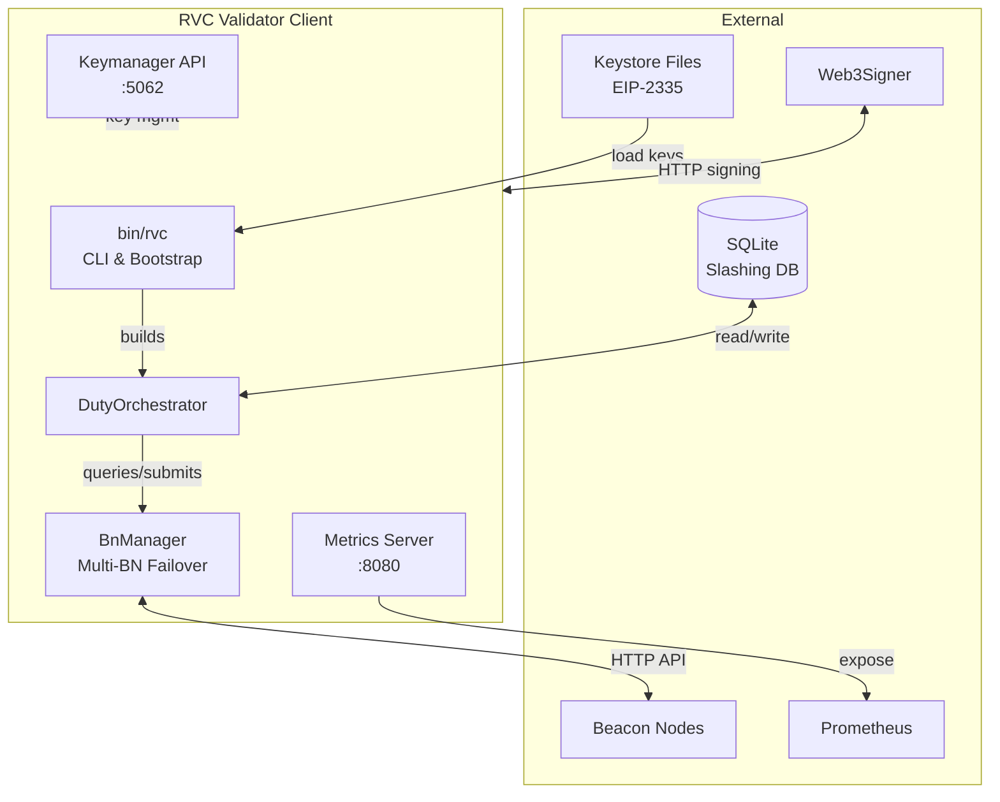
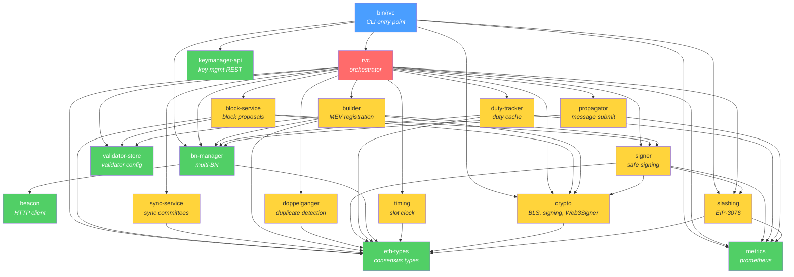
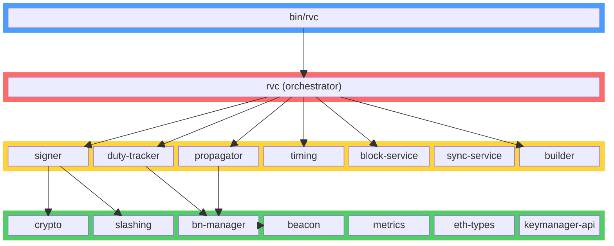
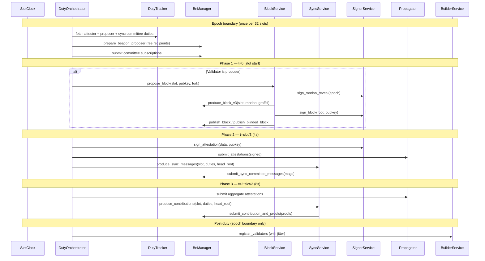
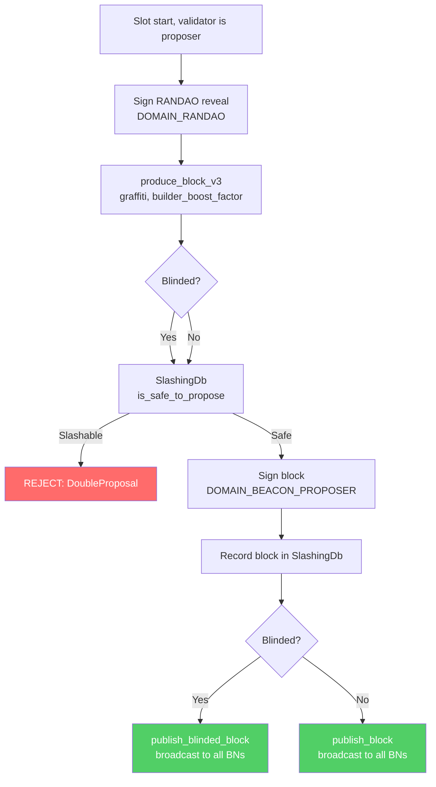
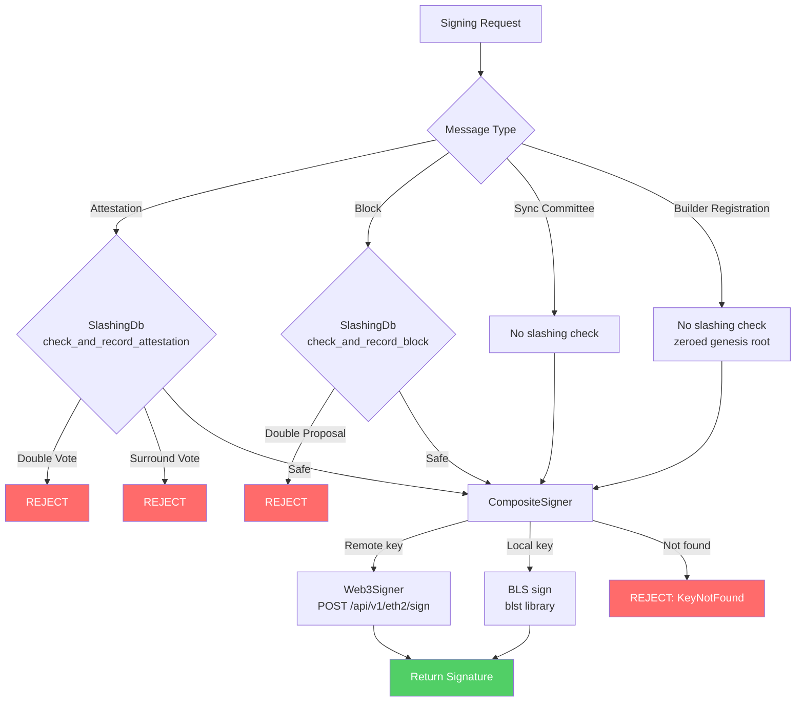
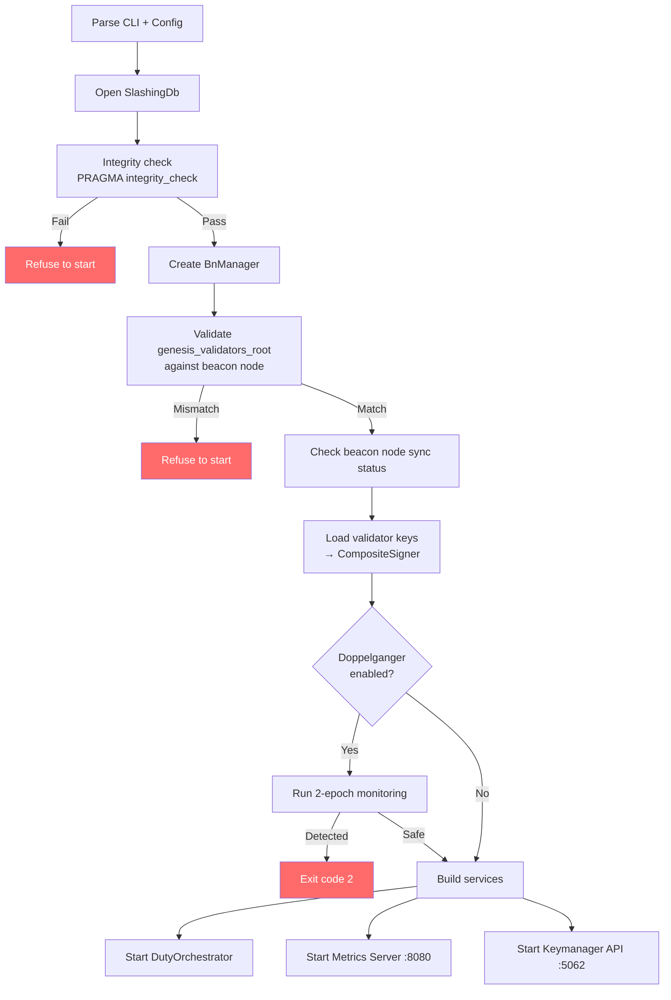
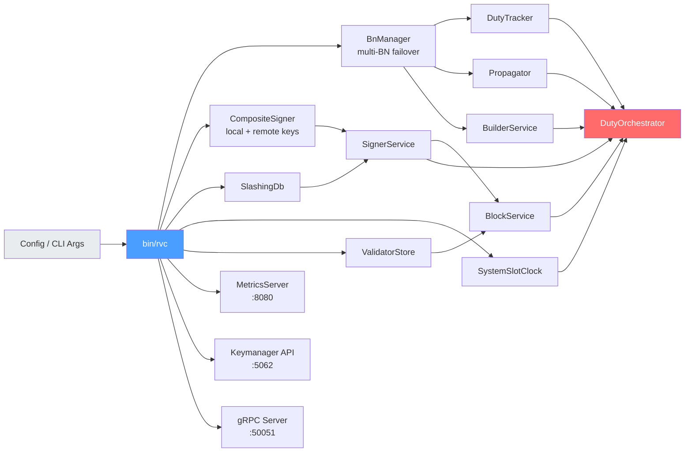

# Architecture

RVC is a Rust-based Ethereum Validator Client built as a modular workspace of 18 crates. It handles the full validator lifecycle: block proposals, attestations, sync committee participation, aggregation duties, slashing protection, multi-BN failover, doppelganger detection, MEV/builder integration, and runtime key management via the Keymanager API.

## System Overview

## Crate Dependency Graph

**Layer colors:**
- **Blue** — Binary entry point
- **Red** — Core orchestrator (depends on all internal crates)
- **Yellow** — Domain crates (duty-specific logic)
- **Green** — Foundation crates (infrastructure, no domain logic)

## Crate Layer Diagram

## Slot Processing — 3-Phase Architecture

## Block Proposal Lifecycle

## Signing Flow

## Startup Sequence

## Service Construction

## Workspace Crates

### `bin/rvc` — CLI Entry Point

Binary crate. Parses CLI arguments (via `clap`), loads TOML configuration, initializes logging, runs the startup sequence (slashing integrity → genesis validation → BN sync check → doppelganger detection), builds all services, and runs the `DutyOrchestrator`. Manages graceful shutdown on SIGTERM/SIGINT. Optionally starts the Keymanager API server and configures remote signing.

### `crates/rvc` — Core Orchestrator

Central coordination crate. Contains:

- **`DutyOrchestrator<C, S, B>`** — Main loop with 3-phase slot processing: t=0 block proposals, t=slot/3 attestations + sync messages, t=2*slot/3 aggregations + contributions. Generic over `SlotClock`, `AttestationSubmitter`, and `BeaconBlockClient` for testability.
- **`Config`** / **`Network`** — Configuration types with network presets (Mainnet, Hoodi, Custom).
- **`OrchestratorConfig`** — Fork schedule, genesis root, shutdown timeout.
- **Adapter modules** — `beacon_adapter`, `doppelganger_adapter`, `keymanager_adapters` bridge domain traits to concrete services.
- **gRPC DutyTracker service** — Exposes a `Healthz` RPC via tonic.

### `crates/bn-manager` — Multi-BN Management

Manages connections to one or more Beacon Nodes with strategy-based selection, health scoring, failover, sync status monitoring, and SSE event subscription.

- **`BeaconNodeClient` trait** — Unified async interface for all BN operations. All domain crates depend on this trait, not on `BeaconClient` directly.
- **`BnManager`** — Wraps multiple `BeaconClient` instances. Selection strategies: `First` (lowest latency), `Best` (highest-value response for block production), `Broadcast` (submit to all BNs).
- **Health scoring** — EMA latency (α=0.3), sliding window error rate, composite score (0.4×latency + 0.6×error).
- **SSE events** — Head, ChainReorg, FinalizedCheckpoint, Block.
- **Sync checking** — Monitors `el_offline`, `is_optimistic`, `sync_distance`.

### `crates/block-service` — Block Proposals

Orchestrates the block proposal lifecycle: RANDAO reveal → block production → slashing check → signing → publication.

- **`BlockService<S, B>`** — Generic over `Signer` trait and `BeaconBlockClient`.
- **`BeaconBlockClient` trait** — `produce_block`, `publish_block`, `publish_blinded_block`.
- Handles both full and blinded (MEV) blocks via `Eth-Execution-Payload-Blinded` header.

### `crates/sync-service` — Sync Committees

Produces and submits sync committee messages (at t=slot/3) and contributions (at t=2*slot/3).

- **`SyncService<S, B>`** — Generic over `SyncSigner` and `SyncBeaconClient`.
- **Aggregator selection** — Computes selection proof, checks against `TARGET_AGGREGATORS_PER_SYNC_SUBCOMMITTEE`.
- **Constants** — `SYNC_COMMITTEE_SIZE = 512`, `SYNC_COMMITTEE_SUBNET_COUNT = 4`.

### `crates/builder` — MEV & Builder Integration

Builder registration management and proposer preparation.

- **`BuilderService`** — Batch-signs `ValidatorRegistrationV1` with `DOMAIN_APPLICATION_BUILDER` (zeroed genesis root), submits via `register_validator` endpoint.
- **`prepare_proposers`** — Sends fee recipients to BN at epoch start.
- **Jitter** — Random 0–30s delay before registration to spread load.
- Registration runs at epoch boundary AFTER all duty phases.

### `crates/doppelganger` — Doppelganger Detection

Detects duplicate validator instances before activating signing (Lodestar pattern).

- **`DoppelgangerService`** — 2-epoch monitoring via `post_validator_liveness` endpoint.
- **Restart-aware** — Validators with recent slashing DB entries skip detection.
- **`DoppelgangerStatus`** — `Safe`, `DetectionInProgress`, `DoppelgangerDetected`.

### `crates/beacon` — Beacon Node HTTP Client

Low-level async HTTP client for the Ethereum Beacon Node API. Provides methods for all standard endpoints: duties, block production, attestations, sync committees, voluntary exits, validator liveness. Includes configurable retry logic with exponential backoff.

Used internally by `bn-manager`; domain crates depend on `BeaconNodeClient` trait instead.

### `crates/eth-types` — Ethereum Consensus Types

Pure data types with SSZ encoding/decoding and tree hashing. Defines all consensus types: `Slot`, `Epoch`, `Root`, `ForkName`, `ForkSchedule`, `AttestationData`, `BeaconBlock`, `BlindedBeaconBlock`, `SyncCommitteeMessage`, `SyncCommitteeContribution`, `ValidatorRegistrationV1`, `VoluntaryExit`, and all domain constants.

Quoted-integer serde via `ethereum_serde_utils` for API compatibility. No business logic. No internal dependencies.

### `crates/crypto` — BLS Cryptography & Signing

Wraps the `blst` library for BLS12-381 operations:

- **`Signer` trait** — Async, object-safe (`dyn Signer`), `Send + Sync`. Abstracts local vs remote signing.
- **`LocalSigner`** — In-memory key manager wrapping `KeyManager`.
- **`RemoteSigner`** — Web3Signer HTTP client (`POST /api/v1/eth2/sign/{identifier}`).
- **`CompositeSigner`** — Routes: remote → dynamic local → base local. Supports runtime key add/remove.
- **`KeyManager`** — Loads EIP-2335 keystores, stores keys in `HashMap<pubkey_hex, SecretKey>`.
- **Signing functions** — `sign_attestation`, `sign_block`, `sign_randao_reveal`, `sign_sync_committee_message`, `sign_contribution_and_proof`, `sign_aggregate_and_proof`, `sign_selection_proof`, `sign_voluntary_exit`, `sign_builder_registration`.
- **`Zeroize` on drop**, `SecretString` for passwords, `DecryptionAttemptTracker` for brute-force protection.

### `crates/signer` — Safe Signing with Slashing Protection

Combines `crypto` and `slashing` into a safe signing workflow:

- **`SignerService`** — Implements `ValidatorSigner` trait. Every signing operation: slashing check → retrieve key → compute domain → sign → record in DB → update metrics.
- **`ValidatorSigner` trait** — Methods for all message types: attestations, blocks, sync committee, aggregation, RANDAO, voluntary exits, builder registrations.
- **Fail-closed** — Any slashing DB error refuses to sign.

### `crates/slashing` — Slashing Protection (EIP-3076)

SQLite-backed slashing protection for attestations and blocks:

- **Attestation rules** — Double vote, surrounding vote, surrounded vote.
- **Block rule** — Double proposal (same slot, different signing root).
- **`check_and_record_attestation`** / **`check_and_record_block`** — Atomic check-and-record.
- **Integrity checks** — `PRAGMA integrity_check` at startup, genesis root validation.
- **Pruning** — Watermark-based pruning for source epoch, target epoch, and block slot.
- **EIP-3076 interchange** — Import/export for keystore migration.
- **Conformance** — 76 EIP-3076 tests (38 complete + 38 minimal strategy).

### `crates/keymanager-api` — Keymanager REST API

HTTP server for runtime key management per the Ethereum Keymanager API standard:

- **Endpoints** — `GET/POST/DELETE /eth/v1/keystores`, `GET/POST/DELETE /eth/v1/remotekeys`.
- **Authentication** — Bearer token (256-bit CSPRNG, hex-encoded, `0o400` file permissions, constant-time comparison via `subtle`, `Zeroizing<String>`).
- **Traits** — `KeystoreManager`, `RemoteKeyManager`, `SlashingProtectionExporter`, `ValidatorManager`, `DoppelgangerMonitor`.
- **Key import** — Imports keystore → adds to `CompositeSigner` → imports slashing protection → triggers doppelganger detection.

### `crates/validator-store` — Per-Validator Configuration

Stores per-validator preferences: fee recipient, graffiti, builder settings.

- **`ValidatorStore`** — TOML-backed config with hot-reload (`reload_config` with parse-first/apply-second atomicity).
- **Queries** — `effective_fee_recipient`, `effective_graffiti`.

### `crates/duty-tracker` — Validator Duty Caching

Fetches and caches attester, proposer, and sync committee duties from the beacon node.

- **Attester duties** — Per-epoch cache with dependent root tracking.
- **Proposer duties** — Per-epoch cache, prefetched at epoch start.
- **Sync committee duties** — Per-sync-committee-period cache (~256 epochs).
- Depends on `BnManager` via `BeaconNodeClient` trait.

### `crates/propagator` — Message Propagation

Submits signed messages to beacon node(s). Uses `AttestationSubmitter` trait for dependency injection. Supports attestations and aggregate attestation proofs. Depends on `BnManager` for multi-BN broadcast.

### `crates/timing` — Slot Clock

Slot timing abstraction:

- **`SlotClock` trait** — `current_slot()`, `time_until_slot()`, `time_until_attestation()`, epoch/slot conversions.
- **`SystemSlotClock`** — Production implementation using system time relative to genesis.
- **`MockSlotClock`** — Test implementation with configurable time.

### `crates/metrics` — Prometheus Metrics & Health

Global Prometheus metrics registry. Runs an Axum HTTP server exposing `/metrics` and `/healthz` endpoints. Metrics cover slot processing, attestations, blocks, sync committees, aggregation, slashing protection, BN health, builder registrations, keymanager requests, and DB pruning.

## Key Design Patterns

- **3-phase slot processing** — t=0 blocks, t=slot/3 attestations + sync messages, t=2*slot/3 aggregations + contributions.
- **Trait-based injection** — `BeaconNodeClient`, `SlotClock`, `AttestationSubmitter`, `Signer`, `ValidatorSigner` allow swapping implementations for testing.
- **Composite pattern** — `CompositeSigner` routes local/dynamic/remote keys. `BnManager` routes across multiple BNs.
- **Adapter pattern** — 5 adapters in the orchestrator bridge keymanager-api traits to concrete services.
- **Arc-wrapped services** — All long-lived services are `Arc<T>` for cheap cloning across async tasks.
- **Fail-closed signing** — Any error in the slashing protection path refuses to sign.
- **Downward-only dependencies** — Binary → Orchestrator → Domain → Foundation. Never upward.
- **Graceful shutdown** — `tokio::watch` channel signals completion of current slot before exiting.

## Consensus Protocol Parameters

| Parameter | Value |
|---|---|
| Slot duration | 12 seconds |
| Slots per epoch | 32 |
| Epoch duration | 6.4 minutes |
| Block proposal timing | slot start (t=0) |
| Attestation timing | slot_start + slot_duration / 3 (4s) |
| Aggregation timing | slot_start + 2 * slot_duration / 3 (8s) |
| BLS scheme | BLS12-381, min-pk variant |
| Slashing protection | EIP-3076 (conservative) |
| Keystore format | EIP-2335 |
| Keymanager API | Standard Ethereum Keymanager API |
| Supported forks | Phase0, Altair, Bellatrix, Capella, Deneb, Electra |

## Configuration & Deployment

The validator client is configured via a TOML file or CLI flags:

- Beacon node endpoint(s) (multi-BN supported)
- Keystore directory path and password file
- Slashing DB path
- Fee recipient (default + per-validator overrides)
- Graffiti (default + per-validator overrides)
- Builder preferences (enabled, boost factor)
- Doppelganger detection (`--no-doppelganger` to disable)
- Keymanager API (`--keymanager-enabled`, address, token file)
- Remote signer URL (`--remote-signer-url`)
- Metrics port (default 8080) with `/metrics` and `/healthz`
- gRPC port (default 50051) with `Healthz` RPC
- Network preset or custom genesis parameters
