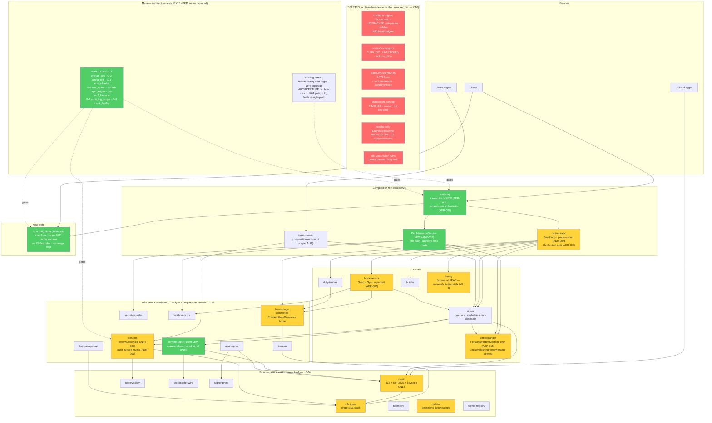

# Software Architecture: rs-vc Architecture Remediation

> Target architecture for the architecture-remediation initiative on the rs-vc Cargo workspace
> (29 members at HEAD, verified by counting `CLASSIFICATION` at
> `crates/architecture-tests/src/lib.rs:57-92`), baseline `develop` @ `0ae9a09` (v0.7.0),
> authored 2026-08-12.
>
> **Authoritative inputs, in precedence order:**
> [`docs/research/architecture-review-2026-08-11.md`](../../docs/research/architecture-review-2026-08-11.md)
> (the architecture review; source of the Target Architecture this document makes implementable) →
> [`prd.md`](./prd.md) (requirement IDs `ARCH-P0-*`/`ARCH-P1-*`/`ARCH-P2-*`, the constraint register
> C1–C10, assumptions A-1…A-15) → [`research/00-overview.md`](./research/00-overview.md) and the
> three track documents in [`research/`](./research/) → the repository's
> [`CLAUDE.md`](../../CLAUDE.md) (TDD cycle, KAT-first policy, `thiserror`/`anyhow`, no `.unwrap()`
> in production code — binding on every interface below).
>
> **Where research contradicts the review, research wins** — it verified against HEAD. Every such
> case is stated explicitly at the point of use and filed in *§10 Verification Deltas*, never
> silently smoothed. Four constraint mechanisms are **replaced** on that basis (C1's admissible
> design set, C3's gate mechanism, C5's assumed anchor, C6's latency model); no constraint is
> rejected.
>
> **This document is not a restatement of the review.** It adds: verification against HEAD with
> `file:line`, decomposition into 15 numbered ADRs, real Rust signatures for the four new seams
> (§5), eight implementable gate specifications (§6), and a per-anchor migration-safety argument
> (§7). Where the review's Target Architecture named a mechanism that does not work at HEAD, the
> corrected mechanism is carried forward here.
>
> **No-ask constraint:** every open question is resolved to a stated default in *§9 Assumptions*.
> Nothing is escalated.
>
> **Scope:** design only. This document changes no source file, deletes nothing, and executes none
> of the sequences it specifies — deleting the orphan trees in particular is downstream work.

---

## 1. Overview

rs-vc is a Rust Ethereum validator client plus a standalone remote BLS signer, structured as a
29-member Cargo workspace whose layering is **executably governed**: a CI-enforced DAG with
forbidden/required-edge tables, a byte-matched generated `ARCHITECTURE.md`, a KAT-first signing-root
policy, and a single unbypassable signing gate. The review's verdict — *"the architecture is
fundamentally sound and unusually well-governed; the problems are runtime-model defects, hygiene
debt, and change-amplifiers, not layering rot"* — is adopted here as a **premise**, and it sets the
burden of proof: no decision below re-cuts the crate DAG, moves the slashing-protection choke point,
or replaces the gate harness, because no verified defect justifies it.

The target therefore changes **five** things and preserves everything else. **(1) Task topology:** a
minimal `TaskExecutor` with two entry points and a tiered drain, and an orchestrator that is spawned
and joined rather than polled inline in a `select!` and dropped mid-phase. **(2) Slot ordering:** the
t=0 proposal decision comes first with a bounded budget, and `SlotContext` is **split** into a
`parent_root` captured at t=0 and a `head_root` captured at phase 2 — the finding that inverts the
review's fix, because a third consumer feeds that field into `expected_parent_root` and "just make
the capture succeed" would arm a dropped-proposal bug. **(3) Key admission:** one
`KeyAdmissionService` with raw-`SecretKey` admission as a first-class mode, replacing a split-brain
in which provider-refreshed keys are admitted to signing and then starved of duties. **(4) The
slashing critical section:** tentative-commit-then-reconcile, with the sign lifted out of the DB
transaction — what both surveyed reference implementations already do — proven against a
retain-on-ambiguity matrix rather than only against the EIP-3076 vectors, which are blind to the
change. **(5) Config:** the reth `NodeConfig` model, where the clap `Args` group structs *are* the
config sections, deleting the duplication instead of generating over it; figment is rejected
outright, which honours C3 by construction.

Around those five, eight new architecture-test gates convert disciplines currently held by convention
— no orphan directories, no config drift, "env = security opt-outs only", no raw spawns, Base/Infra
edges, the KM-2 teardown contract, audit-log scoping, mock fidelity — into CI-enforced properties.
That conversion, not any individual fix, is the durable output: every gate exists because a *class*
of defect was found, not an instance.

## 2. Design Principles

Derived from the review's keep-list (**C9**) and from what verification showed actually protects it.

1. **Preserve the choke points; change only what flows through them.** Slashing protection stays at
   the signer, one wiring site keeps the signing gate unbypassable, and the DAG keeps its shape.
   ADR-005 changes *when* a row is committed relative to the sign — never *where* the check runs.
2. **A discipline without a gate is a defect waiting for a rename.** Every property this initiative
   relies on gets a scanner: orphan directories, config seams, env vars, spawns, layer edges, the
   KM-2 contract. Two of the properties the review believed were gated (C5's teardown contract, the
   `RVC_*` rule) turned out to be held by convention and unit tests alone.
3. **Extend the harness; never replace it.** `crates/architecture-tests` is ahead of the ecosystem
   tooling. New gates are new files in its existing idiom — hand-rolled scans, shrinking-only tables,
   non-vacuity assertions, failure messages that name the path.
4. **Fail-closed, and fail *safe* when ambiguous.** Retain-on-ambiguity is a safety property, not an
   implementation detail: when it is unknown whether a signature exists, the slashing record stays.
   Every new failure path in ADR-005 is chosen so that its own failure over-constrains future
   signing rather than permitting a sign.
5. **Type-level guarantees over conventions.** A `Send + Sync` supertrait beats seven remembered
   bound sites; `Option<T>` beats "distinguish clap's default from the operator's"; an enum
   `AdmissionSource` beats an error path for keystore-less keys; exhaustive destructuring beats a
   scanner (which is why one PRD gate clause is *dropped* — rustc already enforces it).
6. **No config surface may accept input and do nothing.** Every knob either changes behaviour or is
   rejected at startup with a named error. This is the single most operationally dishonest failure
   mode in the codebase and it has five verified instances.
7. **Observability may never be able to wedge the process.** Audit emission leaves the mutex; the
   executor's shutdown channel is bounded and uses `try_send`; expected-path events (SSE drops,
   failover) are never logged as errors.
8. **Measure before you move.** M1/M2/M3 baselines are entry criteria, not follow-ups. The
   hold-duration metric exists; the load harness does not and must be built.
9. **Irreversible actions get an archive.** Untracked trees have no git object behind them, so `rm`
   is unrecoverable — archive, verify by restore-and-diff, then delete in a separate commit.
10. **Sequential and simple until measured otherwise.** No actor framework, no store migration, no
    crate re-cut. The single-loop orchestrator is adequate once ordering is fixed; the next scaling
    wall (fsync, and the sequential attestation loop) is named rather than pre-optimised.

## 3. Architecture Decision Records

Each ADR names the constraint IDs it touches. Every ADR body is written against `file:line` at
`0ae9a09`; where the review's framing did not survive verification, the ADR states the corrected fact
in its Context rather than inheriting it.

---

### ADR-001 — `TaskExecutor`: two entry points, tiered drain, scanner-enforced

- **Status:** Accepted. Owns ARCH-P1-4. Touches **C9** (anchors 1, 6, 7), **NG3**.
- **Context.** rvc has **three** spawn idioms and **none of them joins**. Measured at HEAD:
  126 raw `tokio::spawn(` occurrences across 53 files, partitioning to **9** live production sites in
  scope (`crates/rvc/src` + `bin/rvc/src`), 4 in Infra crates rvc depends on, 5 in
  `signer-server`/`bin/rvc-signer` (out of scope, A-13), **25 in the untracked orphan trees**, and 83
  in test/test-support. The PRD's M8 baseline of "≥4 known" is a floor that misses five live sites,
  two with safety-adjacent silent-death consequences: `crates/rvc/src/liveness_loop.rs:355` (keys stay
  `Pending` forever) and `crates/rvc/src/slashing_monitor.rs:126` (slashed-validator detection stops).
  A panicking background task today is a **silent leak** — the process keeps running with the feature
  dead and no signal.
- **Decision.**
  1. Adopt **four of Lighthouse's nine** `task_executor` mechanisms: named spawns (`&'static str`, so
     the metric label is allocation-free), panic containment → `ShutdownReason::Failure`, per-task
     metrics (one gauge + one counter, **not** six), and the `ShutdownReason` enum. Reject
     `HandleProvider`/`Weak<Runtime>`, `async_channel` exit-wrapping, the rayon variants,
     `block_on_dangerous`, `spawn_handle`, and the whole `spawn_blocking` family.
  2. **Two entry points, not one:** `spawn(name, tier, fut)` for the composition root and
     `register(name, tier, handle)` for library crates that already return a `JoinHandle`. `register`
     is the primitive; `spawn` is `register(name, tier, tokio::spawn(fut))`.
  3. **Tiered drain** (`Ingress → Orchestrator → Background → Telemetry`) with A-7's 5 s as a
     **total** process budget split 2.0 / 2.0 / 0.5 / 0.5.
  4. Lives at **`crates/rvc/src/bootstrap/executor.rs`** — not a new crate.
  5. The raw-spawn ban is enforced by a **path-scoped scanner** in `architecture-tests` (§6, G-4);
     clippy `disallowed-methods` is a deferred, optional, workspace-wide secondary.
- **Alternatives rejected.**
  - *A single `spawn`-only API (Lighthouse's shape).* Rejected: four live production spawns sit inside
    Infra crates — `crates/bn-manager/src/manager.rs:313`, `sse.rs:174`, `sync_status.rs:194`, and
    `crates/keymanager-api/src/lifecycle.rs:140` — which **cannot** depend on a composition-root
    executor without violating the DAG gate. `keymanager-api` depends only on
    `eth-types`/`metrics`/`observability`; the review itself calls that "a model boundary." Destroying
    it for a metrics label is not a trade. `register` costs zero new crate edges.
  - *L4 exit-signal wrapping (`async_channel` raced against the task).* Rejected: rvc already threads
    `tokio_util::sync::CancellationToken` to 6 of 9 live tasks and to `serve_with_shutdown`
    (`bootstrap/run.rs:268-276`). Racing a future against a signal **is** the drop-based cancellation
    PB-A2 exists to eliminate. The executor takes the existing token.
  - *A new `rvc-task` crate.* Rejected for now: a new crate costs a `CLASSIFICATION` row, an
    `ARCHITECTURE.md` regeneration, and a `Base`/`Infra` placement decision ADR-011 has not yet made —
    for a ~200-line module with one consumer. Promote only if `signer-server` adopts it (A-13: it does
    not).
  - *clippy `disallowed-methods` as the primary gate.* Rejected — see ADR-001's enforcement note and
    §6 G-4. The lint does match free functions, but it cannot be path-scoped; CI runs `--all-targets`
    so it would fire on all 83 test sites, and the obvious escape (a per-crate `clippy.toml`)
    **replaces rather than merges** the workspace file, silently dropping the three Gate-1 secret-key
    bans at `clippy.toml:25-29`. That hazard is *created by the naive fix*; it must be written down
    before someone reaches for it.
  - *Actor framework / actor-per-validator.* Rejected by NG3 and by the review: the sequential loop is
    adequate once ordering is fixed.
- **Consequences.** Every task gains a name, a tier, a metric label, panic→shutdown escalation, and a
  bounded join. `run.rs:319`'s 100 ms `sleep` (the fake join), `:317`'s `shutdown()` into a dropped
  future, and the three-arm inline `select!` at `:297-313` all disappear. Two tokio tasks exist per
  logical task (work + monitor) — the price of detecting a panic *when it happens* rather than at
  join; at ~13 registered tasks the cost is negligible. **Conditional to carry forward (RA-5):** if
  the migration converts the metrics server from abort-drain to cooperative shutdown — which it
  should, it being the only live task that never sees a token — the Telemetry budget rises to 2.0 s
  and A-7's total from 5 s to **6.5 s**. That is a PRD amendment, not a silent absorption.
  Registration must standardise on `Option<JoinHandle>` (`register_opt`), not the finished-no-op-handle
  idiom at `slashing_monitor.rs:122-123`, so `rvc_tasks_running{task}` is honestly 0 when a feature is
  disabled.

---

### ADR-002 — Spawnable orchestrator: six `?Send` sites plus a `Send + Sync` supertrait

- **Status:** Accepted. Owns ARCH-P0-4 item 1. Touches **C9** (anchor 2, by *not* touching it).
- **Context.** The review calls `#[async_trait(?Send)]` on `BeaconBlockClient`
  (`crates/block-service/src/traits.rs:13`) the root cause and implies a one-line fix. Exhaustive
  static audit at HEAD: `rg 'impl BeaconBlockClient for'` returns **six impls, one production**
  (`crates/rvc/src/beacon_adapter.rs:18-19`, wrapping `Arc<dyn BeaconNodeClient>` which is already
  `Send + Sync` at `crates/bn-manager/src/traits.rs:178-188`). A field-by-field audit of
  `DutyOrchestrator`'s eighteen fields (`coordinator/mod.rs:204-235`) finds **exactly one** failing
  field — `block_service: BlockService<SignerService, B>`, which holds `beacon: Arc<B>` where
  `BeaconBlockClient` declares **no supertraits at all**. No production `!Send` lock guard crosses an
  await anywhere under `crates/rvc/src/orchestrator/` (guard scan: every `.read()`/`.write()` is a
  snapshot-then-drop, and the two `.await`ed locks at `duty_management.rs:162`, `:191` are
  `tokio::sync::RwLock`, whose guards are `Send`).
- **Decision.** Remove `#[async_trait(?Send)]` at **all six sites** (trait declaration plus five
  impls) **and** add the supertrait: `pub trait BeaconBlockClient: Send + Sync`. Then `tokio::spawn`
  the orchestrator, hold its `JoinHandle`, and on signal do `handle.shutdown()` → `timeout(join)` —
  making the existing watch/`wait_for` machinery real. Delete the `tokio::task::LocalSet` +
  `spawn_local` scaffold at `crates/rvc/tests/sync_independent_of_attesting.rs:269-273` and drive the
  orchestrator with a bare `tokio::spawn`: **that compile is the sharpest available proof of
  spawnability** and converts an existing workaround into the regression pin. Delete the three stale
  `#[allow(clippy::arc_with_non_send_sync)]` (`bootstrap/services.rs:186`, `config/builder.rs:3`,
  `orchestrator/coordinator/tests/mod.rs:6`) in the same PR.
- **Alternatives rejected.**
  - *Route B — add `+ Send + Sync` at all seven `B: BeaconBlockClient` bound sites* (`coordinator/mod.rs:125`,
    `:154`, `:208`, `:241`; `block_proposal/mod.rs:53`; `block-service/src/service/mod.rs:27`, `:36`).
    Rejected: it re-creates the enforced-by-discipline seam this initiative exists to remove (G7), and
    every future bound site must remember it. The supertrait is 1 line and satisfies every bound
    automatically. It also restores consistency: `BeaconBlockClient` is the **only** service trait in
    the workspace without `: Send + Sync` — eight peers declare it (`SlotClock`, `BeaconNodeClient`,
    `AttestationSubmitter`, `Signer`, `ValidatorSigner`, `SigningEnablement`, `RegistrationSigner`,
    `BuilderBeaconClient`). The anomaly is its absence.
  - *Treating the `!Send` slashing staging guard as a second, deeper cause.* **Refuted by primary
    evidence** and rejected: `crates/signer/src/core.rs:36-41` documents that the guard is confined to
    a `spawn_blocking` thread; `:284-287` shows the sign is `Handle::block_on`, not `.await`; `:542`
    runs it under `spawn_blocking` with a `Send + 'static` closure bound (`:492`); and `core.rs:930`
    wraps `sign_slashable` in a bare `tokio::spawn` inside a **green unit test** — compile-checked
    proof its future is `Send`.
- **Consequences.** ≈20 lines, **net negative** after deleting the scaffold. **ADR-002 has no
  dependency on ADR-005** — stated explicitly because a planner reading C1 together with
  `slashing/src/stage.rs:57-63` will otherwise serialise the task-topology work behind the slashing
  redesign for no reason. Risk R3 downgrades from Medium × Medium to **Low × Low**; assumption A-6 is
  promoted from assumption to **finding**. The escape hatch in ARCH-P0-4 ("removal *or* a recorded
  alternative") is retained for exactly one reason: **the compile was never run** — no research track
  had a shell. The verdict is "no blocker found by exhaustive audit," not "the build passed." The
  probe (a throwaway worktree, `sed` over the six sites, `cargo check --workspace --all-targets
  --all-features`) is the **first task** of the issue. If it fails, the diagnostic names a concrete
  type and that name is the deliverable; look first in `crates/block-service/src/service/**` and in
  `MockBeaconClient`'s method bodies after `mocks.rs:439`, which hold `std::sync::Mutex<Vec<…>>` call
  logs — a body that locks and *then* awaits is the classic instance. **Do not edit
  `crates/rvc/src/main.rs:1608`'s allow** — it is inside an orphan tree under C10.

---

### ADR-003 — Split `SlotContext` into `parent_root` (t=0) and `head_root` (phase 2)

- **Status:** Accepted. Owns ARCH-P0-8. Touches **C6** (sequencing), **C9** (anchor 3 — the new tests
  must stay outside the KAT scanner's name pattern).
- **Context — the largest single correction in this initiative.** The review ranks this MEDIUM and
  "unverified empirically." It is **real, HIGH, and understated on three counts**.
  `SlotContext::capture` queries `get_block_root(slot.to_string())` — the **current** slot's root — at
  t≈0 (`crates/rvc/src/orchestrator/slot_context.rs:41-42`), when no block for that slot can exist by
  the ordering of the slot itself. A spec-conformant BN answers `404 Block not found` (beacon-APIs
  `apis/beacon/blocks/root.yaml`; Lighthouse `block_id.rs` uses `WhenSlotSkipped::None` →
  `custom_not_found`). `:42-58` collapses 404/400/500/transport-failure into the same
  `head_root = None`, so the **status code is irrelevant** — only a `200` carrying a usable root would
  evaporate the finding, and that behaviour was Lighthouse issue #2186, classified as a **bug** and
  removed. Three understatements: (a) **contributions** (`sync_committee.rs:148-157`) fail identically
  and independently of messages (`:65-74`) — the review cites only the latter, so *both*
  sync-committee reward components are lost; (b) the defect is **most systematic when the BN is
  healthiest**, because the pre-`capture` duty fetches are cache-guarded and cost nothing warm, so
  `capture` fires at t≈0+ε — degraded BNs *accidentally mask* it; (c) every configured BN is queried
  and 404s every slot (`bn-manager/src/manager.rs:918-923` `query_first` + `fallback_unsynced`).
  **And the finding that rewrites the fix (VD-Q1-6):** `ctx.head_root` has **three** production
  consumers, not two. The third, `crates/rvc/src/orchestrator/block_proposal/mod.rs:104`, passes it
  into a parameter named `expected_parent_root` (`block-service/src/service/mod.rs:89-102`) feeding
  `BlockResponseValidator` (`validation.rs:63-70`). A block proposed *for* slot N can never have slot
  N's own root as its parent. So today the **H-4 parent-root check is shipped and inert**, and on any
  slot where `capture` *does* succeed the check compares a valid block's parent against slot N's own
  root, mismatches, and **drops the proposal** (`ParentRootMismatch`).
- **Decision.** **Split the field; do not repair the query.**
  `SlotContext { slot, epoch, parent_root: Option<Root>, head_root: Option<Root> }` where
  `parent_root` is captured at **t=0** via `get_block_root(slot - 1)` **walking back over skipped
  slots** (four attempts, `slot-1 … slot-4`, then `"head"` as a terminal, `warn`-logged, counted last
  resort — A-4), and `head_root` is captured at **phase 2** and reused at phase 3.
- **Alternatives rejected.**
  - *"Make `capture` succeed" (the naive reading of the review's fix).* **Rejected — it arms a
    dropped-proposal bug.** Activating `check_parent_root` with slot N's own root in
    `expected_parent_root` turns a valid block into a `ParentRootMismatch` rejection, precisely on the
    slow/degraded slots where proposals are already at risk.
  - *Re-capturing the head at every phase.* Rejected: it breaks H-5, whose regression test
    (`test_messages_and_contributions_share_head_root`, `sync_committee.rs:558`) requires phases 2 and
    3 to agree. Capturing once at phase 2 and reusing at phase 3 satisfies H-5 **in full** — the t=0
    capture was over-eager, buying cross-phase consistency with the one phase that could not supply a
    usable value.
  - *Reverting to the literal `"head"` block_id.* Rejected: that is what the L-5 fix removed
    (`slot_context.rs:32-39`). Both captures stay slot-qualified; `"head"` survives only as the
    terminal last resort in the walk-back.
  - *Downgrading the finding and closing it.* Rejected: the review's MEDIUM was explicitly conditioned
    on being unverified, and the condition is now discharged.
- **Consequences.** The walk-back is **required for correctness, not polish**: giving up at the first
  404 leaves `parent_root = None` on every post-skip slot, re-disabling H-4 exactly where a
  wrong-ancestor block is most likely. Three doc comments that let the conflation survive review must
  be corrected, not merely edited: `slot_context.rs:24` ("Head block root at slot start"),
  `slot_context.rs:26-28` ("`None` when the beacon node query failed" — `None` is the **normal** path,
  not the exception), and `block-service/src/validation.rs:9` ("`parent_root` matches the expected
  head root"). **Sequencing (binding): ADR-003 lands before ADR-004**, in the same phase — ADR-004
  removes the accidental masking and makes the sync-committee loss deterministic on every slot in
  every BN-health regime. A mock-fidelity scan is required (§6, G-8): **all seven**
  `with_get_block_root` stubs in the workspace return `Ok(...)` for any `block_id`, and the one at
  `crates/rvc/tests/sync_independent_of_attesting.rs:87-91` is single-handedly why CI is green.
  Fixing one call site leaves six loaded guns. New tests must **not** be named with a `_root` suffix,
  or they enter the KAT scanner's scope for no benefit (they assert HTTP behaviour, not spec-defined
  roots).

---

### ADR-004 — Proposal-first slot ordering with a bounded cold-cache fetch

- **Status:** Accepted. Owns ARCH-P0-3. Touches **C6** (binding), **C7**, **C9**.
- **Context.** The per-slot body at `crates/rvc/src/orchestrator/coordinator/mod.rs` orders:
  `:373` key-gen cache invalidation → `:376-379` `fetch_epoch_duties(current_epoch)` →
  `:380-383` `fetch_epoch_duties(current_epoch + 1)` → `:386-397` epoch-boundary prep →
  `:402` `SlotContext::capture` (a BN round trip) → `:405` `maybe_propose_block`. Two refinements the
  review understates (VD-1): **both** epoch fetches run on *every* slot — the `// === Epoch boundary:`
  comment sits at `:375`, *above* them, while the `if current_slot % SLOTS_PER_EPOCH == 0` guard
  begins at `:386` — and `SlotContext::capture` is a **third** pre-proposal BN interaction the
  review's critical-path list omits. Countervailing correction (VD-Q1-2): all three fetches are
  cache-guarded (`duty_management.rs:66`, `:86`, `:106`), so the 6 × 10 s worst case is a **tail** risk
  conditional on cache miss, not a per-slot constant.
- **Decision.** Reach the proposal decision **first**, with an aggregate pre-proposal deadline.
  Enumerated dispositions: both `fetch_epoch_duties` calls and the epoch-boundary prep move into the
  **phase-3 → next-slot wait window** (the existing builder-registration race there is the pattern to
  extend), keeping an epoch-boundary/dependent-root-change trigger; `SlotContext::capture` no longer
  gates the proposal — after ADR-003 it is a `parent_root` capture that is either bounded by the same
  pre-proposal deadline or moved behind the decision. Cold cache (first slot after boot; **every** slot
  after a `key_gen`-driven invalidation at `:373`) triggers a **bounded 500 ms** duty fetch with its
  own metric and log line.
- **Alternatives rejected.**
  - *"Propose only if a cached duty exists."* Rejected by **C6**: it converts a key import into a
    guaranteed missed proposal on the following slot.
  - *Moving only the duty fetches (the review's literal list).* Rejected: it leaves
    `SlotContext::capture` on the critical path (VD-1), so the proposal is still gated on a BN round
    trip with no deadline.
  - *Parallelising the slot loop / adopting an actor model.* Rejected by NG3.
  - *Landing this before ADR-003.* Rejected: it removes the accidental masking of the sync-committee
    defect and makes a known reward loss 100 % deterministic.
- **Consequences.** M1/M2 baselines must be captured **before** this lands or the targets are
  unfalsifiable — an entry criterion, not a nice-to-have. The acceptance harness must inject
  per-request BN latency and prove `maybe_propose_block` is entered within budget in three scenarios
  (warm; cold post-boot; cold immediately after a `key_gen` bump), and must prove the cold-cache path
  **does** propose when a duty exists. Critically, ADR-004's own acceptance tests **must not** use a
  mock that returns `Ok` for a slot-qualified `get_block_root` (§6 G-8), or the new ordering bakes in
  the assumption ADR-003 exists to remove.

---

### ADR-005 — Slashing critical section: tentative-commit-then-reconcile

- **Status:** Accepted. Owns ARCH-P1-5. Touches **C1** (binding), **C2** (prerequisite), **C9**,
  and the cross-plan pin A-12.
- **Context.** There are **four** nested serialization points, not one: the orchestrator's sequential
  duty loop (VC path only), the per-pubkey `ValidatorLockMap` async lock (`signer/src/core.rs:505`),
  the global `parking_lot::Mutex<Connection>` (`slashing/src/stage.rs:355`/`:436`), and the SQLite
  `BEGIN IMMEDIATE` write lock (`:357`/`:438`). The mutex and the write lock are acquired one line
  apart and released together — effectively one lock with two enforcement layers — and **both are held
  across the sign**, because the sign is `Handle::block_on` on the blocking thread
  (`core.rs:284-287`). The work inside the section is tiny (`BEGIN IMMEDIATE`, 1–2 watermark reads,
  one rule check, one INSERT, COMMIT); the section is long in **wall-clock**, not in work. The
  authority sentence that is easy to miss (`core.rs:500-504`): the per-pubkey lock is a
  performance/TOCTOU device — *"The authoritative double-sign serializer is the SQLite `BEGIN
  IMMEDIATE` lock held by the staged guard."* Any redesign that shortens that window must
  re-establish where the authority lives.
- **Decision.** **Tentative-commit-then-reconcile**, scoped to the `RetainStagedRow` policy: the DB
  critical section becomes a short write transaction — `BEGIN IMMEDIATE` → rule check → INSERT →
  `COMMIT` — and the sign runs **outside** it, with no DB lock held. On the unambiguous-no-signature
  class (`KeyNotFound`, `LocalRejected`, `UnsupportedSigningType` — the only class where the current
  design rolls back *under* `Retain`), a best-effort **compensating delete** of the just-committed
  history row replaces the rollback. This is what **both** surveyed references already do: Lighthouse
  runs `TransactionBehavior::Exclusive`, check + insert + **COMMIT**, then signs outside; Web3Signer
  takes `pg_advisory_xact_lock`, inserts, commits, and only then does the caller sign.
- **Prior-art warning (VD-S9) — this ordering was already shipped in this repo, and reverted as a
  bug.** Read this before rejecting ADR-005 on sight. `crates/signer/tests/phantom_row_m1.rs:1-10`
  documents M-1 verbatim: *"Before the fix, `SignerService::sign_attestation` and `sign_block` called
  `check_and_record_*` (which committed the row immediately) and only then called `signer.sign`. A
  signing failure left a committed row in the DB, causing the next legitimate sign attempt to look
  like a DoubleVote."* The current stage→sign→commit design **is** that bug's fix, and the regression
  test is still green in-tree. **Why ADR-005 is not a re-introduction of M-1:** M-1 committed
  unconditionally and had **no compensation** on any failure class, so a phantom row survived
  forever and permanently over-constrained the pubkey. ADR-005 keeps M-1's ordering but adds the
  best-effort compensating delete on exactly M-1's failure class (unambiguous-no-signature), and
  scopes the whole change to the `RetainStagedRow` policy. The delta between the reverted design and
  this one is precisely the compensation step — so **the compensating delete is not an optimization,
  it is the entire reason this ordering is admissible**, and any implementation that ships the
  reorder without it re-opens M-1. Note the failure mode M-1 caused was **liveness, not safety** (a
  phantom row refuses a legitimate sign; it never permits a double-sign), which is why the
  fail-safe direction of the compensating delete is the correct one. Issue ARCH-P1-5 must cite this
  ADR bullet in its description, and the M-1 regression test must stay green across the change.
- **Alternatives rejected.**
  - *"Stage → release → sign → re-check-and-commit."* Rejected **by name** in C1: it cannot retain a
    released row, so an ambiguous remote sign silently becomes a rolled-back row — a signature that
    may exist on the wire with no slashing record. The single highest-consequence mistake available
    in this initiative.
  - *Per-pubkey connections.* **Rejected with reason (VD-S1)** — the PRD and review both list it as
    admissible and it is not. Against one SQLite file it buys **zero** concurrency: SQLite permits one
    writer at a time even in WAL mode, and `BEGIN IMMEDIATE` takes that writer lock at stage time, so
    a second connection's `BEGIN IMMEDIATE` returns `SQLITE_BUSY` or blocks for the whole sign —
    identical wall, worse failure mode. Lighthouse pins `POOL_SIZE = 1` *and* `locking_mode=EXCLUSIVE`
    for exactly this reason.
  - *Sharding into per-pubkey DB files.* Rejected: it breaks single-file EIP-3076 export/import, GVR
    pinning (`slashing/src/db/mod.rs:150`), backup (`db/migrations.rs:115-116`), and the integrity
    check.
  - *Enabling / relying on WAL.* Rejected as a non-fix: WAL is **already enabled and hard-fails at
    open** (`slashing/src/db/open.rs:217-238`). It gives reader/writer concurrency, not writer/writer.
  - *Migrating off SQLite to Postgres.* Out of scope (NG5).
  - *Group commit (batching N checks into one transaction and one fsync) as a day-one design.*
    Rejected as premature; admitted **only if measured** — see Consequences.
  - *Leaving `stage.rs`'s doc-comment rationale intact.* Rejected: `stage.rs:32-48`'s justification
    *"the WAL writer lock is coarse-grained anyway"* is a true statement used to license a false
    conclusion. Because there is only one writer, holding it across a 200 ms sign is *maximally*
    expensive (VD-S4). The new design's rationale must not inherit it.
- **Consequences.** **What makes reconcile safe is a fact stated in neither the review nor the PRD
  (VD-S6):** the signing path does **not** raise watermarks — they are raised only by interchange
  import (`slashing/tests/conformance.rs:18-21`) — so a compensating delete of a history row cannot
  lower a watermark and cannot re-open a slot a minified import had closed. Blast radius is exactly
  one history row, and every failure of the delete fails **safe** (the retained row over-constrains
  future signing). `TimeoutPolicy` has no `Default` (`core.rs:63-97`) and
  `TimeoutPolicySource::ResolveUnderLock` re-evaluates twice, merged fail-closed by `fail_closed_max`
  (SEC-1); the new design must preserve that double resolution around the *commit* point.
  **Scope honesty (VD-S2): ARCH-P1-5 alone does not deliver G6 on the VC path.** The VC's attestation
  phase is a sequential await loop (`crates/rvc/src/orchestrator/attestation.rs:171-192`, no
  `join_all`/`FuturesUnordered`/`spawn` anywhere under `orchestrator/`), so 200 keys × 200 ms take
  **40 s — ten slots — with a free DB**. Either the load profile targets the `signer-server`/
  `SigningGate` path, where requests genuinely arrive concurrently and the mutex does bind, or a
  companion requirement makes the attestation loop concurrent. **The next wall is fsync**:
  `synchronous=EXTRA` + `fullfsync=ON` (`db/open.rs:240-246`) makes 200 serialized durable writes per
  window; group commit is the mitigation *if measured to bind*, and it preserves commit-before-sign
  exactly. **Prerequisites:** ADR-006 lands first (C2), and A-12's prospective byte-identical pin on
  `stage.rs` must be lifted or re-pinned before this touches the file. Effort: **10–15 engineering
  days** for redesign plus proof harness, excluding the load harness ARCH-P1-15 must **build** (a
  hold-duration metric exists at `signer/src/core.rs:219`; **no bench or load harness does**).

### ADR-006 — Audit-log emission moved outside the slashing mutex

- **Status:** Accepted. Owns ARCH-P0-9. Touches **C2** (is the constraint), prerequisite for ADR-005.
- **Context.** `crates/slashing/src/scoped.rs:75` calls `audit_log(&self.client_cn, pubkey_hex,
  outcome)` *after* `self.db.stage_block(...)` at `:68` has returned a guard that still holds the
  connection mutex. The code documents the hazard against itself at `:70-74`: *"A tracing subscriber
  that attempts to read the DB would deadlock because parking_lot mutexes are non-reentrant."* The
  identical hazard is repeated on the attestation path at `:103-107` (VD-S5 — the review's citation
  covers only the block path).
- **Decision.** Restructure both paths so the outcome is captured as a value and emitted **after** the
  guard is released or handed off. Accept the consequence that a `"staged"` audit event then
  correlates with commit/discard rather than preceding it, and re-document the ordering guarantee in
  `scoped.rs` — **replacing** the misleading `:70-74` note, not editing around it. Add a scanner
  (§6, G-7) asserting no `audit_log` call site is lexically inside a scope holding a staged guard.
- **Alternatives rejected.**
  - *Bundling this into ADR-005 (the review's Phase 4 placement).* Rejected: it is a **live**
    availability hazard triggerable today by an ordinary observability change — a subscriber that
    reads the slashing DB wedges *all* signing, permanently, with no timeout, while the process
    continues to look healthy. Bundling carries the landmine through four phases; landing it first
    also strictly shrinks ADR-005's diff.
  - *Making the mutex reentrant, or documenting "do not write such a subscriber."* Rejected: the
    former changes the lock's safety characteristics for an observability convenience; the latter is
    the enforced-by-discipline pattern G7 exists to end.
- **Consequences.** Scope is **hard-bounded to `scoped.rs`**: `git diff <base> -- crates/slashing/src/stage.rs`
  must be empty for the PR. That is not an arbitrary limit — it is the mechanism by which this work
  sidesteps the tracing initiative's *prospective* byte-identical pin on `stage.rs` (A-12/R9), so it
  can land early with no cross-plan negotiation. The RED demonstration is a test that installs a
  subscriber acquiring the slashing DB lock on every event and drives a full stage→sign→commit; it
  must be written **with a timeout**, because today it deadlocks rather than fails.

---

### ADR-007 — Key admission: a `KeyAdmissionService` with a keystore-less mode

- **Status:** Accepted. Owns ARCH-P0-5. Touches **C4** (binding), **C9**.
- **Context — the review describes a component that does not exist.** The Target Architecture says
  both paths should "flow through the `KeyChangeNotifier` … which atomically updates composite signer,
  `PubkeyMap`, `ValidatorStore`, denylist, doppelganger registration, and bumps `key_gen_tx`."
  Verified at HEAD: `crates/rvc/src/keymanager_adapters/notifier.rs` is **61 lines**; the struct has
  **two** fields, `pubkey_map: PubkeyMap` and `key_gen_tx: watch::Sender<u64>` (`:29-32`), and its
  whole surface is `new`, `pubkey_map()`, `notify`, `insert_and_notify`, `remove_and_notify`
  (`:36-60`). It touches neither the composite signer, nor `ValidatorStore`, nor the denylist, nor
  doppelganger — those updates live in the *adapters that own a notifier*. Meanwhile the provider path
  (`crates/rvc/src/bootstrap/enablement.rs:170-192`) **does** register with the forward-window machine
  (`:185-188`) and **does** add to the composite signer (`:189`); what it never touches is
  `PubkeyMap`, `ValidatorStore` and `key_gen_tx`. Since the liveness loop is constructed with
  `Some(Arc::clone(&keys.pubkey_map))` precisely so it can re-resolve indices after import (`:139-147`),
  a key absent from `pubkey_map` is **never sampled** — the outcome ("stuck `Pending`") is what the
  review says, but the mechanism is **starvation, not absent registration** (VD-2).
- **Decision.** Introduce a **`KeyAdmissionService`** (§5.2) as the single admission choke point for
  both callers, with admission source modelled explicitly as
  `AdmissionSource::{Keystore { .. }, RawSecret }`. One method performs the whole multi-store update —
  denylist re-check, composite signer, `PubkeyMap`, `ValidatorStore`, doppelganger
  `register_for_import`, `key_gen_tx` bump — and returns an outcome enum. `KeyChangeNotifier` is
  retained as the `PubkeyMap` + generation-counter component it actually is, and becomes an internal
  collaborator of the admission service rather than the thing callers reach for.
- **Alternatives rejected.**
  - *"Route the provider path through the existing notifier"* (the review's fix). Rejected: it would
    update `PubkeyMap` and `key_gen_tx` and nothing else, leaving `ValidatorStore` unpopulated — a
    partial fix that looks complete.
  - *"Register the refreshed keys with doppelganger"* (the review's stated defect). Rejected as a
    **no-op**: `enablement.rs:187` already does it.
  - *Making the provider path write a synthetic keystore file to disk so it can reuse the keystore
    admission path.* Rejected by **C4**: keystore-less admission is a first-class mode, not an error
    path; writing a fake keystore invents a secret-at-rest artefact for a key whose whole point is
    that it lives in a cloud secret manager.
  - *Failing provider admission when no keystore is present.* Rejected by C4 for the same reason.
- **Consequences.** **Sizing: this is a build, not a rewiring** — R6 records that the review's
  overstatement already materialised once. **A real interface constraint the PRD does not name:**
  `RefreshService::run<F>(mut self, on_new_key: F) where F: Fn(SecretKey)`
  (`crates/secret-provider/src/refresh.rs:179-181`) takes a **synchronous, non-`async`, `Fn`**
  callback. So either `KeyAdmissionService::admit` must be synchronous (or expose a sync entry point
  usable from that closure), or `RefreshService`'s bound changes to an async callback — a decision the
  issue must make explicitly rather than discover at compile time. Default taken (A-A2): keep
  `RefreshService`'s signature and give the admission service a synchronous `admit_blocking` entry
  point over `parking_lot`-guarded state, since every store it touches (`PubkeyMap`,
  `ValidatorStore`, `watch::Sender`) is already synchronously updatable. Acceptance must be written
  against `PubkeyMap`/`ValidatorStore`/`key_gen_tx` **plus** a liveness-sampling test proving the key
  can leave `Pending` — the starvation defect tested directly — and must preserve the denylist
  re-check at `enablement.rs:174-183` (the DELETE-races-refresh guard). Free win: with a live
  `PubkeyMap`, ADR-014's sibling requirement (monitoring push, PB-B2) gets a live validator count.

---

### ADR-008 — Config consolidation: the reth `NodeConfig` model; figment rejected outright

- **Status:** Accepted. Owns ARCH-P1-2 (and supersedes its stated mechanism). Touches **C3**.
- **Context.** The PRD counts four hand-maintained sites per knob. Opening them found **five**, and
  the fifth is the one that leaks: (1) 13 clap `Args` group structs, `bin/rvc/src/cli.rs:195-575`,
  **74 fields**; (2) **`impl From<StartArgs> for CliOverrides`**, `cli.rs:587-685`, 99 lines — *not
  counted by the PRD*; (3) `CliOverrides`, `crates/rvc/src/config/types.rs:1313-1383`, **65** fields;
  (4) the `merge_with_cli` field list, `:1211-1291`; (5) `Config` + `Default` + `ConfigWire`, 3,187
  lines. Of the four seams between them, **three are already compiler-enforced**: β (struct literal),
  γ (`merge_cli_fields!` exhaustively destructures `CliOverrides` at `types.rs:934-936`), δ (`$dst`
  field paths). Only **seam α** — group `Args` fields → `From<StartArgs>`, read by *field access* at
  `:607-682` — is unguarded: adding a field to `BeaconArgs` compiles silently and is ignored at
  runtime.
- **Decision.** Adopt the **reth `NodeConfig` model**: the clap `Args` group structs **are** the config
  sections. `Config` holds them (`Config { keymanager: KeymanagerArgs, tracing: TracingArgs, … }`),
  `bin/rvc` `#[command(flatten)]`s the same structs, and `CliOverrides` + `From<StartArgs>` +
  `merge_with_cli` are **deleted** rather than generated over. The section structs live in the
  extracted `rvc-config` crate so `clap` is confined there (fallback if the extraction slips: add
  `clap` to `crates/rvc` directly — A-A3). Section fields become `Option<T>` with no `default_value`;
  defaults move to `Default` impls applied after TOML and CLI are folded in (this is what makes
  ADR-009 true by construction).
- **Alternatives rejected.**
  - *figment-style layered providers* (the review's and PRD's stated mechanism). **Rejected outright,
    not merely "minus `Env`."** Figment layers *values*, so the clap declaration must still exist
    somewhere — it cannot reach "one declaration per knob" **in principle**, and it attacks seams γ/δ
    that rustc already guards while leaving seam α untouched. Its one real prize, `Metadata`
    provenance in error messages, is worth having and is obtainable in ~40 lines of `ConfigError`
    context with no dependency. There is a sharper reason too: rvc already has two env→config
    fallbacks (`types.rs:438`, `:447`), and adding a library whose idiomatic use is an env layer while
    forbidding that layer by policy is a standing invitation to re-add it. **C3 is honoured by not
    taking the dependency.**
  - *A declarative macro.* Rejected because **rvc already did it**: `merge_cli_fields!`
    (`types.rs:932-981`) is exactly that answer for the one seam a macro can reach from inside
    `crates/rvc`. Extending it to emit clap `Arg` definitions requires moving the CLI surface into the
    library crate, inverting `bin/rvc → rvc` (`bin/rvc/Cargo.toml:34`) and making the library own the
    binary's UX.
  - *A derive crate (`confique` / `twelf` / `config-rs`+derive).* Rejected on the 3,187-line number: it
    requires annotating every `Config` field, would have to re-express the hand-written `ConfigWire`
    shim and the custom `Deserialize` that special-cases `logfile` (`types.rs:895-920`), and generates
    no clap args — so seam α survives. High churn, low seam coverage.
  - *reth's type-state `NodeBuilder`.* Rejected: reth's type-state encodes *component wiring* (types
    not yet chosen), not config; rvc's bootstrap has a fixed component set. Adopting it is
    NG3-adjacent framework adoption closing zero defects.
- **Consequences.** The collapse is **mostly a renaming exercise, not a redesign** — the section
  boundaries already visible in `merge_with_cli`'s `$dst` paths (`types.rs:1243-1290`:
  `self.keymanager.enabled`, `self.tracing.endpoint`, `self.secret_provider.gcp.project_id`) are
  already close to isomorphic with the clap group boundaries. That is the single most important fact
  for effort estimation. `--help` output changes (defaults move into doc comments where the field
  becomes optional) — operator-visible, belongs in the release note. **Four BN timeout args have no
  config-file representation at all** (`--block-production-timeout`, `--attestation-timeout`,
  `--aggregate-timeout`, `--duty-fetch-timeout`, routed straight to `bn_manager::OperationTimeouts` at
  `cli.rs:739-763`); default taken is to give them `Config` fields, raising the knob count 65 → 69
  and shrinking the gate's `BYPASS` table accordingly. The ADR-011 interim gate is **interim by
  construction**: this collapse deletes seam α, so two of its four clauses are deleted with it.

---

### ADR-009 — Config precedence: clap defaults must not clobber the config file

- **Status:** Accepted. **New requirement — this defect appears in neither the review nor the PRD.**
  Touches **C3** indirectly; belongs to the PB-B1/PB-B2 "inert config surface" family, not to
  evolvability debt.
- **Context.** Nine `CliOverrides` fields are populated with an **unconditional `Some(...)`** because
  their clap field is non-`Option` with a `default_value`: `metrics_address`, `metrics_port`,
  `grpc_port`, `grpc_address`, `log_level`, `tracing_exporter`, `keymanager_body_limit`,
  `slashed_validators_action`, `beacon_max_body_bytes` (`bin/rvc/src/cli.rs:614,615,616,617,622,641,652,658,682`).
  `load_config(config_path)` reads the TOML and **then** `merge_with_cli` runs (`cli.rs:780-781`),
  whose `set` arm is `if let Some(v) = $field { $dst = v.clone(); }` (`types.rs:942-946`). With
  `--metrics-port` absent, `cli_overrides.metrics_port` is `Some(8080)` — clap's default,
  indistinguishable from an operator-supplied 8080 — and it overwrites the TOML. **A TOML
  `metrics_port = 9090` is silently reset to 8080.** All nine clap defaults were checked individually
  against their `Config` defaults and **all nine agree**, which is the only reason the symptom is
  "config file ignored" rather than "documented default unreachable" — and is exactly what makes it
  invisible. No existing test catches it: `test_start_args_convert_to_equivalent_cli_overrides`
  (`cli.rs:1018-1216`) passes every flag explicitly, and `test_start_help_lists_every_flag`
  (`cli.rs:1005-1015`) checks a hand-maintained `START_FLAGS` array against `--help`. Neither is a
  precedence test.
- **Decision.** Make the nine clap fields `Option<T>` and move their defaults into `Config::default()`
  — a ~30-line change — **before** ADR-008's collapse. Land the shrinking-only
  `CLAP_DEFAULT_CLOBBERS` list in the config-drift gate (§6, G-2 clause iv) **first**, so the defect
  is visible in CI before anyone fixes it and a tenth instance cannot appear.
- **Alternatives rejected.**
  - *Fold it into ADR-008 (the collapse fixes it by construction).* Rejected: ADR-008 is a large,
    multi-PR change that may slip past this initiative, and shipping a live operator-facing defect fix
    behind a refactor is precisely the pattern that produced PB-B1. Doing it first is not wasted work.
  - *Consulting `clap::ArgMatches::value_source` to distinguish supplied-from-default.* Viable but
    rejected as the primary fix: it keeps the two-source ambiguity alive in the type system, whereas
    `Option<T>` removes it. It remains the fallback where a field must stay non-optional for `--help`
    ergonomics.
- **Consequences.** **This finding is static-analysis only — no shell was available to any research
  track.** The execution step is the first task of the issue: run `rvc start --config <toml with
  metrics_port = 9090>` and observe the bind port. If it binds 9090, some later path re-applies the
  TOML and the finding is withdrawn (nothing between `cli.rs:781` and the metrics bind at
  `bootstrap/tasks.rs:81-88` appeared to do so). Recorded as **A-A4**, and it is a *Problem Statement*
  item, not a P1 item.

---

### ADR-010 — Environment-variable governance: call-site scan, four classes

- **Status:** Accepted. Owns ARCH-P1-3, and **replaces its stated mechanism**. Touches **C3**,
  **C9** (anchor 4).
- **Context.** "env = security opt-outs only" is a real discipline expressed at
  `crates/rvc/src/config/types.rs:1114` (`validate_insecure_env_var`) and enforced today by nothing.
  C3 says to codify it with an "`RVC_*` allow-list scan gate." Taken literally, **that gate does not
  work**: `RVC_` matches **438 occurrences across 57 files**, overwhelmingly Prometheus metric-name
  constants (`crates/metrics/src/definitions.rs` 80, `secret-provider/src/key_source_manager.rs` 32,
  `secret-provider/src/metrics.rs` 21, `secret-provider/src/refresh.rs` 16) — ~95 % false positives —
  and it **misses** three live env reads with no `RVC_` prefix at all: `RUST_LOG`
  (`crates/telemetry/src/init.rs:152`), `OTEL_EXPORTER_OTLP_ENDPOINT` and `OTEL_TRACES_SAMPLER_ARG`
  (`config/types.rs:438`, `:447`). It would also be red on day one against `RVC_LOG_FORMAT`
  (`crates/telemetry/src/format.rs:53`), a live **non-security** env knob with documented CLI-wins
  precedence (`format.rs:77`, `:269`).
- **Decision.** The gate scans `std::env::var` **call sites** and `*_ENV` / `*_ENV_VAR` string
  constants — not the `RVC_` prefix — and classifies each against a four-class allow-list:
  **(1) security opt-out** (the sanctioned class: `RVC_REMOTE_SIGNER_ALLOW_INSECURE`,
  `RVC_ALLOW_INSECURE`, `RVC_ALLOW_NON_WAL_SLASHING_DB`, `RVC_SIGNER_ALLOW_INSECURE`,
  `RVC_METRICS_ALLOW_NON_LOOPBACK`); **(2) grandfathered non-security**, shrinking-only
  (`RVC_LOG_FORMAT`); **(3) ecosystem-standard config-wins fallback**, allowed by name
  (`RUST_LOG`, `OTEL_EXPORTER_OTLP_ENDPOINT`, `OTEL_TRACES_SAMPLER_ARG`); **(4) anything else —
  fail**, naming the file and the variable.
- **Alternatives rejected.**
  - *The `RVC_` prefix scan named in C3.* Rejected on measurement (above). The constraint is right;
    the mechanism named for it is wrong — the same class of correction as ADR-001's clippy verdict.
  - *Renaming metric constants off the `RVC_` prefix to make a prefix scan viable.* Rejected: far more
    churn, and it would break every dashboard and alert rule keyed on the metric names.
  - *Allowing the two `OTEL_*` reads to be swept into a general env layer.* Rejected: note their
    precedence is **config-else-env** — config wins, env only fills a `None` — which is the *opposite*
    of figment's idiomatic `Env` layer. That shape is defensible and the rule must say so explicitly,
    or a future refactor will "harmonise" it in the wrong direction.
- **Consequences.** The gate must land **before** ADR-008's collapse, so the migration cannot quietly
  introduce an env layer. Class 2 is shrinking-only by the same convention as the KAT `EXEMPTIONS`
  list, so grandfathering cannot grow.

### ADR-011 — Layer taxonomy: Base / Infra split

- **Status:** Accepted. Owns ARCH-P1-8 (+ P1-9, P1-10, P1-14 as its dependents). Touches **C9**
  (anchors 1, 3), **NG1**, **NG2**.
- **Context.** `crates/architecture-tests/src/lib.rs:57-92` classifies all 29 members into five layers
  (Binary 3, Orchestrator 1, Domain 8, Foundation 15, Meta 2 — verified by counting the table).
  `Layer::Foundation` (`:74-88`) is a grab-bag: pure leaves (`rvc-eth-types`, `rvc-observability`,
  `rvc-metrics`, `rvc-signer-proto`, `rvc-web3signer-wire`) sit **beside** network and I/O services
  (`beacon` — "HTTP client"; `rvc-bn-manager` — "multi-BN"; `rvc-crypto` — "BLS, signing,
  **Web3Signer**"; `rvc-secret-provider` — "cloud key mgmt"; `rvc-keymanager-api` — "key mgmt REST";
  `rvc-slashing` — "EIP-3076"; `rvc-grpc-signer`; `rvc-validator-store`). Because they share one
  layer, the no-Domain-dependency rule binds narrowly and nothing structurally forbids a
  Foundation→Domain edge.
- **Decision.** Split `Foundation` into **`Base`** (pure leaves; **zero internal out-edges**, gated)
  and **`Infra`** (I/O services; **may not depend on Domain**, gated), keeping every other layer
  unchanged. Two new gates (§6, G-5a/G-5b). Slim `rvc-crypto` into `Base` by extracting
  `remote_signer/` (the reqwest client) into an Infra crate and moving `is_aggregator`/duty selection
  to `eth-types`; sanction `bn-manager` as the single home for `ProduceBlockResponse` and delete the
  field-copying half of `beacon_adapter`; decentralize `metrics::definitions` so each crate registers
  its own metrics.
- **Alternatives rejected.**
  - *Re-cutting crate boundaries generally.* Rejected by NG1: the 29-crate granularity is validated
    against reth/lighthouse layouts and CI-enforced. This ADR **re-labels** existing crates and adds
    gates; it moves exactly one boundary (the `remote_signer` extraction).
  - *Replacing `architecture-tests` with `rust_arkitect` / `cargo-archtest`.* Rejected by NG2 — the
    review finds the in-house harness *ahead* of the ecosystem tooling. Widen its reach, do not
    replace it.
  - *Treating the review's Base membership list as a specification.* Rejected — see Consequences.
- **Consequences.** **Two corrections to the review's Base list, both verified at HEAD.** (i) VD-3:
  the review lists `timing` among "pure leaves … to become the new `Base` layer"; at HEAD
  `("rvc-timing", Layer::Domain, "timing", "slot clock")` sits at `lib.rs:72`, in the **Domain**
  block, not Foundation. Its reclassification must be a deliberate, reasoned decision with a stated
  rationale, not an assumed no-op. (ii) **New (VD-A1):** the review's Base/Infra enumeration omits two
  Foundation members entirely — `rvc-signer-registry` (`lib.rs:84`) and `rvc-grpc-signer` (`:78`) —
  and does not place `rvc-validator-store` or `rvc-slashing`. Every one of the 29 members needs a row
  in the new taxonomy or the generated `ARCHITECTURE.md` will not regenerate byte-identically, which
  is itself an existing gate. The split must therefore start from the **table**, not from the review's
  prose. Sequencing: the `Wire*` twin deletion in `crates/eth-types/src/block_body.rs` must precede
  the next body-changing fork — it is the exact field-order bug class the KAT-first policy exists to
  catch, so every touched root test stays KAT-anchored (C9 anchor 3).

---

### ADR-012 — Orphan-tree removal: archive → verify → delete

- **Status:** Accepted. Owns ARCH-P0-1 and ARCH-P0-2. Touches **C10** (binding), **C9** (anchor 1).
- **Context.** Four untracked trees — `crates/rvc-signer/` (19,750 LOC), `crates/rvc-keygen/` (3,749),
  `crates/rvc/src/main.rs` (2,771 lines, never compiled: `crates/rvc/Cargo.toml:3` sets
  `autobins = false`), and `crates/rvc/src/commands/` — ≈26,270 lines total, invisible to every gate
  because the architecture tests read `cargo metadata` and non-members are outside the DAG check, the
  classification table, the KAT scan and the log-field scan. `git log --all` over all four paths
  returns **nothing**: never tracked, no commit, no blob, no reflog entry. They also hold **25** of the
  126 raw `tokio::spawn` sites, which must not appear in any migration list.
- **Decision.** A three-step, **three-commit** sequence. **(1) Archive** all four trees verbatim to a
  named branch (`archive/untracked-orphans-2026-08-12`) **and** a tarball at a named path recorded in
  the issue — both, because a branch can be pruned and a tarball can be lost. Archive as **content,
  not as workspace members**: `crates/rvc-signer/Cargo.toml:2` declares `name = "rvc-signer-bin"`, the
  same package name as `bin/rvc-signer/Cargo.toml:2`, so adding it to `[workspace] members` is a
  duplicate-package hard error. **(2) Verify** by independent restore-and-compare into a scratch
  directory — file count plus per-file hash, zero differences — with the manifest hash recorded in
  the issue. **(3) Delete**, in a separate commit referencing the archive ref. Two detectors land in
  the **same PR as the deletion commit, after it**, so `develop` is never red: **D1** every
  `crates/*`/`bin/*` directory with a `Cargo.toml` is a `cargo metadata` member; **D2** no `.rs` file
  under a member's `src/` is excluded from compilation by `autobins = false` / a missing `mod`
  without a documented marker (§6, G-1).
- **Alternatives rejected.**
  - *"Delete the dead trees and add an orphan-directory gate"* as one issue (the review's Phase 0
    item). Rejected: a single issue cannot express the archive-verify-delete sequence, and the risk
    class here is unique — every other deletion in this initiative (`crates/sync-service`, the healthz
    server, the `Wire*` twins) is **tracked and restorable from history**.
  - *Merging the trees with their `bin/` counterparts.* Rejected on content evidence: the orphan
    keygen lacks `fs_util.rs` (present only in the tracked tree) and still carries **14** inline
    `0o600`/`set_permissions` sites where the member has 12 factored through it. The orphan is
    pre-extraction and **lacks a security fix**; merging would move code backwards.
  - *A single detector.* Rejected: D1 catches the two orphan *crates*; only D2 catches
    `crates/rvc/src/main.rs` and `commands/`, which live inside a member.
  - *Merging a knowingly-red gate to demonstrate RED.* Rejected: the RED state is demonstrated
    **locally**, by running each detector against the pre-deletion tree and pasting the failure output
    into the PR — the "demonstrated, not asserted" standard without breaking CI between two
    requirements.
- **Consequences.** After deletion, `rg 'struct CliOverrides'` returns exactly **one** hit
  (`crates/rvc/src/config/types.rs:1313`), down from two — the concrete proof that the grep-ambiguity
  failure mode is closed. Build and test results must be *unaffected*, since nothing compiled these
  trees; if anything changes, the archive is the only way to find out why. **A-15 stands
  unconditionally:** no content comparison against `bin/` is performed as part of the deletion
  decision, because the archive is what makes that question answerable later. Downstream constraint
  for ADR-002: `crates/rvc/src/main.rs:1608` carries an `#[allow(clippy::arc_with_non_send_sync)]`
  that **must not be edited** — editing an unrecoverable tree is the one action C10 forbids outright.

---

### ADR-013 — Head-event triggering: timer authoritative, events advisory

- **Status:** Accepted. Owns ARCH-P1-12. Touches **C7** (binding), **C9** (anchor 6).
- **Context.** Every surveyed reference client triggers attestations at "1/3 slot **or** head event,
  whichever first"; rvc is purely timer-driven. Lighthouse treats head events strictly as a **latency
  optimization** — the timer stays authoritative and a missed event costs latency, never a duty — and
  Lighthouse issue #918 is the cautionary tale in the other direction (polling alone caused missed
  blocks until the duties service *pushed* change notifications). rvc's SSE stream is a bounded
  `mpsc(64)` with a documented drop-on-overflow policy (H-11) that falls back to polling on endpoint
  failover.
- **Decision.** Add the head-event trigger as a strictly **additive** early path. The 1/3-slot timer
  remains authoritative. Dropped events and failover-to-polling are **expected path**: no `error!`,
  no failure metric; the drop counter is labelled as expected. Duplicate suppression is required (an
  early event must not produce a second attestation).
- **Alternatives rejected.**
  - *Making the event stream the trigger, with the timer as a fallback.* Rejected by **C7**: it makes
    a lossy-by-design channel load-bearing, so a duty is missed whenever the queue overflows.
  - *Enlarging or unbounding the SSE channel to reduce drops.* Rejected by C9 anchor 6 (zero unbounded
    channels) and by the premise: drops are normal, and engineering around them adds memory pressure
    to remove a cost that is already zero.
  - *Alerting on SSE drops.* Rejected: it pages on the expected path.
- **Consequences.** Because it is purely additive, ADR-013 is independently revertible (NFR-4) and its
  worst-case regression is latency, never a duty — the property that makes "events are an
  optimization" enforceable. The acceptance surface is a test that **drops every SSE event** and still
  asserts every attestation happens on the timer, plus a test that an early head event fires the
  attestation sooner with no duplicate.

---

### ADR-014 — Healthz retirement and probe migration

- **Status:** Accepted. Owns ARCH-P1-16 (and the PB-B2 monitoring-count fix as its sibling). Touches
  **C8** (binding).
- **Context.** `crates/rvc/src/bootstrap/run.rs:263-276` builds a `DutyTrackerService` and serves
  `DutyTrackerServer` on the configured gRPC address, occupying a top-level `select!` arm at `:298`.
  Its only content is a healthz endpoint. Removing it is **operator-visible**: k8s liveness/readiness
  probes or monitoring may target the gRPC endpoint.
- **Decision.** Remove the server, but only with: a release-note deprecation naming the replacement
  probe (default: the existing metrics HTTP surface, A-4); a documented probe-migration check; one
  release of deprecation warning before removal; and **disposal of the `grpc_address`/`grpc_port`
  knobs** — removed or repointed, never left accepting input that does nothing.
- **Alternatives rejected.**
  - *Deleting it as ordinary Phase-0 hygiene alongside the orphan trees* (the review's grouping).
    Rejected: it is the only Phase-0 deletion with an external contract. Grouping it with untracked
    dead code invites a "hygiene" delete that causes k8s to kill every pod in the fleet on the next
    rollout.
  - *Leaving the knobs in place after removing the server.* Rejected explicitly: that recreates
    PB-B1's failure mode — a config surface that accepts input and does nothing — inside the change
    that exists to eliminate it.
  - *Keeping the server and simply moving it out of the `select!` arm.* Viable and cheaper; rejected
    because the endpoint carries no information the metrics surface does not, so the maintenance and
    the top-level arm buy nothing.
- **Consequences.** **The dependency claim is unverified (VD-A3).** No probe inventory exists in this
  repo and no research track covered C8, so "k8s may target it" is a hypothesis about deployments,
  not a verified fact. The deprecation window *is* the mechanism for discovering the truth before
  removal — which is the honest design under a no-ask constraint, and is why the release-note and the
  migration check are acceptance criteria rather than courtesies.

---

### ADR-015 — Doppelganger mechanism collapse, with the KM-2 gate that does not yet exist

- **Status:** Accepted. Owns ARCH-P1-11. Touches **C5** (binding), **C9**.
- **Context.** Four doppelganger mechanisms coexist. Retiring the legacy time-based
  `DoppelgangerGate`/`DoppelgangerService` once `ForwardWindowMachine` covers its consumers collapses
  them to one plus the store-level flag, and deletes the GVR-blind public
  `LegacySlashingHistoryReader` (`crates/doppelganger/src/traits.rs:68-75`) whose own doc comment says
  misuse for the forward-window machine *"would bypass chain-identity checks"* — protected today by
  naming discipline alone.
- **Decision.** Retire the legacy mechanism, and **first** add the KM-2 gate (§6, G-6). The surviving
  mechanism must preserve the contract exactly: `stop_monitoring` leaves machine state `Pending`
  (M-12 wall-clock elapse ≠ forward-window cancel) and `cancel_monitoring` calls
  `ForwardWindowMachine::cancel` for DELETE / re-import freshness. The DELETE path continues to call
  `remove_validator` + `cancel_monitoring`.
- **Alternatives rejected.**
  - *Collapsing `stop_monitoring` and `cancel_monitoring` into one method during the retirement* — the
    natural simplification, and the exact failure C5 exists to prevent. It would either cancel a
    forward window on M-12 elapse (re-enabling a key that must stay `Pending`) or fail to reset the
    window on re-import (admitting a key on a stale window).
  - *Relying on the existing keymanager-api gate to protect the contract.* **Rejected because there is
    no such gate (VD-6).** `rg 'KM-2|lifecycle|stop_monitoring' crates/architecture-tests` returns
    nothing. The contract lives in a trait default (`crates/keymanager-api/src/traits.rs:79-88`, where
    `cancel_monitoring` defaults to `stop_monitoring`), a doc table and a runtime `debug` note
    (`crates/rvc/src/keymanager_adapters/doppelganger.rs:143-144`, `:204-229`), module docs
    (`crates/keymanager-api/src/lifecycle.rs:29-33`), and unit tests
    (`keymanager_adapters/tests/misc_adapters.rs:112-121`).
  - *Deleting `LegacySlashingHistoryReader` on its own, ahead of the retirement.* Rejected: it is
    public and the legacy mechanism still consumes it; the deletion is a consequence of the
    retirement, not a precondition.
- **Consequences.** C5 becomes **two** obligations — preserve *and* gate — and the gate is the harder
  half, because the review assumed it already existed. `rg 'LegacySlashingHistoryReader'` returning
  nothing is the acceptance signal for the foot-gun's removal. Note the trait *default* at
  `traits.rs:79-88` is itself the trap: an implementor that does not override `cancel_monitoring`
  silently gets `stop_monitoring` semantics, which is precisely the collapse the gate must catch.

## 4. Target Module / Crate Structure

The crate DAG is **not** re-cut (NG1). Relative to `0ae9a09` this target: **deletes** 3 workspace
members' worth of surface (2 orphan non-members + `sync-service`, a real member), **adds** 1 crate
(`rvc-config`) and 1 extracted Infra crate (`remote-signer-client`), **moves** one module
(`crypto::remote_signer`), **re-labels** the Foundation layer into Base and Infra, and **adds** 8
gates. Everything else keeps its identity.



**Reading the diagram.** Green = new, yellow = changed in place, red = deleted. The only *new* crate
edges are `bin/rvc → rvc-config`, `rvc → rvc-config`, and `signer → remote-signer-client` (which
replaces `signer → crypto`'s HTTP half). Note what is **not** here: no actor framework, no
`rvc-bootstrap`/`rvc-orchestrator` crate split (the review's target diagram shows them as separate
boxes; they remain **modules inside `crates/rvc`** — NG1 forbids the re-cut and ADR-001 explicitly
declines a new crate for the executor), and no store migration off SQLite (NG5).

Two deletions carry different risk classes and the diagram deliberately keeps them apart:
`crates/rvc-signer/` + `crates/rvc-keygen/` + `crates/rvc/src/main.rs` + `commands/` are **untracked
and unrecoverable** (C10 — archive, verify, then delete), whereas `sync-service`, the healthz server
and the `Wire*` twins are tracked and restorable from history. `sync-service`'s removal also drops the
member count 29 → 28, its `[workspace.dependencies]` alias (`Cargo.toml:33`) and its `CLASSIFICATION`
row (`architecture-tests/src/lib.rs:71`), and requires `ARCHITECTURE.md` to regenerate
byte-identically.

## 5. Interface Specifications

Signatures, not prose. Every type named below either exists at HEAD (cited) or is introduced here.
Where a signature is constrained by an existing call site, the constraint is named — those are the
places where a plausible-looking API fails to compile.

### 5.1 `TaskExecutor` — `crates/rvc/src/bootstrap/executor.rs` (ADR-001)

```rust
use std::sync::Arc;
use tokio::sync::mpsc;
use tokio::task::{AbortHandle, JoinHandle};
use tokio_util::sync::CancellationToken;

/// Drain order. Lower tiers drain first; each tier is fully drained (or its
/// budget expires) before the next begins.
#[derive(Copy, Clone, Debug, PartialEq, Eq, PartialOrd, Ord)]
pub enum ShutdownTier {
    /// Surfaces admitting NEW work: keymanager API, gRPC. Stopped first, so a
    /// keymanager import cannot land during orchestrator teardown.
    Ingress,
    /// Duty orchestrator and liveness loop. In-flight publishes complete here.
    Orchestrator,
    /// Refreshers and monitors, incl. registered bn-manager SSE / sync-status.
    Background,
    /// Metrics HTTP + SIGHUP log reload. Drained last so logging guards owned
    /// by `main` flush after all HTTP work is gone (`bootstrap/run.rs:321-322`).
    Telemetry,
}

/// Why the process is stopping. Enum shape from Lighthouse (L5); transport is rvc's.
#[derive(Copy, Clone, Debug, PartialEq, Eq)]
pub enum ShutdownReason {
    Success(&'static str),
    Failure(&'static str),
}

impl ShutdownReason {
    pub fn message(&self) -> &'static str;
}

/// Per-tier wall-clock budgets. Defaults sum to A-7's 5 s TOTAL process budget:
/// Ingress 2.0 / Orchestrator 2.0 / Background 0.5 / Telemetry 0.5.
#[derive(Copy, Clone, Debug)]
pub struct TierBudget([std::time::Duration; 4]);

impl Default for TierBudget { fn default() -> Self; }

pub struct TaskExecutor {
    token: CancellationToken,                  // the EXISTING token; no new exit channel (L4 rejected)
    shutdown_tx: mpsc::Sender<ShutdownReason>, // channel(8), try_send only — C9 anchor 6
    registry: Arc<parking_lot::Mutex<Vec<Registered>>>,
}

struct Registered {
    name: &'static str,
    tier: ShutdownTier,
    /// Aborts the WORK task when its tier budget expires.
    work: AbortHandle,
    /// The monitor; joining it proves the work task finished.
    monitor: JoinHandle<()>,
}

impl TaskExecutor {
    /// Returns the executor and the single `ShutdownReason` receiver, which the
    /// composition root selects on alongside `shutdown_signal()`.
    pub fn new(token: CancellationToken) -> (Self, mpsc::Receiver<ShutdownReason>);

    /// Hand this to a task instead of an exit channel — identical to today's
    /// `shutdown.clone()` at `bootstrap/tasks.rs:97`, `:118`.
    pub fn token(&self) -> CancellationToken;

    /// Entry point 1 — composition root, which owns the future.
    /// Defined as `register(name, tier, tokio::spawn(fut))`; no duplicated monitor logic.
    pub fn spawn<F>(&self, name: &'static str, tier: ShutdownTier, fut: F)
    where
        F: std::future::Future<Output = ()> + Send + 'static;

    /// Entry point 2 — THE PRIMITIVE. For library crates that already return a
    /// handle and cannot depend on a composition-root executor without violating
    /// the DAG gate: `bn-manager/src/manager.rs:313`, `sse.rs:174`,
    /// `sync_status.rs:194`, `keymanager-api/src/lifecycle.rs:140`.
    ///
    /// Generic over `R` because real handles are not all `JoinHandle<()>` —
    /// `BackgroundTasks::metrics_handle` is `JoinHandle<Result<(), std::io::Error>>`
    /// (`bootstrap/tasks.rs:29`).
    pub fn register<R: Send + 'static>(
        &self,
        name: &'static str,
        tier: ShutdownTier,
        handle: JoinHandle<R>,
    );

    /// Feature-disabled case. Registers nothing when `None`, so
    /// `rvc_tasks_running{task}` is honestly 0 — replacing the finished-no-op-handle
    /// idiom at `slashing_monitor.rs:122-123`.
    pub fn register_opt<R: Send + 'static>(
        &self,
        name: &'static str,
        tier: ShutdownTier,
        handle: Option<JoinHandle<R>>,
    );

    /// Cancels the token, then drains tier by tier. Consumes `self`.
    pub async fn shutdown(self, budget: TierBudget) -> ShutdownOutcome;
}

pub struct ShutdownOutcome {
    pub joined: Vec<&'static str>,
    /// Exceeded its tier budget and was aborted; logged at `warn` with the name (A-7).
    pub aborted: Vec<&'static str>,
}
```

**Two implementation properties that are easy to get backwards** — stated because inverting either
produces a silently broken executor. (1) The **monitor holds the work `JoinHandle`; the registry holds
the work's `AbortHandle`.** Aborting the monitor would not stop the work, so `shutdown` aborts `work`,
then joins `monitor`, which then observes `Err(is_cancelled)` and records the exit. (2) The monitor
uses **`try_send`, never `send().await`** — a full channel means shutdown is already in flight, so
dropping the second reason is correct, and awaiting inside a monitor would make panic reporting itself
blockable.

Metrics (A-A5, from RA-1): two series only — `rvc_tasks_running{task}` (gauge) and
`rvc_task_exits_total{task, outcome}` (counter, `outcome ∈ {ok, panic, cancelled}`). No lifetime
histogram: 8 of the 9 live in-scope tasks are infinite loops, for which task-lifetime is meaningless.

**The migration list — this is the whole of ARCH-P1-4's conversion work, in one table.** P1 = live
production in scope; P2 = Infra-crate sites that use `register` and whose spawn does **not** move.
The 25 orphan-tree sites and the 5 `signer-server` sites appear nowhere here (deleted by ADR-012;
out of scope by A-13), and the 83 test/test-support sites are not touched.

| # | Site | What it runs | Tier | Cancellation today | Handle today | Joined today | Panic today |
|---|---|---|---|---|---|---|---|
| P1-1 | `bin/rvc/src/logging.rs:217` | SIGHUP log-reload loop | Telemetry | `shutdown_token` | discarded | no | silent leak |
| P1-2 | `crates/rvc/src/bootstrap/tasks.rs:88` | `serve_metrics_with_health` | Telemetry | **none** (abort-only) | `BackgroundTasks.metrics_handle` (`:29`) | abort + 2 s (`:146-150`) | `JoinError` swallowed at `:148` |
| P1-3 | `bootstrap/tasks.rs:103` | monitoring push (PB-B2) | Background | `shutdown.clone()` `:97` | discarded | no | silent leak |
| P1-4 | `bootstrap/tasks.rs:124` | proposer-config URL refresh (PB-B1) | Background | `shutdown.clone()` `:118` | discarded | no | silent leak |
| P1-5 | `bootstrap/enablement.rs:170` | secret-provider refresh (PB-B3) | Background | inside `RefreshService` `:164` | discarded | no | silent leak; **key admission stops** |
| P1-6 | `keymanager_adapters/spawn.rs:247` | Keymanager API axum server | **Ingress** | **none** | discarded | no | silent leak; key-mgmt API dies |
| P1-7 | `liveness_loop.rs:355` | per-slot doppelganger liveness tick | Orchestrator | `cancel` token `:78` | `LivenessLoopSpawn.join` `:62`, dropped at `run.rs:170` | no | silent leak; **keys stay `Pending` forever** |
| P1-8 | `slashing_monitor.rs:123` | finished no-op handle when disabled | — | n/a | discarded | n/a | replaced by `register_opt(None)` |
| P1-9 | `slashing_monitor.rs:126` | slashed-validator epoch check | Background | `shutdown_token` `:130` | returned, discarded at `run.rs:248` | no | silent leak; **detection stops** |
| P2-1 | `bn-manager/src/manager.rs:313` | SSE loop (fn returns `JoinHandle`, `:307`) | Background | — | returned | no | `register` at the root |
| P2-2 | `bn-manager/src/sse.rs:174` | SSE consumer loop | Background | — | returned | no | `register` at the root |
| P2-3 | `bn-manager/src/sync_status.rs:194` | sync-status poller (`:193`) | Background | — | returned | no | `register` at the root |
| P2-4 | `keymanager-api/src/lifecycle.rs:140` | KM-2 monitoring lifecycle (**C5**) | Background | — | returned | no | `register` at the root |

Plus the two futures polled **inline** today rather than spawned: the tonic gRPC server
(`bootstrap/run.rs:298` — Ingress; its `serve_with_shutdown` token arm at `:268-276` must be kept, and
its redundant `shutdown_signal()` arm dropped once the executor owns signal handling, or a second
SIGINT during drain bypasses tier ordering) and `orchestrator.run()` (`:304` — Orchestrator, spawnable
only after ADR-002).

### 5.2 `KeyAdmissionService` — keystore-less admission (ADR-007, C4)

The existing component this replaces, verbatim at HEAD
(`crates/rvc/src/keymanager_adapters/notifier.rs:29-60`) — two fields, four methods, nothing else:

```rust
pub struct KeyChangeNotifier { pubkey_map: PubkeyMap, key_gen_tx: watch::Sender<u64> }
impl KeyChangeNotifier {
    pub fn new(pubkey_map: PubkeyMap, key_gen_tx: watch::Sender<u64>) -> Self;
    pub fn pubkey_map(&self) -> &PubkeyMap;
    pub fn notify(&self);
    pub fn insert_and_notify(&self, pubkey: &[u8; 48], public_key: PublicKey);
    pub fn remove_and_notify(&self, pubkey: &[u8; 48]);
}
```

The new seam:

```rust
use crypto::{PublicKey, SecretKey};

/// Where an admitted key came from. `RawSecret` is a FIRST-CLASS mode (C4):
/// no keystore file on disk, no denylist row to persist.
pub enum AdmissionSource {
    /// Keymanager import: a keystore exists and is persisted by the adapter.
    Keystore { keystore_path: std::path::PathBuf },
    /// Secret-provider refresh (`bootstrap/enablement.rs:172-189`): the key
    /// arrives as a raw `SecretKey` from a cloud secret manager.
    RawSecret,
}

pub enum AdmissionOutcome {
    Admitted { pubkey: [u8; 48], key_gen: u64 },
    /// Denylist re-check fired — the DELETE-races-refresh guard currently at
    /// `bootstrap/enablement.rs:174-183`. NOT an error.
    SkippedDenylisted { pubkey: [u8; 48] },
    /// Already present in `PubkeyMap` + `ValidatorStore`; idempotent no-op.
    AlreadyPresent { pubkey: [u8; 48] },
}

#[derive(Debug, thiserror::Error)]
pub enum AdmissionError { /* thiserror per CLAUDE.md; no `anyhow` in a library seam */ }

pub struct KeyAdmissionService {
    notifier: KeyChangeNotifier,                 // PubkeyMap + key_gen_tx, retained as-is
    composite_signer: Arc<CompositeSigner>,      // enablement.rs:166
    validator_store: Arc<ValidatorStore>,        // the store the provider path never touches
    denylist: Arc<Denylist>,                     // enablement.rs:167
    machine: Option<Arc<ForwardWindowMachine>>,  // Option: doppelganger may be disabled
    epoch_clock: Arc<EpochClock>,                // enablement.rs:169
}

impl KeyAdmissionService {
    /// THE single admission choke point. Performs, in order:
    ///   denylist re-check -> composite signer -> PubkeyMap -> ValidatorStore
    ///   -> doppelganger `register_for_import` -> `key_gen_tx` bump.
    ///
    /// Synchronous by necessity, NOT by preference: the only existing caller on
    /// the provider side is `RefreshService::run<F>(self, on_new_key: F) where F: Fn(SecretKey)`
    /// (`crates/secret-provider/src/refresh.rs:179-181`) — a non-async `Fn`.
    /// Every store touched is `parking_lot`/`watch`-guarded and synchronously
    /// updatable, so this costs nothing. See A-A2 for the rejected alternative
    /// (changing `RefreshService`'s bound to an async callback).
    pub fn admit(
        &self,
        secret: SecretKey,
        source: AdmissionSource,
    ) -> Result<AdmissionOutcome, AdmissionError>;

    /// DELETE path. Mirrors `admit`'s store set in reverse and calls
    /// `cancel_monitoring` (not `stop_monitoring`) — see ADR-015 / C5.
    pub fn withdraw(&self, pubkey: &[u8; 48]) -> Result<(), AdmissionError>;
}
```

**Call-site replacement** (this is the whole point of the ADR): the closure body at
`bootstrap/enablement.rs:172-190` — denylist check, `machine.register_for_import`,
`signer_for_refresh.add_local_key` — collapses to `admissions.admit(sk, AdmissionSource::RawSecret)`,
and the keymanager adapters call the same method with `AdmissionSource::Keystore { .. }`. The defect
closed is not "missing doppelganger registration" (that already happens at `:187`) but the three
stores the provider path never reaches: `PubkeyMap`, `ValidatorStore`, `key_gen_tx`.

### 5.3 Slashing staging: tentative-commit API (ADR-005, C1)

At HEAD (`crates/slashing/src/stage.rs:334-340`, `:415-421`, `:166`, `:199`) the API hands out an
RAII guard that **owns the mutex** for the caller's whole sign:

```rust
pub fn stage_block<'db>(&'db self, pubkey_hex: &str, slot: Slot,
                        signing_root_hex: Option<String>, gvr: &Root)
    -> Result<StagedBlock<'db>, SlashingError>;
pub fn stage_attestation<'db>(&'db self, pubkey_hex: &str, source_epoch: Epoch,
                              target_epoch: Epoch, signing_root_hex: Option<String>, gvr: &Root)
    -> Result<StagedAttestation<'db>, SlashingError>;
impl StagedBlock<'_> { pub fn commit(self) -> Result<(), SlashingError>; pub fn discard(self); }
// StagedBlock/StagedAttestation hold `Option<MutexGuard<'db, Connection>>` and are !Send (`:57-63`).
```

The replacement removes the lifetime and the guard from the caller's hands entirely — the transaction
opens and closes inside one call — and returns a **reservation token** that is `Send`:

```rust
/// Proof that a history row is COMMITTED and the DB lock is released.
/// Carries what a compensating delete needs. `Send` — the mutex is gone.
#[derive(Debug, Clone)]
pub struct CommittedReservation {
    pub pubkey_hex: String,
    pub kind: ReservationKind,           // Block { slot } | Attestation { source, target }
    pub signing_root_hex: Option<String>,
    /// Distinguishes a fresh INSERT (reconcilable) from an idempotent re-sign or
    /// duplicate, where NOTHING may be deleted.
    pub inserted: bool,
}

impl SlashingDb {
    /// Rule check + INSERT + COMMIT in ONE short write transaction. The mutex is
    /// acquired and released inside this call; no guard escapes.
    /// GVR is still checked BEFORE the mutex, preserving the M-6 nested-lock
    /// avoidance already at `stage.rs:341-351`.
    pub fn reserve_block(&self, pubkey_hex: &str, slot: Slot,
                         signing_root_hex: Option<String>, gvr: &Root)
        -> Result<CommittedReservation, SlashingError>;

    pub fn reserve_attestation(&self, pubkey_hex: &str, source_epoch: Epoch, target_epoch: Epoch,
                               signing_root_hex: Option<String>, gvr: &Root)
        -> Result<CommittedReservation, SlashingError>;

    /// Best-effort compensating delete. Callable ONLY for the
    /// unambiguous-no-signature class (`SignerError::is_unambiguous_no_signature`,
    /// `signer/src/core.rs:316`). A no-op when `!reservation.inserted`.
    ///
    /// Cannot lower a watermark and cannot re-open a slot: watermarks are raised
    /// only by interchange import (VD-S6, `slashing/tests/conformance.rs:18-21`),
    /// never by the signing path. Every failure fails SAFE — the row stays,
    /// over-constraining future signing, never permitting a sign.
    pub fn reconcile_unsigned(&self, reservation: &CommittedReservation) -> ReconcileOutcome;
}

pub enum ReconcileOutcome { Deleted, NotApplicable, Failed(SlashingError) }
```

Contract the new API must reproduce **exactly** — this table *is* the C1 safety property, assembled
from `signer/src/core.rs:290-343`, `:346-376`, `:379-409`, `:412-450`:

| Outcome | `DiscardStagedRow` (today → new) | `RetainStagedRow` (today → new) |
|---|---|---|
| Rule violation / SQL error at reserve | error before any row → unchanged | same |
| Sign **succeeded** | COMMIT → row already committed | COMMIT → row already committed |
| Sign **timed out** | ROLLBACK → `reconcile_unsigned` | **COMMIT → row already committed (identical)** |
| **Ambiguous** signer error | ROLLBACK → `reconcile_unsigned` | **COMMIT → row already committed (identical)** |
| **Unambiguous no-signature** | ROLLBACK → `reconcile_unsigned` | ROLLBACK → `reconcile_unsigned` (**stricter**: a failed delete retains) |
| `commit_row()` fails | `CommitFailed` → reserve returns `Err`, no sign is attempted | same |
| Blocking task panics | guard `Drop` → ROLLBACK → row committed, sign never released | same |

`TimeoutPolicySource::ResolveUnderLock`'s double resolution (`core.rs:518-524` and `:280-282`, merged
fail-closed by `fail_closed_max`, SEC-1) is preserved by re-evaluating around the **reserve** point
instead of the guard's lifetime. Because no guard crosses the sign, `spawn_blocking` is no longer
*required* by the `!Send` guard — but it stays (C9 anchor 7): it is what makes the sequence
uncancellable, and moving it is a separate decision this ADR does not take.

### 5.4 Config declaration: one knob, one place (ADR-008/ADR-009)

Today a knob exists in five shapes. The target has **one**: the clap `Args` group struct *is* the
config section.

```rust
// crates/rvc-config/src/sections/metrics.rs  (the new crate; `clap` confined here)

#[derive(Debug, Clone, clap::Args, serde::Deserialize, serde::Serialize)]
#[serde(default, deny_unknown_fields)]
pub struct MetricsArgs {
    /// Address the metrics server binds. (default: 127.0.0.1)
    //  NOTE: `Option<T>` with NO `default_value` — this is what makes ADR-009
    //  true by construction: "operator supplied it" and "clap invented it" stay
    //  distinguishable, so a TOML value is never clobbered.
    #[arg(long = "metrics-address")]
    pub address: Option<std::net::IpAddr>,

    /// Port the metrics server binds. (default: 8080)
    #[arg(long = "metrics-port")]
    pub port: Option<u16>,
}

impl MetricsArgs {
    /// Defaults applied AFTER TOML and CLI are folded in — the single home for
    /// the default value that today lives in `cli.rs` as `DEFAULT_METRICS_PORT`
    /// AND in `Config::default()`.
    pub fn resolved(self) -> ResolvedMetrics;
}

// Config holds sections; there is no `CliOverrides`, no `From<StartArgs>`, no merge step.
#[derive(Debug, Clone, serde::Deserialize)]
pub struct Config {
    pub metrics: MetricsArgs,
    pub keymanager: KeymanagerArgs,
    pub tracing: TracingArgs,
    // … one field per section, matching the TOML layout
}

impl Config {
    /// Precedence, explicit and testable: defaults < file < CLI.
    /// `source` is carried into every `ConfigError` (the one idea worth taking
    /// from figment, at ~40 lines and no dependency).
    pub fn load(file: Option<&std::path::Path>, cli: StartArgs) -> Result<Self, ConfigError>;
}

#[derive(Debug, thiserror::Error)]
pub enum ConfigError {
    #[error("{field}: {message} (from {source_layer})")]
    Invalid { field: &'static str, message: String, source_layer: ConfigSource },
    // …
}

pub enum ConfigSource { Default, File(std::path::PathBuf), Cli }
```

`bin/rvc` keeps only `#[command(flatten)] pub metrics: MetricsArgs` and hands the parsed struct to
`Config::load`. Deleted outright: `CliOverrides` (65 fields), `impl From<StartArgs> for CliOverrides`
(99 lines), and the `merge_cli_fields!`-driven `merge_with_cli` (65 arms).

## 6. New Architecture-Test Gates

**House idiom, taken from `crates/architecture-tests/tests/kat_policy.rs` and binding on every gate
below.** Four properties, each with its anchor in that file: (a) **no external dependency** — a
hand-rolled scan, stated as "Phase-1 rule P6" at `kat_policy.rs:23`; (b) **shrinking-only const
tables** whose own doc comment says entries may be *removed, never added* (`:32-41`); (c)
**non-vacuity assertions** — `assert!(files.len() > 100, "scanned only {} files; workspace walk
likely broke")` (`:414`) and `assert!(matched > 20, …)` (`:444`) — so a scanner that silently stops
matching **fails** rather than passing; (d) **matcher unit tests on synthetic input** (`:482-563`),
which is how a gate demonstrates RED *in the same PR* without merging a knowingly-failing test.
Every gate must also **name the offending path in its failure message** (NFR-5 / R10) — a gate that
says only "violation found" gets disabled.

New gates are new files under `crates/architecture-tests/tests/`, one per property (A-14); the
harness is **extended, never replaced** (NG2, C9 anchor 1).

| ID | File | Owns | Detects |
|---|---|---|---|
| **G-1** | `orphan_dirs.rs` | ADR-012 / ARCH-P0-2 | D1 orphan directory, D2 uncompiled source |
| **G-2** | `config_drift.rs` | ADR-008/009 / ARCH-P1-1 | seam α, reverse-mapping, clap-default clobbers, validation |
| **G-3** | `env_allowlist.rs` | ADR-010 / ARCH-P1-3 | unsanctioned `env::var` call sites |
| **G-4** | `raw_spawn.rs` | ADR-001 / ARCH-P1-4 | raw `tokio::spawn` outside the executor |
| **G-5a/b** | `layer_edges.rs` | ADR-011 / ARCH-P1-8 | Base out-edges; Infra→Domain edges |
| **G-6** | `km2_lifecycle.rs` | ADR-015 / ARCH-P1-11 | collapse of `stop_monitoring` / `cancel_monitoring` |
| **G-7** | `audit_log_scope.rs` | ADR-006 / ARCH-P0-9 | `audit_log` inside a staged-guard scope |
| **G-8** | `mock_fidelity.rs` | ADR-003 / ARCH-P0-8 | `with_get_block_root` stubs that `Ok` unconditionally |

---

### G-1 — Orphan-directory and uncompiled-source gate (`orphan_dirs.rs`)

Two **distinct** detectors, because they catch different orphans and one alone would have missed half
the ≈26,270 lines:

- **D1 — orphan directory.** Every directory under `crates/*` and `bin/*` containing a `Cargo.toml`
  must appear in the `cargo metadata` workspace-member set. *Catches:* `crates/rvc-signer/`,
  `crates/rvc-keygen/`.
- **D2 — uncompiled source.** No `.rs` file under a **member** crate's `src/` may be excluded from
  compilation by an `autobins = false` / missing-`mod` combination without a documented marker.
  *Catches:* `crates/rvc/src/main.rs` (`crates/rvc/Cargo.toml:3` sets `autobins = false`) and
  `crates/rvc/src/commands/`, both of which live **inside** a member and are therefore invisible to
  D1.

Non-vacuity: assert the member count equals the workspace's (29 at HEAD, 28 after ARCH-P2-7's
`sync-service` removal) and that D2 actually walked a non-trivial file count. Landing order is a hard
instruction from ADR-012: **both detectors land in the same PR as the deletion commit, after it**;
RED is demonstrated locally against the pre-deletion tree with the output pasted into the PR.

### G-2 — Config-conformance gate (`config_drift.rs`)

Aimed at **seam α only** — the one seam of four that rustc does not guard.

- **Clause (i) of ARCH-P1-1 is DROPPED, not forgotten.** "Every `CliOverrides` field is consumed in
  `merge_with_cli`" is **already enforced by rustc**: `merge_cli_fields!` exhaustively destructures
  `CliOverrides` (`crates/rvc/src/config/types.rs:934-936`), and the macro's own doc comment states
  it (`:925-926`). A scanner for it can only ever be green. A reader who does not know this will
  think it was overlooked — hence this sentence.
- **Clause (ii) — seam α, the real hole.** For each of the 13 flattened group `Args` structs
  (`bin/rvc/src/cli.rs:195-575`, **74 fields** total), every field must be read by
  `impl From<StartArgs> for CliOverrides` (`:587-685`) as `<binding>.<field>`, unless it appears on
  the shrinking-only `BYPASS` table. The destructure at `:589-604` is exhaustive over the **group
  bindings**, so adding a *group* fails to compile — but the fields are read by *field access*, so a
  new field in `BeaconArgs` compiles silently and is ignored at runtime.
- **Clause (iii) — descoped.** Not "every `Config` field has a validation or a marker" (65 lines of
  noise); instead: every `CliOverrides` field appears in `Config::validate`'s body (`types.rs:1015`)
  **or** on a shrinking-only `UNVALIDATED` list.
- **Clause (iv) — NEW, owns ADR-009.** A shrinking-only `CLAP_DEFAULT_CLOBBERS` list of the nine
  fields populated with an unconditional `Some(<clap field with a default_value>)`. A tenth entry is
  a new instance of a known live defect.

Two required tables, each with a *different* justification a reviewer will otherwise read as a
miscount: **`BYPASS`** (8 entries — the four BN timeouts routed to `bn_manager::OperationTimeouts` and
the four `RunOptions`/logging args at `cli.rs:738-776`; shrinking as ADR-008 gives the timeouts
`Config` fields) and **`ALIASES`** (2 entries, for opposite reasons — `no_doppelganger_detection` is a
**1:1 negated rename** at `cli.rs:623`, while `no_keymanager` + `keymanager_enabled` is a **2:1
collapse** at `:628-634` and is the sole `−1` in the arithmetic `74 − 8 − 1 = 65`, which matches
`CliOverrides`' 65 fields exactly).

Non-vacuity: `assert_eq!(bindings.len(), 13)` and `assert_eq!(checked, 74)`, so a rename of
`StartArgs` cannot turn the gate green forever. **The gate is GREEN at HEAD** — the hole is real and
unguarded but not yet exploited — so the RED demonstration must be a synthetic-input matcher unit test
(`seam_alpha_detector_flags_an_unread_field`), which is the only available demonstration.

**Placement is forced, not preferred:** `bin/rvc/Cargo.toml:12-14` declares a `[[bin]]` and **no
`[lib]`**, so nothing can `use` `cli::Cli` from outside; and Rust has no field reflection, so the
`CliOverrides` side must be scanned textually regardless. A typed `clap::CommandFactory` gate could
only live as a unit test inside `cli.rs` — which is exactly where the existing, hand-maintained and
therefore non-binding `test_start_help_lists_every_flag` (`:1005`) already sits.

**Lifetime, to be stated in the file's module doc:** this gate is **interim by construction**.
ADR-008's collapse deletes seam α, at which point clauses (i)/(ii) are deleted with it and only (iii)
and (iv) survive — (iv) with an empty list.

### G-3 — `RVC_*` environment allow-list gate (`env_allowlist.rs`)

Scans **`std::env::var` call sites and `*_ENV` / `*_ENV_VAR` string constants** — **not** the `RVC_`
prefix. The prefix scan fails on measurement: 438 `RVC_` hits across 57 files, ~95 % Prometheus metric
names, and it misses `RUST_LOG` and both `OTEL_*` reads (ADR-010). Four classes: security opt-out
(the five sanctioned `RVC_*_ALLOW_*` vars), grandfathered non-security (shrinking-only:
`RVC_LOG_FORMAT`), ecosystem-standard config-wins fallback (`RUST_LOG`,
`OTEL_EXPORTER_OTLP_ENDPOINT`, `OTEL_TRACES_SAMPLER_ARG`), and **anything else — fail**, naming file
and variable. Each allow-list entry carries a required reason string, mirroring the KAT `EXEMPTIONS`
convention.

### G-4 — Raw-spawn scanner (`raw_spawn.rs`)

Path-scoped to `crates/rvc/src/**` + `bin/rvc/src/**`, skipping `#[cfg(test)]` regions by comparing
each hit's line number against the file's `#[cfg(test)]` line — the same partitioning that reduced 126
raw hits to **9** live production sites. A shrinking-only allow list is seeded with the four Infra
library sites reached via `register` (`bn-manager/src/manager.rs:313`, `sse.rs:174`,
`sync_status.rs:194`, `keymanager-api/src/lifecycle.rs:140`).

**`spawn_blocking` is explicitly NOT scanned and must never be added to the ban list** (C9 anchor 7):
`crates/signer/src/core.rs:542` *is* the cancellation-proof core and
`crates/signer-server/src/dvt/peer_service.rs:231,323` carry `!Send` guards. A ban that catches them
is a C9 regression wearing a hygiene costume.

**Why a scanner and not clippy `disallowed-methods`:** the lint does match free functions, but it
cannot be path-scoped; CI runs `--all-targets`, so it would fire on all 83 test/test-support sites —
including `crates/rvc-test-support/src/lib.rs:199`, which is production code in a test-support crate
and would be misreported; feature-gated code is outside the default workspace run
(`clippy.toml:21-24`), so the ban would inherit exactly the blind spot the repo already documents; and
the obvious escape — a per-crate `clippy.toml` — **replaces rather than merges** the workspace file
(first found wins; there is no merge), silently dropping the three Gate-1 secret-key bans at
`clippy.toml:25-29`. Only one `clippy.toml` exists in the repo today, so **that hazard is created by
the naive fix, not present now** — which is precisely why it is written down here. Clippy remains an
optional, deferred, workspace-wide secondary after the 83 test sites are triaged; if that triage is
not worth the churn, skip it.

### G-5a / G-5b — Base and Infra edge rules (`layer_edges.rs`)

- **G-5a — Base zero-out-edge.** No `Layer::Base` package may declare a production workspace
  dependency on any other workspace package. This is the existing zero-out-edge pin generalised from
  a hand-listed set to a layer predicate.
- **G-5b — Infra may not depend on Domain.** Any `Layer::Infra` → `Layer::Domain` edge fails, naming
  both packages. Today's coarse Foundation grouping is why nothing structurally forbids it.

Both are RED-demonstrable against a scratch edge. Two membership facts the split must start from —
the **table**, not the review's prose: (i) `rvc-timing` is `Layer::Domain` at
`crates/architecture-tests/src/lib.rs:72`, **not** Foundation, so the review's inclusion of it among
"pure leaves" requires a deliberate reclassification (VD-3); (ii) the review's enumeration omits
`rvc-signer-registry` (`:84`) and `rvc-grpc-signer` (`:78`) and does not place `rvc-slashing` or
`rvc-validator-store` (VD-A1). Every one of the members needs a row, or the byte-matched generated
`ARCHITECTURE.md` — itself an existing gate — will not regenerate.

### G-6 — KM-2 teardown gate (`km2_lifecycle.rs`)

Pins the distinction the review believed was already gated: `stop_monitoring` leaves forward-window
machine state `Pending` (M-12 wall-clock elapse ≠ cancel) while `cancel_monitoring` calls
`ForwardWindowMachine::cancel` (DELETE / re-import freshness). The gate fails if the two collapse to
one method, if an implementor of `keymanager-api`'s trait silently inherits the
`cancel_monitoring → stop_monitoring` default (`crates/keymanager-api/src/traits.rs:79-88`) on the
doppelganger adapter, or if the DELETE path stops calling `cancel_monitoring`. **This gate does not
exist at HEAD** — `rg 'KM-2|lifecycle|stop_monitoring' crates/architecture-tests` returns nothing —
so it must land **before** ADR-015's retirement, not after.

### G-7 — Audit-log scope scanner (`audit_log_scope.rs`)

Asserts no `audit_log` call site is lexically inside a scope holding a staged guard, over **both**
paths in `crates/slashing/src/scoped.rs` (block `:68-76`, attestation `:103-107` — VD-S5). Brace-aware
scope tracking, same technique as `kat_policy`'s brace-aware extraction.

### G-8 — Mock-fidelity scan (`mock_fidelity.rs`)

No `with_get_block_root` stub in the workspace may return `Ok(...)` unconditionally for a
slot-qualified `block_id`. **All seven** stubs at HEAD do exactly that
(`orchestrator/slot_context.rs:70-73`, `sync_committee.rs:388-391`, `aggregation.rs:609-613`,
`coordinator/tests/mod.rs:253-257`, `tests/common/pipeline_fixture.rs:243-245`,
`tests/sync_independent_of_attesting.rs:87-91`, plus the single error stub at `slot_context.rs:77-79`),
and the one at `sync_independent_of_attesting.rs:87-91` is **single-handedly why CI is green** on the
ADR-003 defect: it is the only test that drives the real composition through `capture`. Fixing one
call site leaves six loaded guns, which is why this is a scan and not a code review note.

## 7. Migration Safety

"The suite is green" is not a proof. This section names, per keep-list anchor (**C9**), the artefact
that turns red if the property regresses — and, where the obvious artefact is insufficient, says so.

### 7.1 Proof obligations per keep-list anchor

| # | Keep-list anchor | What proves it survived | Which ADRs it constrains |
|---|---|---|---|
| 1 | **`architecture-tests` harness and its gate suite** | Every gate in §6 is a **new file** in the existing scanner idiom; no existing gate file is modified except to shrink a shrinking-only table. The byte-matched generated `ARCHITECTURE.md` regenerating identically is the single sharpest signal that the crate graph moved only where an ADR says it moved. | ADR-011 (adds rows), ADR-012 (removes a member), all gate-owning ADRs |
| 2 | **Cancellation-proof stage→sign→commit core** | **EIP-3076 vectors are necessary and insufficient — this is the trap.** The 38 in-tree official vectors (`crates/slashing/tests/conformance/*.json`, runner `conformance.rs:8-21`, already driving the production `stage_* → commit()/discard()` path) prove the **rule engine** is unchanged — which is their job, and they will pass identically before and after the reordering. That is exactly why they are **blind to the change under test**: EIP-3076 specifies conditions on what may be signed and an interchange format; it says nothing about ordering, nothing about durability, nothing about crash safety, and the vectors are single-threaded single-outcome fixtures. Three **additional** proof surfaces are required, all gating the switchover rather than following it: (a) an **error-class × policy matrix test** reproducing the §5.3 table cell by cell — in particular that a remote-signer **timeout** and an **ambiguous** error each leave the row **retained**; (b) **crash / cancellation injection** at every await point, asserting no signature can exist without its record; (c) a **concurrency proptest** over interleaved reservations for the same and different pubkeys. | ADR-005, ADR-006 |
| 3 | **KAT-first policy** | Any new or renamed `*_root` / `*tree_hash*` / `*signing_root*` test is KAT-anchored or carries `// kat_exempt: <reason>`; the `EXEMPTIONS` list **shrinks only**. ADR-011's `Wire*` twin deletion is the exact field-order bug class the policy exists to catch, so every touched container root test must be re-anchored, not merely re-run. Inverse obligation on ADR-003: its new tests must **avoid** a `_root` suffix so they do not enter the scanner's scope for no benefit — they assert HTTP behaviour, not spec-defined roots. | ADR-003, ADR-011 |
| 4 | **"env = security opt-outs only"** | G-3, which converts an observed discipline into a gated one. Reading a new env var without an allow-list entry fails CI, naming file and variable. | ADR-008, ADR-010 |
| 5 | **Single unbypassable signing gate** | The existing single wiring site (`crates/rvc/src/config/builder.rs:394`) and the workspace grep gate forbidding direct `CompositeSigner` use both stay green, **and** the `signer-registry` enumeration gate is run with **`--features dvt`** in CI. That flag is the load-bearing part: `crates/signer/src/dvt/peer_service.rs:227-230` bypasses `SigningGate` today, and `clippy.toml:21-24` documents that feature-gated code is outside the default workspace run — so a default-features CI pass proves nothing about the DVT surface. ADR-005 introduces **no new signing surface**: `reserve_*` is a DB call, not a signing entry point. | ADR-005, ARCH-P1-6/P1-7 |
| 6 | **Zero unbounded channels** | The executor's only new channel is `mpsc::channel(8)` with `try_send` and never `send().await` (§5.1). ADR-013 adds **no** channel — it consumes the existing bounded `mpsc(64)` SSE stream. | ADR-001, ADR-013 |
| 7 | **`spawn_blocking` stays out of executor scope** (new anchor) | G-4's scanner does not scan `spawn_blocking`, and its allow list must never gain `crates/signer/src/core.rs:542` or `signer-server/src/dvt/peer_service.rs:231,323`. A reviewer checking "did the ban list grow?" is checking the right thing. | ADR-001, ADR-005 |

### 7.2 Change-specific safety arguments

- **ADR-002 (`?Send`).** The proof is a **compile**, and it has not been run — no research track had a
  shell. The regression pin is behavioural: `crates/rvc/tests/sync_independent_of_attesting.rs` must
  no longer use `LocalSet`/`spawn_local`, and the orchestrator future must be driven by a bare
  `tokio::spawn`. If it compiles, the orchestrator is spawnable — the sharpest available proof.
  Secondary: no `#[allow(clippy::arc_with_non_send_sync)]` remains under `crates/rvc/src/` outside the
  orphan trees, so a future regression of this exact bug class cannot be masked.
- **ADR-003 / ADR-004 (slot phases).** Behaviour-contract tests must show **which** duties are
  performed is unchanged and only **when** changed. G-8 is what stops the new ordering from baking in
  the old mock's assumption. The H-5 property keeps its existing regression test
  (`test_messages_and_contributions_share_head_root`, `sync_committee.rs:558`); the H-4 property gains
  one it never had (a BN returning a wrong-ancestor block must be rejected with `ParentRootMismatch`),
  which must be **RED before the fix**, since the check is inert today.
- **ADR-007 (key admission).** Existing keymanager adapter tests staying green is the
  no-behaviour-change proof for the import path; the new coverage is the provider path reaching
  `PubkeyMap` / `ValidatorStore` / `key_gen_tx` **plus** a liveness-sampling test proving the key can
  leave `Pending`. The denylist re-check (`enablement.rs:174-183`) keeps its own test — it is a
  DELETE-races-refresh guard, easy to lose in a refactor that "simplifies" the callback.
- **ADR-008/009 (config).** A round-trip parity test over **every** existing knob, plus G-2 staying
  green throughout the migration. ADR-009's own falsifier is an execution step, not a test:
  `rvc start --config <toml with metrics_port = 9090>` must bind 9090.
- **ADR-012 (orphan deletion).** `cargo build --workspace` and `cargo nextest run --workspace` must be
  **unaffected** — nothing compiled these trees, so any change is itself the finding. The archive's
  restore-and-diff manifest hash is the only recovery path that exists.

### 7.3 Sequencing constraints that are safety constraints

| Order | Reason |
|---|---|
| **ADR-006 before ADR-005** | C2: the deadlock is a live hazard; landing it first also shrinks ADR-005's diff. |
| **ADR-003 before ADR-004** | ADR-004 removes the accidental masking and makes a known sync-committee reward loss deterministic on every slot. |
| **G-2 before ADR-008; ADR-009 before ADR-008** | The gate must be green *through* the collapse; the ~30-line precedence fix must not ship behind a multi-PR refactor that may slip (that is the pattern that produced PB-B1). |
| **G-3 before ADR-008** | So the collapse cannot quietly introduce an env layer. |
| **G-6 before ADR-015** | The contract must be gated before the mechanism that holds it is retired. |
| **G-1's detectors in the same PR as ADR-012's delete, after it** | `develop` is never red; RED is demonstrated locally. |
| **M1/M2/M3 baselines before ADR-004 and ADR-005** | Unmeasurable targets are unfalsifiable. ARCH-P1-15 must **build** the load harness — the hold-duration metric exists (`signer/src/core.rs:219`, pinned by `crates/signer/tests/tx_hold_metric.rs`), **no harness does**. |
| **A-12 resolved before ADR-005 touches `stage.rs`** | The tracing plan's byte-identical pin is prospective (verified not wired in CI at HEAD); it must be lifted or re-pinned, not discovered. |
| **ADR-002 independent of ADR-005** | Stated as a constraint *against* over-sequencing: the `!Send` guard never enters the orchestrator's future, so serialising task topology behind the slashing redesign is pure schedule loss. |
| **ADR-011's `Wire*` deletion before the next body-changing fork** | The only sequencing constraint here with an **external calendar trigger** rather than a phase dependency. The dual-SSZ stack doubles per-container fork work and reintroduces the field-order bug class the KAT-first policy exists to catch (`crates/eth-types/src/block_body.rs`), so the deletion must land *before* the fork work, not alongside it. `docs/forks.md` (the add-a-fork checklist enumerating the verified dispatch sites) is part of the same trigger. |

**Revertibility (NFR-4).** Each ADR must be separately revertible. ADR-013 is the strongest case
(purely additive; reverting costs latency only). ADR-005 is the weakest and is therefore the one that
needs an explicit rollback plan: because the reservation is committed before the sign, a revert to the
guard-holding design is safe in the slashing direction (the old design retains strictly less, never
more) but must be accompanied by re-running the §7.1 anchor-2 surfaces, not just the vectors.

## 8. Constraint Conformance Table (C1–C10)

Every constraint in the PRD's register is carried forward. **None is rejected as a constraint**; four
have their *named mechanism* replaced, because research verified the mechanism the review proposed
does not work (C1, C3) or rests on a false latency model (C6) or an anchor that does not exist (C5).
A row that said only "honored" would be a defect, so each row states the mechanism, the owning ADR,
and the correction it carries.

| # | Constraint | How this architecture honors it (mechanism, not intent) | Correction carried | Owner |
|---|---|---|---|---|
| **C1** | Retain-on-ambiguity is a safety property; lock-shortening must not break it | The critical section is redesigned as **tentative-commit-then-reconcile**: `BEGIN IMMEDIATE` → rule check → INSERT → `COMMIT` **before** the sign; the sign runs with no DB lock held; only the *unambiguous-no-signature* class issues a best-effort compensating delete. On the three classes where retain fires today (success, timeout, ambiguous error) the new ordering is **behaviourally identical by construction** — the row is already committed — and it is *stricter* on the fourth. Every failure of the compensating delete fails **safe** (a retained row over-constrains future signing; it never permits one). The double-sign **authority** moves from the guard-held `BEGIN IMMEDIATE` window to the committed row plus the per-pubkey lock, and §7 names the three proof surfaces (error-class × policy matrix, crash/cancellation injection, concurrency proptest) that re-establish it. | **The PRD's admissible-design list is narrowed.** `prd.md:792-793` and the review both offer *"or per-pubkey connections"*; research **VD-S1** shows this buys **zero** concurrency against one SQLite file (one writer at a time even under WAL; Lighthouse pins `POOL_SIZE = 1` *plus* `locking_mode=EXCLUSIVE`) and would break single-file EIP-3076 export/import, GVR pinning (`crates/slashing/src/db/mod.rs:150`) and the backup story. Admissible set is now `{tentative-commit-then-reconcile}`, plus `{group commit}` **only if fsync is measured to bind** (VD-S2/V12). Per-pubkey connections and sharded DB files are **rejected with reason** so a future implementer does not re-open them. The safety of the reconcile step rests on **VD-S6** — watermarks are raised only by interchange import (`crates/slashing/tests/conformance.rs:18-21`, `db/interchange.rs`), never by the signing path — so a compensating delete of a history row **cannot lower a watermark and cannot re-open a slot**. That fact appears in neither the review nor the PRD and is what makes reconcile admissible at all. | **ADR-005**, §7 |
| **C2** | Audit-log emission must move outside the mutex | `crates/slashing/src/scoped.rs` is restructured so the staged guard is dropped (or the outcome is moved out of the guard's scope) before `audit_log` is called; the emission becomes an outcome-carrying value returned to the caller. **Both** paths are covered — block at `:68-76` and attestation at `:103-107` — and a `kat_policy`-style scanner (§6, G-7) asserts no `audit_log` call site is lexically inside a scope holding a staged guard. Landed **first**, ahead of ADR-005, and scoped so `crates/slashing/src/stage.rs` is untouched (`git diff --` on that path is empty for the PR), which is what lets it ship without renegotiating the tracing plan's prospective byte-identical pin (A-12/R9). | **VD-S5:** the review's evidence cites `scoped.rs:70-75` only — the *block* path. The attestation path repeats the identical hazard at `:103-107`. A criterion written against `:70-75` alone leaves half the surface live. Also: ADR-005 *dissolves* C2 on the sign path (no guard is held across anything a subscriber can observe), but that is not a reason to defer — C2 is a live availability hazard today and the cheap fix strictly reduces ADR-005's risk. | **ADR-006** |
| **C3** | The figment `Env` provider layer is forbidden | Honored **more strongly than C3 requires**: figment is not adopted *at all* (ADR-008). Research V7/V8 shows figment layers *values*, so it cannot reach "one declaration per knob" in principle — the clap declaration must still exist somewhere — and its one real prize (`Metadata` provenance in errors) is obtainable in ~40 lines of `ConfigError` context with no dependency. Not taking the dependency removes the standing invitation to re-add the `Env` layer later. The rule itself is codified by a gate (§6, G-3). | **The gate mechanism C3 names does not work.** C3 says "codify the rule with an `RVC_*` allow-list scan gate." Measured at HEAD: `RVC_` matches **438 occurrences across 57 files**, overwhelmingly Prometheus metric-name constants (`crates/metrics/src/definitions.rs` alone: 80) — ~95 % false positives — **and** it misses three live env reads that carry no `RVC_` prefix: `RUST_LOG` (`crates/telemetry/src/init.rs:152`), `OTEL_EXPORTER_OTLP_ENDPOINT` and `OTEL_TRACES_SAMPLER_ARG` (`crates/rvc/src/config/types.rs:438`, `:447`). **RVD-6/RA-10:** the gate scans `std::env::var` **call sites** and `*_ENV` / `*_ENV_VAR` constants, classified into four classes, and grandfathers `RVC_LOG_FORMAT` (`crates/telemetry/src/format.rs:53`) as a live non-security knob or it is red on day one. The constraint is right; its suggested mechanism is replaced. | **ADR-008**, **ADR-010**, §6 G-3 |
| **C4** | Keystore-less key admission must be a first-class mode | A new `KeyAdmissionService` (§5.2) takes `AdmissionSource::{Keystore{path,…}, RawSecret}` as an explicit enum, not an error path. `RawSecret` admission performs **no filesystem write** and requires **no denylist row**, while still performing the denylist *re-check* that `crates/rvc/src/bootstrap/enablement.rs:174-183` does today (the DELETE-races-refresh guard). Both admission callers — the keymanager import adapter and the secret-provider refresh callback — go through the one method, which updates `CompositeSigner`, `PubkeyMap`, `ValidatorStore`, doppelganger registration and bumps `key_gen_tx` before returning. | **VD-5: this is a build, not a rewiring.** The review says `KeyChangeNotifier` "atomically updates composite signer, `PubkeyMap`, `ValidatorStore`, denylist, doppelganger registration, and bumps `key_gen_tx`." At HEAD it is 61 lines with **two** fields (`pubkey_map`, `key_gen_tx`) and three methods (`crates/rvc/src/keymanager_adapters/notifier.rs:29-32`, `:46-60`); it touches none of the other four stores. Routing the provider path "through the existing notifier" would therefore fix nothing. Correspondingly **VD-2**: provider-refreshed keys *are* registered with the forward-window machine today (`enablement.rs:185-188`) — the defect is **starvation** (absent from `PubkeyMap`, so the liveness loop never samples them), not absent registration, and the acceptance criteria must be written against `PubkeyMap`/`ValidatorStore`/`key_gen_tx`. | **ADR-007**, §5.2 |
| **C5** | The KM-2 teardown contract must survive — and must gain a gate | The `stop_monitoring` (no-op for machine state: M-12 wall-clock elapse ≠ forward-window cancel) vs `cancel_monitoring` (`ForwardWindowMachine::cancel`, for DELETE / re-import freshness) distinction is preserved verbatim in the surviving mechanism, and a **new** architecture test (§6, G-6) pins the distinction so a future collapse of the two methods fails CI. The legacy retirement may not land before that gate exists. | **VD-6: the anchor the review names does not exist.** The review says the contract is one "the keymanager-api gate currently owns." `rg 'KM-2\|lifecycle\|stop_monitoring' crates/architecture-tests` returns **nothing**. The contract lives in a trait default (`crates/keymanager-api/src/traits.rs:79-88`), a doc table and a runtime `debug` note (`crates/rvc/src/keymanager_adapters/doppelganger.rs:143-144`, `:204-229`) and unit tests (`keymanager_adapters/tests/misc_adapters.rs:112-121`) — convention plus tests, not a gate. So C5 is **two** obligations, not one: preserve *and* gate. | **ADR-015**, §6 G-6 |
| **C6** | Cold-cache pre-proposal fetch, not a silent skip | Proposal-first (ADR-004) reaches the proposal decision from the cached proposer duty; when the cache is cold it performs a **bounded, short-deadline** duty fetch (default 500 ms, A-5) with its own metric and log line, and only then decides. "Propose only if a cached duty exists" is rejected explicitly: the cold window is the first slot after boot **and every slot after a `key_gen`-driven invalidation** (`crates/rvc/src/orchestrator/coordinator/mod.rs:373`), so the naive form converts a key import into a guaranteed missed proposal on the following slot. | **VD-Q1-2 corrects the latency model the budget is sized against.** The PRD carries "up to 6 × 10 s BN timeouts — every slot" as review-carried. At HEAD all three fetches are **cache-guarded** (`crates/rvc/src/orchestrator/duty_management.rs:66`, `:86`, `:106`; prefetch guarded again at `:162`), so a warm-cache slot costs **zero** BN round trips. The 6× worst case is real but *conditional on cache miss*. C6 is unchanged in force — the bounded fallback is still required — but the pre-proposal budget must be sized against a tail risk, not a phantom per-slot 60 s, and the cold-cache branch is exactly the branch C6 governs. Second-order: the same fact makes ADR-003 urgent, because warm-cache slots fire `SlotContext::capture` at t≈0+ε, guaranteeing the 404. | **ADR-004**, §7 |
| **C7** | SSE drops are normal, not errors | Head-event triggering is *additive*: attestations fire on "1/3-slot timer **or** head event, whichever first", with the **timer authoritative**. The bounded `mpsc(64)` drop-on-overflow policy (H-11) and failover-to-polling are treated as expected-path: the drop counter is labelled as expected, and no `error!` or failure metric is emitted on drop or failover. The acceptance surface is a test that drops **every** SSE event and still asserts every attestation happens on the timer. | Carried forward as stated; no research contradiction. One addition: because ADR-013 is additive to a timer that already works, it is *independently revertible* (NFR-4) — reverting it can only cost latency, never a duty. That property is what makes "events are a latency optimization" enforceable rather than aspirational. | **ADR-013** |
| **C8** | Healthz removal is operator-visible | Removal of the healthz-only `DutyTrackerServer` (`crates/rvc/src/bootstrap/run.rs:263-276`, `select!` arm at `:298`) ships only with: a release-note deprecation naming the replacement probe (default: the existing metrics HTTP surface, A-4), a documented probe-migration check, one release of deprecation warning before removal, and **disposal of the `grpc_address`/`grpc_port` knobs** — removed or repointed, never left accepting input that does nothing, which would recreate the very failure family (PB-B1) this initiative exists to close. | **Honest gap, stated rather than papered over: no research track covered C8, and it is not verified beyond the PRD's own reading of `run.rs:263-276`.** No operator probe inventory exists in this repo, so "k8s liveness/readiness may target it" remains a *hypothesis about deployments*, not a verified fact. This architecture therefore does not claim to know who depends on the endpoint; it makes the deprecation window and the probe-migration check the mechanism by which that is discovered before removal. Filed as **VD-A3** (unverified at HEAD) in §10. | **ADR-014**, §10 VD-A3 |
| **C9** | The keep-list: no phase may regress these | Seven anchors, each with a named proof obligation in §7: (1) architecture-tests harness — *extended only*, every new gate is a new file in its existing scanner idiom (NG2); (2) cancellation-proof stage→sign→commit core — ADR-005 replaces the *ordering* but §7 re-proves cancellation with a crash/cancellation-injection surface; (3) KAT-first policy — ADR-011's `Wire*` deletion is the exact bug class it exists for, so every touched root test stays KAT-anchored and `EXEMPTIONS` shrinks only; (4) "env = security opt-outs only" — now *gated* (G-3) rather than observed; (5) single unbypassable signing gate — preserved, and extended to the DVT surface with a `--features dvt` CI pass (§7); (6) zero unbounded channels — the executor's `ShutdownReason` channel is `mpsc(8)` with `try_send` only, never `send().await`; (7) **`spawn_blocking` is out of executor scope**. | **A seventh anchor is added, and it is load-bearing.** Research L7: `crates/signer/src/core.rs:542`'s `spawn_blocking` **is** the cancellation-proof core, and `crates/signer-server/src/dvt/peer_service.rs:231,323` carry `!Send` guards. Routing those through a composition-root executor would (a) invert the DAG (`signer` is Domain; the executor lives in the composition root) and (b) put a metrics/shutdown side-channel inside the one path that must stay cancellation-proof. So `spawn_blocking` must not acquire an executor edge **and must not appear on the raw-spawn ban list** — a ban list that catches it is a C9 regression disguised as hygiene. | **All ADRs**, §7 |
| **C10** | Archive before deleting untracked trees | ADR-012 specifies a three-step, three-commit sequence: **archive** the four trees verbatim to a named branch (`archive/untracked-orphans-2026-08-12`) **and** a tarball at a named path — both, because a branch can be pruned and a tarball can be lost; **verify** by independent restore-and-compare (file count + per-file hash), recording the manifest hash in the issue; **delete** in a separate commit referencing the archive ref. The archive stores **content, not workspace members**: `crates/rvc-signer/Cargo.toml:2` declares `rvc-signer-bin`, the same package name as `bin/rvc-signer/Cargo.toml:2`, so adding it to `[workspace] members` is a duplicate-package hard error and the tree cannot be revived as-is. | **VD-4 changes the risk class, not the conclusion.** The review calls these a *"stale pre-refactor snapshot"*, implying a refactor left them behind. `git log --all` over all four paths returns **nothing** — never tracked, no commit, no blob, no reflog entry. `rm` is therefore **unrecoverable**, unlike every other deletion in this initiative (`crates/sync-service`, the healthz server, the `Wire*` twins are all tracked and restorable). An issue saying only "delete the orphan trees" does not satisfy ARCH-P0-1. Corroborated by mtime (orphans 2026-07-26 12:40 vs tracked 2026-07-28 00:48 — ≈2 days *older*) and by content: `bin/rvc-keygen/src/fs_util.rs` exists only in the tracked tree, the orphan carrying 14 inline `0o600`/`set_permissions` sites against the member's 12 factored through `fs_util.rs`. Consequence for other work: `crates/rvc/src/main.rs:1608`'s `#[allow(clippy::arc_with_non_send_sync)]` **must not be edited** by ADR-002 (research A-9). | **ADR-012** |

**Verdict summary:** C1 honored with a narrowed admissible set (per-pubkey/sharded rejected with
reason); C2 honored and widened to both paths; C3 honored *more strongly* (no figment at all) with
its named gate mechanism replaced; C4 honored, re-sized from rewiring to a build; C5 honored as two
obligations (preserve + gate the review wrongly assumed existed); C6 honored with a corrected
latency model; C7 honored as stated; **C8 honored procedurally with its dependency claim recorded as
unverified**; C9 honored with a seventh anchor (`spawn_blocking` excluded); C10 honored with an
archive-verify-delete sequence justified by a corrected provenance finding. **No constraint is
rejected.**

## 9. Assumptions

Per the no-ask constraint, **every open question raised by this design is resolved to a stated
default here. Nothing is escalated.** The PRD's A-1…A-15 and the research tracks' assumptions remain
in force and are not repeated; listed below are the ones this *architecture* creates or amends,
prefixed `A-A` to keep IDs distinct.

| # | Open question | Stated default | Overturned by |
|---|---|---|---|
| **A-A1** | **All three research tracks ran without a shell** — no `cargo`, no `git`, no wiremock, no `rvc start`. Two probes are specified but unexecuted. | Treat the static analysis as authoritative **pending execution**, and make each probe the **first task** of its requirement: the `?Send` compile check (throwaway worktree, six `sed` sites + supertrait, `cargo check --workspace --all-targets --all-features`) for ADR-002; the TOML-clobber check (`rvc start --config <toml with metrics_port = 9090>`) for ADR-009; the wiremock 404 pin for ADR-003. No verdict in this document is stated as "the build passed." | Any diagnostic naming a type outside the audited field set; a bind on 9090; a BN returning `200`-with-parent for a not-yet-produced slot |
| **A-A2** | `RefreshService::run<F>(self, on_new_key: F) where F: Fn(SecretKey)` (`crates/secret-provider/src/refresh.rs:179-181`) is a **synchronous** callback, so `KeyAdmissionService::admit` cannot be `async` without changing that bound | **Keep `RefreshService`'s signature; make `admit` synchronous.** Every store it touches (`PubkeyMap`, `ValidatorStore`, `watch::Sender`, denylist) is `parking_lot`/`watch`-guarded and synchronously updatable, so this costs nothing and avoids a public API change in an Infra crate. | A store gaining an `async`-only update path (e.g. `ValidatorStore` persisting to disk under `tokio::fs`), which would force the async-callback variant |
| **A-A3** | Where the shared config section structs live once the clap surface must be visible to both `bin/rvc` and `crates/rvc` | **A new `rvc-config` crate**, so `clap` is confined to it. Acceptable fallback if the extraction slips: add `clap` directly to `crates/rvc`. | ADR-011's Base/Infra classification making a new crate expensive to place |
| **A-A4** | Is ADR-009's clap-default-clobbers-TOML defect real? | **Assumed real** from a complete static read of `cli.rs:780-781` → `types.rs:942-946` → the nine `Some(...)` initialisers. It is a *Problem Statement* item (PB-B family), not evolvability debt, and is fixed **before** the ADR-008 collapse. | The execution step in A-A1 binding 9090 |
| **A-A5** | Executor metric shape and cardinality | Two series: `rvc_tasks_running{task}` (gauge) and `rvc_task_exits_total{task,outcome}` (counter; `outcome ∈ {ok, panic, cancelled}`). No lifetime histogram — 8 of 9 live in-scope tasks are infinite loops. ≈13 × 3 = 39 series. | A need for per-task latency, which belongs on the work, not the task |
| **A-A6** | Does the `Base`/`Infra` split take the review's membership list or the checked-in table as its starting point? | **The table** (`architecture-tests/src/lib.rs:57-92`). The review's prose omits `rvc-signer-registry` and `rvc-grpc-signer`, does not place `rvc-slashing` or `rvc-validator-store`, and misclassifies `rvc-timing` (VD-3, VD-A1). Every member gets a row with a stated reason, or `ARCHITECTURE.md` cannot regenerate byte-identically. | Nothing — the byte-match gate makes this non-negotiable |
| **A-A7** | Is `spawn_blocking` in scope for the executor or the raw-spawn ban? | **Neither.** It is excluded from both, and this is recorded as a **seventh keep-list anchor** under C9. A ban list that grows to include `signer/src/core.rs:542` is a C9 regression. | A redesign that removes the `!Send` guard *and* the cancellation-proofing rationale — ADR-005 removes only the first |
| **A-A8** | Does ADR-005 deliver G6 ("slashable signing scales to the target validator count") on the VC path? | **No, and the plan must say so.** The VC's attestation phase is a sequential await loop (`orchestrator/attestation.rs:171-192`), so 200 keys × 200 ms cost 40 s with a free DB. Default: **retarget the load profile at the `signer-server`/`SigningGate` path**, where the mutex genuinely binds, and record the VC-path concurrency work as a separate requirement rather than assuming G6 falls out of ADR-005. | A companion requirement making the attestation loop concurrent, which would restore the original G6 framing |
| **A-A9** | Group commit as a design element of ADR-005 | **Not day one.** fsync (`synchronous=EXTRA` + `fullfsync=ON`, `slashing/src/db/open.rs:240-246`) is the *next* wall; group commit is admitted **only if measured to bind**, and it preserves commit-before-sign exactly. | The ARCH-P1-15 load harness showing fsync dominating the post-redesign profile |
| **A-A10** | Does this initiative own the `signer-server` composition root? | **No** (PRD A-13), except where shared signing code is touched. Consequence: the executor stays a module at `bootstrap/executor.rs` rather than becoming a crate, and the 5 `signer-server`/`bin/rvc-signer` spawn sites are out of the migration list. | `signer-server` adopting the executor, which would justify promoting it to `rvc-task` |
| **A-A11** | What replaces the healthz gRPC probe, given no probe inventory exists? | The existing **metrics HTTP surface** (PRD A-4), named explicitly in the deprecation note; the deprecation window itself is the discovery mechanism for who actually depended on the endpoint. | An operator-supplied probe requirement the metrics port cannot satisfy |

## 10. Verification Deltas

Claims from the review (and, where noted, from the PRD) re-checked against HEAD `0ae9a09` that did
**not** reproduce as stated. Deltas established by the upstream research tracks are carried here with
their original IDs; deltas **established by this document** are prefixed `VD-A`.

| ID | Source claim | Status at HEAD | Corrected fact carried forward | Lands in |
|---|---|---|---|---|
| **VD-4** | Review: the orphan trees are *"a stale pre-refactor snapshot"* | **Wrong provenance** | `git log --all` over all four paths returns **nothing** — never tracked, no commit, no blob, no reflog entry. The tracked `bin/` copies were added fresh; the originals were never removed. Corroborated by mtime (orphans ≈2 days *older*) and content (`bin/rvc-keygen/src/fs_util.rs` exists only in the tracked tree; the orphan carries 14 inline `0o600` sites vs the member's 12). `crates/rvc-signer/Cargo.toml:2` declares `rvc-signer-bin`, colliding with `bin/rvc-signer` — it cannot be revived as-is. **The conclusion (delete) is unchanged; the risk class is not:** `rm` is unrecoverable | ADR-012, C10 |
| **VD-5** | Review: `KeyChangeNotifier` *"atomically updates composite signer, `PubkeyMap`, `ValidatorStore`, denylist, doppelganger registration, and bumps `key_gen_tx`"* | **Describes a component that does not exist** | 61 lines; two fields (`pubkey_map`, `key_gen_tx`, `notifier.rs:29-32`); `new`/`pubkey_map()`/`notify`/`insert_and_notify`/`remove_and_notify` (`:36-60`). Touches none of the other four stores. Satisfying C4 is a **build**, not a rewiring | ADR-007, §5.2 |
| **VD-2** | Review: provider-refreshed keys are *"never scheduled for duties **or enabled by doppelganger**"* | **Half wrong** | `machine.register_for_import` **is** called (`enablement.rs:185-188`) and `add_local_key` at `:189`. Missing: `PubkeyMap`, `ValidatorStore`, `key_gen_tx`. Because the liveness loop resolves indices through `pubkey_map` (`:139-147`), the mechanism is **starvation**, not absent registration — so "register with doppelganger" is a **no-op fix** | ADR-007 |
| **VD-Q1-6** | Review + PRD: Weakness 8 is a **sync-committee-only** defect | **Incomplete, and it hides a second bug** | `ctx.head_root` has **three** production consumers: `sync_committee.rs:65`, `:148`, and `block_proposal/mod.rs:104`, which feeds it into `expected_parent_root` (`block-service/src/service/mod.rs:89-102` → `validation.rs:63-70`). Today H-4 is **shipped and inert**; making `capture` succeed **arms** a `ParentRootMismatch` dropped proposal. The field must be **split**, not repaired | ADR-003 |
| **VD-Q1-1** | Review cites the skip at `sync_committee.rs:65-70` (messages) | **Incomplete** | Contributions fail identically and independently at `:148-157`. **Both** sync-committee reward components are lost | ADR-003 |
| **VD-Q1-3** | Review ranks Weakness 8 **MEDIUM**, *"unverified empirically"* | **Condition discharged** | Mechanism verified end-to-end; the only evaporating behaviour (200-with-parent) is a **fixed Lighthouse bug** (#2186 → `WhenSlotSkipped::None`). **Re-rank HIGH** | ADR-003 |
| **VD-Q1-2** | PRD `:80` (review-carried): duty fetches cost *"up to 6 × 10 s BN timeouts — every slot"* | **Conditional, not unconditional** | All three fetches are cache-guarded (`duty_management.rs:66`, `:86`, `:106`; prefetch again at `:162`). Warm cache = **zero** BN round trips. **Inverts the intuition:** the sync-committee skip is most systematic when the BN is *healthiest*, because `capture` then fires at t≈0+ε | ADR-003, ADR-004, C6 |
| **VD-1** | Review: duty fetches and epoch prep run before `maybe_propose_block` (`coordinator/mod.rs:375-405`) | **Correct but incomplete** | (i) **Both** epoch fetches run **every slot** — the `// === Epoch boundary:` comment sits at `:375`, *above* them, while the `% SLOTS_PER_EPOCH` guard begins at `:386`; (ii) `SlotContext::capture` (`:402`) is a **third** pre-proposal BN round trip the critical-path list omits | ADR-004 |
| **VD-Q2-1** | Review: *"Remove `?Send` from `BeaconBlockClient` (`traits.rs:13`)"* — implying one site | **Necessary but not sufficient** | Six annotation sites **plus** `pub trait BeaconBlockClient: Send + Sync`. Removing the annotation makes method *futures* `Send`; it does not make the *type* `B` `Send + Sync`, which `Arc<B>` in `BlockService` requires | ADR-002 |
| **VD-Q2-2** | Not claimed, but strongly implied by C1/C2 + `stage.rs:57-63`: the `!Send` staging guard contributes to the orchestrator's `!Send`-ness | **Refuted** | The guard never enters the orchestrator's future — `signer/src/core.rs:36-41`, `:284-287` (`Handle::block_on`, not `.await`), `:542` (`spawn_blocking` with a `Send + 'static` bound at `:492`), and `core.rs:930`'s bare `tokio::spawn` in a green test. **ADR-002 has no dependency on ADR-005** | ADR-002, §7.3 |
| **VD-S1** | Review + PRD `:792-793`: *per-pubkey connections* are an admissible alternative for C1 | **Not admissible** | Against one SQLite file it buys **zero** concurrency (one writer at a time even in WAL; `BEGIN IMMEDIATE` takes it at stage time). Lighthouse pins `POOL_SIZE = 1` *and* `locking_mode=EXCLUSIVE`. Sharding into per-pubkey files would break single-file EIP-3076 export/import, GVR pinning, backup and integrity check. **Rejected with reason**; admissible set is `{tentative-commit-then-reconcile}` (+ group commit if measured) | ADR-005, C1 |
| **VD-S2** | Review + PRD: the mutex is *"a hard ceiling on validators-per-instance"* | **True, but not on the VC path** | `orchestrator/attestation.rs:171-192` is a sequential await loop with no `join_all`/`FuturesUnordered`/`spawn` anywhere under `orchestrator/`; 200 keys × 200 ms = **40 s with a free DB**. **G6 is not reachable from ARCH-P1-5 alone** | ADR-005, A-A8 |
| **VD-S3** | PRD ARCH-P1-5 criterion: *"passes the EIP-3076 conformance vectors"* | **Cannot prove the property it is asked to prove** | EIP-3076 is silent on ordering and durability; the 38 in-tree vectors are single-threaded rule-engine fixtures that pass identically before and after. Three additional proof surfaces required | §7.1 anchor 2 |
| **VD-S4** | `stage.rs:32-48` justifies the long hold partly by *"the WAL writer lock is coarse-grained anyway"* | **True statement, false conclusion** | Because there is only one writer, holding it across a 200 ms sign is **maximally** expensive. The rationale must not be inherited by the new design | ADR-005 |
| **VD-S5** | Review's C2 evidence: `scoped.rs:70-75` | **Half the surface** | The identical hazard repeats for attestations at `scoped.rs:103-107` | ADR-006, G-7 |
| **VD-S6** | Not claimed anywhere | **New, and load-bearing** | The signing path does **not** raise watermarks — they are raised only by interchange import (`slashing/tests/conformance.rs:18-21`). So a compensating delete cannot lower a watermark or re-open a slot. **This is what makes reconcile admissible at all** | ADR-005, C1 |
| **VD-6** | Review: the KM-2 contract is one *"the keymanager-api gate currently owns"* | **No such gate exists** | `rg 'KM-2\|lifecycle\|stop_monitoring' crates/architecture-tests` returns nothing. The contract lives in a trait default, a doc table, a runtime `debug` note and unit tests. C5 is therefore **two** obligations: preserve *and* gate | ADR-015, G-6 |
| **VD-7** | Review cites `stage.rs:32-48` as evidence of the mutex hold | **Prose, not code** | `:32-48` is a module doc-comment section. The mechanism lives in the guard-returning `stage_*` impls and their `MutexGuard<'db, Connection>` ownership. Acceptance criteria must be written against the code, so a doc-only edit fails them | ADR-005, §5.3 |
| **VD-3** | Review's Base list includes `timing` among the *"pure leaves"* | **Misclassified** | `("rvc-timing", Layer::Domain, "timing", "slot clock")` at `architecture-tests/src/lib.rs:72`, inside the Domain block (`:64-72`), not Foundation (`:73-88`) | ADR-011, G-5 |
| **RVD-1** | PRD ARCH-P1-1 clause (i): gate that every `CliOverrides` field is consumed in `merge_with_cli` | **Already enforced by rustc** | `merge_cli_fields!` exhaustively destructures `CliOverrides` (`types.rs:934-936`; the macro says so at `:925-926`). A scanner here can only ever be green — **clause (i) is dropped** and the gate re-aimed at seam α | ADR-008, G-2 |
| **RVD-2** | Enforce the raw-spawn ban with clippy `disallowed-methods` | **Wrong primary gate** | Cannot be path-scoped; `--all-targets` fires it on 83 test sites; feature-gated code is outside the default run (`clippy.toml:21-24`); a per-crate `clippy.toml` **replaces** rather than merges the root file, silently dropping the three secret-key bans at `clippy.toml:25-29`. Scanner primary, clippy deferred secondary | ADR-001, G-4 |
| **RVD-3** | PRD M8: *"≥4 known"* raw-spawn sites | **Baseline is 9** | 126 occurrences / 53 files → 9 live in-scope + 4 Infra + 5 `signer-server` + 25 orphan + 83 test. The five unnamed: `bin/rvc/src/logging.rs:217`, `bootstrap/tasks.rs:88`, `liveness_loop.rs:355`, `slashing_monitor.rs:123`, `:126`. Two have safety-adjacent silent-death consequences | ADR-001 |
| **RVD-4** | Not claimed anywhere | **New live defect** | Nine knobs where a clap `default_value` clobbers a TOML value (`cli.rs:614,615,616,617,622,641,652,658,682` → `types.rs:942-946`). All nine clap/`Config` defaults agree, which is the only reason the symptom is "config file ignored" rather than "documented default unreachable". PB-B family, not evolvability debt | ADR-009, G-2 clause (iv) |
| **RVD-6** | C3's *"`RVC_*` allow-list scan gate"* | **Mechanism does not work** | 438 `RVC_` hits / 57 files, ~95 % metric names; misses `RUST_LOG` and both `OTEL_*` reads; would be red day one on `RVC_LOG_FORMAT`. Scan `env::var` call sites and `*_ENV` constants, four classes | ADR-010, G-3 |
| **VD-A1** | **New (this document).** Review's Base/Infra enumeration | **Incomplete against the table** | The `Foundation` block (`architecture-tests/src/lib.rs:73-88`) has **15** members. The review's split names neither `rvc-signer-registry` (`:84`) nor `rvc-grpc-signer` (`:78`), and does not place `rvc-slashing` (`:85`) or `rvc-validator-store` (`:87`). The split must start from the table — every member needs a row or `ARCHITECTURE.md` cannot regenerate byte-identically | ADR-011, A-A6 |
| **VD-A2** | **New (this document).** PRD ARCH-P0-5 implicitly assumes admission can be routed through an async service | **Constrained by an existing signature** | `RefreshService::run<F>(self, on_new_key: F) where F: Fn(SecretKey)` (`crates/secret-provider/src/refresh.rs:179-181`) is a **synchronous, non-`async` `Fn`**. `KeyAdmissionService::admit` must be synchronous or that Infra-crate bound must change — a decision the issue must take explicitly, not discover at compile time | ADR-007, A-A2 |
| **VD-A3** | **New (this document).** C8: *"k8s liveness/readiness or monitoring probes may target the gRPC `Healthz` endpoint"* | **Unverified at HEAD, and unverifiable from the repo** | No research track covered C8 and no probe inventory exists in this repository. The *code* claim reproduces (`bootstrap/run.rs:263-276` serves `DutyTrackerServer`; `select!` arm at `:298`), but the *dependency* claim is a hypothesis about deployments. This document does not dress it up: the deprecation window and probe-migration check **are** the discovery mechanism | ADR-014, C8 |

**Claims that reproduced exactly** (recorded so the absence of a delta is informative, not an
oversight): `crates/rvc/src/keymanager_adapters/notifier.rs` is 61 lines with two fields;
`RefreshService::run`'s `F: Fn(SecretKey)` bound; `stage_block`/`stage_attestation` return
guard types owning `Option<MutexGuard<'db, Connection>>` with `commit(self)`/`discard(self)`;
`enablement.rs:170-192`'s three-action refresh callback; `CLASSIFICATION` totals 29 members with
`rvc-timing` in Domain and 15 entries under Foundation; `kat_policy.rs`'s shrinking-only `EXEMPTIONS`
convention and its "no external dependency (Phase-1 rule P6)" statement at `:23`.
