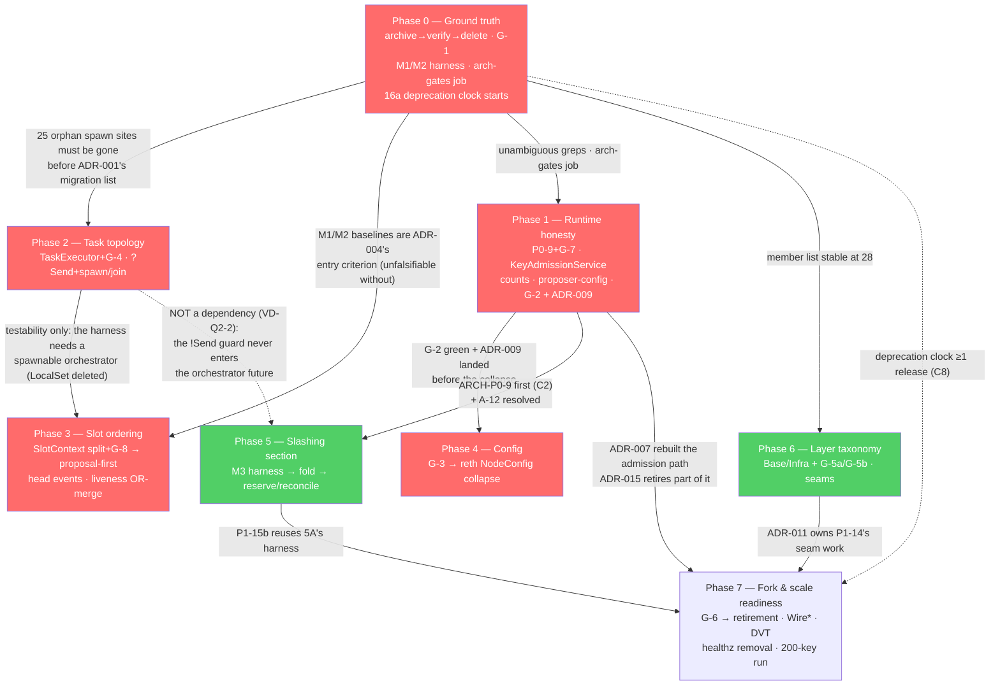

# Project Plan: rs-vc Architecture Remediation

> Phased, dependency-ordered execution plan for the architecture-remediation initiative on the rs-vc
> Cargo workspace (29 members at HEAD, verified by counting `CLASSIFICATION` at
> `crates/architecture-tests/src/lib.rs:57-92`), baseline `develop` @ `0ae9a09` (v0.7.0),
> authored 2026-08-12.
>
> **Authoritative inputs, in precedence order:**
> [`architecture.md`](./architecture.md) → [`prd.md`](./prd.md) →
> [`research/00-overview.md`](./research/00-overview.md) →
> [`../../docs/research/architecture-review-2026-08-11.md`](../../docs/research/architecture-review-2026-08-11.md).
> The architecture re-verified the PRD against HEAD, so **where the two conflict the architecture
> wins**; where the architecture is silent the PRD governs scope. The architecture's **15 ADRs, 8 gate
> specifications and 4 interface specifications are authoritative and are not re-opened here.** This
> plan turns them into phases, entry/exit gates, dependencies, a calendar and a two-developer stream
> model. It does **not** decompose phases into individual issues — that is the estimator's job.
>
> **⚠️ The calendar in this document is superseded.** The issue breakdown that followed it
> ([`issues/00-summary.md`](./issues/00-summary.md)) re-verified every phase against HEAD and landed
> at **99 issues · 216 points · 116–179 working days for one developer**, against this plan's
> **91–136 d** — **+27 %/+32 %**. The gap is not buffer: each phase file names its own driver (Phase 0
> and Phase 5 moved most, the first because the estimator opened files this plan assumed, the second
> because ADR-005's three proof surfaces became switchover *gates* rather than follow-ups). **Quote
> the summary's phase table, not this document's, for scheduling.** The phase *structure*,
> dependencies and entry/exit gates below remain authoritative.
> **What this plan adds over its inputs** (it is not a re-synthesis): a re-derived phase structure
> that departs from the review's Phase 0–5 at **eleven** named points (§3); seven new verification
> deltas found while writing it, two of which change scope — **both** orphan crates collide by package
> name, not just `rvc-signer` (VD-P1), and G-5a as written is unsatisfiable for the very crate ADR-011
> moves into `Base` (VD-P5); a CI-placement decision the upstream documents never take (A-P1); and a
> gate-landing taxonomy that separates the five gates that *can* land before their change from the
> three that structurally cannot (§1.1).
>
> **No-ask constraint:** every open question is resolved to a stated default in *§12 Assumptions*.
> Nothing is escalated.
>
> **Scope:** planning only. This document changes no source file, deletes nothing, and executes none
> of the sequences it schedules. Deleting the orphan trees in particular is downstream work
> (ARCH-P0-1, Phase 0). `docs/prd.md`, `docs/architecture.md` and `docs/project-plan.md` belong to the
> older Test Audit Remediation initiative and are untouched by this plan (NG8).

---

## 1. Overview & Objectives

This initiative is a **targeted correction of runtime-model defects, inert features and
change-amplifiers** — not a rewrite, not a re-layering (PRD NG1–NG8). The crate DAG, the
slashing-protection choke point, the single unbypassable signing gate and the `architecture-tests`
harness are **inputs** to this work, not targets of it.

Eight phases, each independently shippable and separately revertible (NFR-4), ordered by
risk-reduction per effort. The spine is:

**ground truth → honesty → topology → ordering → declaration → the lock → the taxonomy → readiness.**

### 1.1 The single defining sequencing decision

> **No behavioural change in this initiative ships before the artefact that would detect its
> regression exists.** Where that artefact is a CI gate, the gate lands first; where the gate cannot
> precede the change, the change and the gate land in the same PR with RED demonstrated locally; where
> the artefact is a *number* rather than a gate, the measurement harness is an **entry criterion**, not
> a follow-up.

This is not a slogan — it is what re-derives the phase order, and it is forced by the inputs rather
than chosen: architecture Design Principle 2 (*"a discipline without a gate is a defect waiting for a
rename"*), Design Principle 8 (*"measure before you move"*), and **six of the ten rows** in
architecture §7.3 are gate-or-measurement-before-change constraints. Two of the properties this
initiative depends on turned out to be held by convention alone (C5's teardown contract, the `RVC_*`
rule) — precisely the failure mode the thesis exists to prevent.

Taken seriously it moves real work:

- **ARCH-P1-1 (the config-drift gate) leaves Phase 3 and lands in Phase 1**, because ADR-009's
  clap-default-clobbers-TOML defect is a live operator-facing bug whose RED detector is G-2 clause
  (iv) — and ADR-009 must not ship behind ADR-008's multi-PR collapse (architecture ADR-009,
  *Alternatives rejected*).
- **ARCH-P1-15 splits.** The load harness *build* + M3 baseline become the **entry criterion of the
  slashing phase** (P1-15a, Phase 5); only the 200-key validation run stays in the readiness phase
  (P1-15b, Phase 7). The review scheduled all of it in Phase 5 — after the redesign it is supposed to
  judge.
- **A measurement phase exists at all.** M1/M2 have no instrument at HEAD (PRD *Success Metrics*), so
  Phase 0 builds the latency-injecting BN harness and the slot-phase-0 offset metric before Phase 3
  reorders anything.
- **G-6 gates the doppelganger retirement** (VD-6: the gate the review assumed existed does not), and
  **G-3 gates the config collapse** (so the migration cannot quietly introduce an env layer).

Not every gate can go first, and pretending otherwise is how a plan acquires an item that cannot
land. The taxonomy, per gate, at HEAD:

| Gate | State at HEAD | Landing rule | Phase |
|---|---|---|---|
| **G-2** `config_drift` | **GREEN** — seam α is real but unexploited (arch §6 G-2) | Lands standalone and early; RED shown by a synthetic-input matcher unit test | **1** |
| **G-3** `env_allowlist` | Would be **RED day one** on `RVC_LOG_FORMAT` unless class 2 grandfathers it | Lands with its four-class list **before** ADR-008 | **4** (first) |
| **G-6** `km2_lifecycle` | **Absent**; the contract itself is green (trait default + unit tests) | Lands **before** ADR-015's retirement | **7** (first) |
| **G-1** `orphan_dirs` (D1+D2) | **RED** (two orphan crates + `main.rs`/`commands/`) | Same PR as ARCH-P0-1's delete commit, **after** it; RED demonstrated locally | **0** |
| **G-4** `raw_spawn` | **RED** (9 live in-scope sites; 25 more in the orphan trees) | With/after ADR-001's migration — and only after Phase 0 removes the 25 orphan hits | **2** |
| **G-7** `audit_log_scope` | **RED** (both paths, `scoped.rs:75`, `:106`) | With ADR-006, same PR | **1** |
| **G-8** `mock_fidelity` | **RED** (7 stubs return `Ok` unconditionally) | With ADR-003, after the seven stubs are corrected | **3** |
| **G-5a/G-5b** `layer_edges` | **G-5b GREEN at HEAD (VD-P4, verified here)**; G-5a depends on its own definition (VD-P5) | Land with the `CLASSIFICATION` re-labelling; both need synthetic RED demos | **6** |

Three gates therefore land *with* their change rather than before it (G-1, G-4, G-7/G-8), and the
compensating discipline is the repo's existing "demonstrated, not asserted" standard: RED is
reproduced locally against the pre-change tree and the output pasted into the PR, never by merging a
knowingly-failing test (architecture ADR-012).

### 1.2 Objectives, in priority order

1. **Make the repository honest about what it contains** — archive-verify-delete ≈26,270 unrecoverable
   untracked lines, gate the recurrence, and build the two measurement instruments every later phase
   is judged against (Phase 0).
2. **Make every shipped config surface either work or be rejected** — four verified inert surfaces
   plus the clap-clobbers-TOML defect, and remove the observability landmine that can wedge all
   signing (Phase 1).
3. **Make task lifecycle real** — named, owned, cancellable, joined tasks, and a shutdown that lets an
   in-flight publish finish (Phase 2).
4. **Make the slot loop propose first, and stop losing sync-committee rewards** — the `parent_root` /
   `head_root` split before the reordering (Phase 3).
5. **One declaration per knob**, with the env rule gated before the collapse (Phase 4).
6. **Remove the slashing-DB scaling wall without weakening retain-on-ambiguity** (Phase 5).
7. **Make the layer taxonomy bite** — `Base`/`Infra` with two gates, one `ProduceBlockResponse`, HTTP
   out of `crypto` (Phase 6).
8. **Be ready for the next fork and for >100 keys** — one SSZ stack, one doppelganger mechanism, a
   classified DVT surface, a documented load run (Phase 7).

---

## 2. Standing Invariants (every phase, every merge)

**Green-build gate, from `CLAUDE.md` and NFR-6** — every phase's exit criteria include all of these,
and no phase is complete while any is red:

```bash
cargo fmt --all -- --check                              # CLAUDE.md; ci.yml:41
cargo clippy --workspace --all-targets -- -D warnings   # CLAUDE.md; ci.yml:44
cargo clippy -p rvc-signer-bin --all-targets --features dvt -- -D warnings   # ci.yml:47 (Gate 1)
cargo build --workspace
cargo nextest run --workspace                           # NFR-6 — NOT `cargo test --workspace`
```

**Divergence from `CLAUDE.md`, stated rather than silently applied:** `CLAUDE.md` writes the test
command as `cargo test`. NFR-6 and the sibling `plan/tracing-2026-08-06/project-plan.md:65-66`
require `cargo nextest run --workspace` for the workspace run (`cargo test --workspace` deadlocks in
this repo). Single-test runs still use `cargo test <name>` exactly as `CLAUDE.md` says.

**Process invariants:**

- TDD per `CLAUDE.md`: RED → GREEN → REFACTOR. Every gate in §1.1 has a named RED demonstration.
- `thiserror` in libraries, `anyhow` in binaries; no `.unwrap()` in production code; `///` on public
  API.
- **KAT-first policy:** any new or renamed `*_root` / `*tree_hash*` / `*signing_root*` test is
  KAT-anchored or carries `// kat_exempt: <reason>`; `EXEMPTIONS` is shrinking-only. Two inverse
  obligations carried from the architecture: ADR-003's new tests must **avoid** a `_root` suffix (they
  assert HTTP behaviour, not spec-defined roots), and ADR-011's `Wire*` deletion must **re-anchor**
  every touched container-root test, not merely re-run it.
- **NFR-1:** no latency regression on the per-slot deadline path at default `info`, measured against
  the Phase-0 M1/M2 baselines.
- **NFR-4:** each phase separately revertible; no PR whose revert requires reverting another.

**Orphan-tree invariant — with a stated expiry.** Until the end of Phase 0, **never cite, edit or
migrate** `crates/rvc-signer/`, `crates/rvc-keygen/`, `crates/rvc/src/main.rs`, or
`crates/rvc/src/commands/`. Two concrete traps: `crates/rvc/src/main.rs:1608` carries an
`#[allow(clippy::arc_with_non_send_sync)]` that ADR-002 **must not** touch, and the four trees hold
**25 of the 126** raw `tokio::spawn` sites, which must never enter ADR-001's migration list. The
invariant **expires when Phase 0's delete commit lands** — after which G-1 enforces it mechanically
and this rule becomes redundant rather than silently false.

**Keep-list (C9) — per phase, not restated.** Which phases can actually regress each anchor, and the
artefact that turns red:

| # | C9 anchor | Phases that can regress it | Artefact |
|---|---|---|---|
| 1 | `architecture-tests` harness | 0, 6, 7 (rows added/removed) | Byte-matched generated `ARCHITECTURE.md` regenerates identically |
| 2 | Cancellation-proof stage→sign→commit core | **5 only** | Error-class × policy matrix + crash/cancellation injection + concurrency proptest (arch §7.1 anchor 2) — EIP-3076 vectors are necessary and *insufficient* (VD-S3) |
| 3 | KAT-first policy | 3 (ADR-003 test naming), 6/7 (`Wire*` deletion) | `kat_policy.rs`; `EXEMPTIONS` shrinks only |
| 4 | "env = security opt-outs only" | 4 | G-3 |
| 5 | Single unbypassable signing gate | 5, 7 | Single wiring site (`config/builder.rs:394`) + `CompositeSigner` grep gate + `signer-registry` enumeration run **with `--features dvt`** (a **new** CI step — VD-P6) |
| 6 | Zero unbounded channels | 2 (executor `mpsc(8)`, `try_send`), 3 (consumes the existing `mpsc(64)`) | Channel review in the PR + no new `unbounded_channel` |
| 7 | `spawn_blocking` excluded from executor scope | 2 (G-4's ban list), 5 | G-4 must never gain `signer/src/core.rs:542` or `signer-server/src/dvt/peer_service.rs:231,323` |

---

## 3. Departures from the Review's 6-Phase Migration Plan

The review's Phase 0 → Phase 5 spine is the starting point; every departure below is forced by the
architecture's ADRs or by a verified fact, and each names its authority. **No phase evaporated** —
contrary to the possibility the brief anticipates, the review's most under-ranked item (Weakness 8)
*grew* into the largest single correction in the initiative.

| # | Departure | Review's position | This plan | Authority |
|---|---|---|---|---|
| **D1** | Orphan deletion becomes **archive → verify → delete**, three commits | *"Delete `crates/rvc-signer/`, `crates/rvc-keygen/` …"* as one Phase-0 item | ARCH-P0-1 (3-commit sequence) + ARCH-P0-2 (D1+D2 detectors) in Phase 0 | C10, VD-4, ADR-012; strengthened by **VD-P1** below |
| **D2** | Healthz retirement **splits across phases**: 16a deprecation notice in Phase 0, 16b removal in Phase 7 | Deleted in Phase 0 alongside dead code | C8 requires *one release of deprecation warning* before removal — a **calendar** dependency, not an effort one. Starting the clock in Phase 0 costs ~half a day and is the only way the Phase-7 removal is not blocked by it | C8, ADR-014, PRD ARCH-P1-16 |
| **D3** | Audit-log-outside-the-mutex moves **Phase 4 → Phase 1** | Bundled into the Phase-4 lock redesign | Live availability hazard, triggerable today by an ordinary observability change; independent of ADR-005 and strictly shrinks its diff | C2, PRD *Departures*, ADR-006 |
| **D4** | Weakness 8 is **re-ranked MEDIUM → HIGH**, becomes "split the field, don't repair the query", and lands **in the same phase as, and before, proposal-first** | Phase 1: "add the wiremock test; if it 404s, capture parent at t=0" | The naive "make `capture` succeed" reading **arms a dropped-proposal bug** — a third consumer feeds `head_root` into `expected_parent_root` (verified here: `block_proposal/mod.rs:104` → `block-service/src/validation.rs:64`) | VD-Q1-6, VD-Q1-1/3, ADR-003 (*"Sequencing (binding): ADR-003 lands before ADR-004, in the same phase"*) |
| **D5** | The review's Phase 2 **splits into two phases**: task topology (2) and slot ordering (3) | One 2–3 week phase | Different milestones, and ADR-002 **gates ADR-004's testability** (the harness needs a spawnable orchestrator; today's workaround is the `LocalSet` scaffold ADR-002 deletes). Splitting also makes the two-developer overlay possible | PRD *Milestones* ("ARCH-P0-4 gates ARCH-P0-3's testability"), ADR-002 |
| **D6** | The config work **splits**: G-2 + ADR-009 to Phase 1, the collapse to Phase 4; mechanism changes from figment to the **reth `NodeConfig` model**, and the env gate from a prefix scan to a call-site scan | Phase 3: "land the CliOverrides↔clap↔merge gate, then extract `rvc-config` … figment-style" | ADR-008 rejects figment *outright* (it layers values and cannot reach one-declaration-per-knob); ADR-010 shows the `RVC_*` prefix scan fails on measurement (438 hits/57 files, ~95 % metric names, misses `RUST_LOG`); ADR-009 is a live defect that must not ship behind a multi-PR refactor | ADR-008, ADR-009, ADR-010, RVD-1/4/6 |
| **D7** | The review's Phase 4 **splits into Phase 5 (slashing core) and Phase 6 (layer/seam cleanup)** | One 2–3 week phase containing the lock redesign *and* the taxonomy split *and* the type unifications | Radically different risk classes (the initiative's single highest-consequence change vs. mechanical re-labelling), disjoint file sets (`crates/slashing`+`crates/signer` vs. `Cargo.toml`s+`architecture-tests`+`crypto`), and it is what makes a second developer worth ~1.6× | NFR-4, arch §7.2, §9 of this plan |
| **D8** | **Per-pubkey connections and DB sharding are removed from the design space**; the load harness *build* moves to Phase 5 entry; the load *profile* retargets to `signer-server` | Phase 5: *"load-test the sharded slashing path at target validator counts"* | VD-S1 (zero concurrency against one SQLite file; breaks single-file EIP-3076 export/GVR pin/backup); VD-S2 + A-A8 (the VC path's wall is a sequential `await` loop, not the mutex — G6 is **not** reachable from ARCH-P1-5 alone) | VD-S1, VD-S2, A-A8, A-A9 |
| **D9** | **G-6 lands before the doppelganger retirement**, in the same phase | Phase 5: "retire the legacy doppelganger service, carrying the KM-2 contract" | VD-6: the gate the review says "the keymanager-api gate currently owns" **does not exist**. C5 is two obligations — preserve *and* gate | VD-6, C5, ADR-015 |
| **D10** | A **measurement phase exists** (Phase 0 builds the M1/M2 instruments; Phase 5 entry builds M3's) | No measurement work anywhere | M1 and M2 have **no instrument at HEAD**; an unmeasurable target is a defective requirement. Reinforced by **VD-P2** (the two existing `benches/` files are logging-latency benches and are unusable here) | PRD *Success Metrics* + *Phase-0 measurement obligation*, arch Design Principle 8 |
| **D11** | `crates/sync-service`'s deletion joins Phase 0's member-list change | Review Phase 0 (same phase, but as an unrelated item) | Both edits touch the workspace member list, the `CLASSIFICATION` table and the byte-matched `ARCHITECTURE.md`; doing them in one phase pins G-1's non-vacuity member count **once** (29 → 28) instead of twice | ARCH-P2-7, G-1 non-vacuity |

Two items the review ranks HIGH that stay at P1 (unchanged from the PRD, restated so the ordering is
not read as an oversight): **W5** (the global slashing mutex) is HIGH *at scale* and is the highest-risk
change in the initiative, so it follows the correctness fixes; **W6** (config quadruple bookkeeping)
is evolvability — except its *gate*, which D6 pulls forward precisely because it is cheap and is a
precondition on all future knob work.

---

## 4. Verification Against HEAD (`0ae9a09`)

Per house convention this plan re-checked the claims it schedules against. **Confirmed exactly**
(spot-checked while writing, `file:line` as cited): the pre-proposal ordering at
`crates/rvc/src/orchestrator/coordinator/mod.rs:373-405`, including the `// === Epoch boundary:`
comment sitting at `:375` *above* both unconditional `fetch_epoch_duties` calls while the
`% SLOTS_PER_EPOCH` guard begins at `:386`; the inline `select!` at `bootstrap/run.rs:297-313` with
`shutdown_token.cancel()`/`orchestrator_handle.shutdown()` at `:316-317` firing into a dropped future
and the 100 ms `sleep` at `:319`; the healthz `DutyTrackerServer` at `:263-276`; **both** audit-log
hazards at `crates/slashing/src/scoped.rs:69-75` and `:102-107` (VD-S5); `CLASSIFICATION` = 29 rows
with `rvc-timing` in **Domain** at `lib.rs:72` and 15 Foundation members (VD-3); the nine unconditional
`Some(...)` initialisers at `bin/rvc/src/cli.rs:614-617`, `:622` and following (ADR-009); and
`RefreshService::run<F>(mut self, on_new_key: F) where F: Fn(SecretKey)` at
`crates/secret-provider/src/refresh.rs:179-181` (VD-A2 — the callback is synchronous even though `run`
itself is `async`).

Eight deltas found **by this plan**, prefixed `VD-P`. Two change scope (VD-P1, VD-P5); one removes
scope (VD-P4); one removes a hidden failure mode from a Phase-0 exit criterion (VD-P8).

| ID | Claim as written upstream | Status at HEAD | Corrected fact carried forward | Lands in |
|---|---|---|---|---|
| **VD-P1** | PRD/architecture record **one** package-name collision: `crates/rvc-signer/Cargo.toml:2` = `rvc-signer-bin` = `bin/rvc-signer/Cargo.toml:2` | **Understated — both orphans collide** | `crates/rvc-keygen/Cargo.toml:2` declares `name = "rvc-keygen"`, the **same package name** as `bin/rvc-keygen/Cargo.toml:2` (and as the `CLASSIFICATION` row at `lib.rs:60`). **Neither** orphan can be revived by adding it to `[workspace] members` — both are duplicate-package hard errors. Consequences: "archive as content, not as members" applies to both, and **G-1/D1's failure message must not suggest "add it to `members`" as the remedy**, because for these two paths that remedy does not compile | Phase 0 (ARCH-P0-1, ARCH-P0-2) |
| **VD-P2** | Research V8: *"the hold-duration metric exists; **no bench or load harness does**"* | **Correct in substance, and a sizing trap** | Two `benches/` files **do** exist — `crates/signer/benches/sign_path.rs` and `crates/rvc/benches/per_slot.rs` — so a planner checking `git ls-files '*/benches/*'` (as the sibling tracing plan did to justify "harness reuse, not new work") would size M1/M2/M3 downward. Both are **logging-latency** benches under three subscriber regimes and both say so in their own headers (`sign_path.rs:1-24`, `per_slot.rs:1-16`), explicitly *"NOT run under `nextest` or CI"*. Neither measures slot-phase offsets or sign throughput. **All three harnesses are new builds** | Phase 0 (M1/M2), Phase 5 entry (M3 / P1-15a) |
| **VD-P3** | A-4 / A-A11: the healthz replacement probe is *"the existing metrics HTTP surface"* — a stated default, unverified | **Verified and satisfiable** | `crates/metrics/src/server.rs` exposes `/metrics` **and** `/health` (`:57-64`, handler `:134`) plus a `readyz_handler` (`:145`), served by `serve_metrics_with_health` (`:96-106`). ARCH-P1-16a's deprecation note can name a concrete replacement endpoint pair rather than a category. **VD-A3's separate claim — that a k8s probe actually targets the gRPC endpoint — remains unverified and unverifiable from this repo**; the deprecation window is still the discovery mechanism | Phase 0 (16a), Phase 7 (16b) |
| **VD-P4** | ADR-011: Infra→Domain edges are *"not structurally forbidden"* today, implying such edges may exist | **G-5b is GREEN at HEAD** | Scanning every `crates/**/Cargo.toml` for the eight Domain aliases (`timing`, `signer`, `doppelganger`, `block-service`, `builder`, `duty-tracker`, `sync-service`, `signer-server`) returns **only** Domain→Domain (`builder`→`signer`, `block-service`→`signer`, `signer-server`→`signer`, `signer`→`doppelganger`), Orchestrator→Domain (`crates/rvc`), and one hit inside the untracked orphan (`crates/rvc-signer/Cargo.toml:35`). **No Foundation member declares a Domain dependency.** So Phase 6 carries **no hidden edge-removal work** — G-5b is pure codification — but it *does* need a synthetic RED demonstration, since a gate green on day one is otherwise unfalsifiable | Phase 6 (G-5b) |
| **VD-P5** | G-5a as specified: *"No `Layer::Base` package may declare a production workspace dependency on any other workspace package"* | **Unsatisfiable for ADR-011's own decision** | ADR-011 moves `crypto` into `Base` after extracting `remote_signer/`. But `crates/crypto/Cargo.toml:19-26` declares **three** workspace dependencies — `observability`, `eth-types`, `web3signer-wire` — none of which the extraction removes. Under the literal rule `crypto` can never be `Base`. **Resolution (A-P2):** G-5a means *"a `Base` package may depend only on other `Base` packages"*, with the existing `ZERO_OUT_EDGE_IF_PRESENT` pin (`architecture_no_cycles.rs:72-79`: `rvc-eth-types`, `rvc-signer-registry`, `rvc-telemetry`, `rvc-observability`, `rvc-signer-proto`, `rvc-test-support`) retained **unchanged** for the true leaves. This is also what discharges VD-3: under this rule `rvc-timing` (out-edges: `eth-types` only, `crates/timing/Cargo.toml:13`) becomes `Base`-eligible and is reclassified deliberately | Phase 6 (ADR-011, G-5a) |
| **VD-P6** | ARCH-P1-7 / arch §7.1 anchor 5: *"the `signer-registry` enumeration gate is **run with `--features dvt`** in CI"* — phrased as a flag on an existing run | **A new CI step, not a flag** | `.github/workflows/ci.yml:46-47` runs `cargo clippy -p rvc-signer-bin --all-targets --features dvt` — **clippy only**, and scoped to one package. The only workspace **test** execution in CI is `cargo llvm-cov nextest --workspace` at `:166`, which uses default features. There is no dvt test run to add a flag to. ARCH-P1-7 must budget a new CI step | Phase 7 (ARCH-P1-7) |
| **VD-P8** | Implicit in ARCH-P0-2 / G-1: D1 compares directories-with-a-`Cargo.toml` against `cargo metadata` members, with no statement that the two can actually be made equal | **Verified equal after Phase 0, exactly** | `{crates,bin}/*/Cargo.toml` matches **31** paths at HEAD. Removing the two orphans (0A) leaves **29** — precisely the member count — and removing `sync-service` (0C) leaves **28 = 28**. There is no third category (no intentionally-excluded `Cargo.toml`, no nested manifest), so D1 needs **no exclusion list** and its non-vacuity assertion can be a hard equality rather than a `>` bound. Phase 0's exit number is therefore verified, not derived | Phase 0 (0B) |
| **VD-P7** | Implicit everywhere: "the new gates run in CI" | **CI has no job that runs them promptly** | `ci.yml` has exactly three jobs — `check:13` (fmt/clippy/clippy-dvt/audit), `secret-scan:59`, `coverage:129`. The only place a `#[test]` executes is inside `coverage`, under `cargo llvm-cov` instrumentation. All eight new gates would therefore land in the slowest job, coupling gate failures to coverage tooling — against NFR-5 and R10. **Default (A-P1):** Phase 0 adds a fourth job, `arch-gates`, running `cargo nextest run -p rvc-architecture-tests` | Phase 0 |

---

## 5. Estimation Approach

- **Sizing unit: S / M / L / XL**, plus a working-day range for one uninterrupted developer. Ranges
  are given because the task asks for a calendar; they are **derived from counted items**, never
  asserted.
- **The counted items behind each large estimate** (this is the anti-hand-wave discipline the house
  style requires):
  - ADR-001 = the **13 rows** of architecture §5.1's migration table (9 in-scope production spawns +
    4 Infra `register` sites) + 2 inline-polled futures + a 2-series metric + a tiered drain.
  - ADR-002 = **6** `?Send` sites + 1 supertrait + **3** stale `#[allow(clippy::arc_with_non_send_sync)]`
    + deletion of the `LocalSet`/`spawn_local` scaffold — *net negative* lines, gated by one probe.
  - ADR-003 = a field split + a 4-step walk-back + **7** mock stubs + **3** doc comments.
  - ADR-008 = **13** clap group structs / **74** fields; deletes `CliOverrides` (65 fields),
    `From<StartArgs>` (99 lines) and 65 `merge_with_cli` arms; the section boundaries are *already
    near-isomorphic* with the clap groups (ADR-008 *Consequences*) — the single most important sizing
    fact in Phase 4.
  - ADR-005 = the architecture's own **10–15 engineering days**, redesign + proof harness, excluding
    the load harness.
  - ADR-011 = **29 → 28** `CLASSIFICATION` rows, each needing a deliberate Base/Infra/Domain
    placement (A-A6), plus 2 gates; **no edge-removal work** (VD-P4).
- **Two estimates moved on evidence, in opposite directions.** Phase 1 is sized **above** the review's
  "1–2 weeks" because ARCH-P0-5 is a **build, not a rewiring** (VD-5/R6: `KeyChangeNotifier` is 61
  lines with two fields, not the atomic multi-store updater the review describes). Phase 6 is sized
  **below** a naive reading because G-5b needs no edge removals (VD-P4).
- **Uncertainty is named, not padded.** Three items carry gating probes rather than buffer, each the
  **first task** of its own work package (A-A1): ADR-002's `cargo check` probe, ADR-009's
  `rvc start --config <toml with metrics_port = 9090>` bind check, and ADR-003's wiremock 404 pin.
- **Not modelled:** review latency and CI cycles. Add ~10–15 % for review turnaround; Phase 0 also
  introduces a new CI job whose first runs are infrastructure debugging.

---

## 6. Phase Table

| Ph | Theme | Requirements (PRD IDs) | ADRs / gates | Size | Est. (1 dev) | Depends on |
|---|---|---|---|---|---|---|
| **0** | **Ground truth** — archive, gate, measure, start the deprecation clock | ARCH-P0-1, P0-2, P2-5, P2-6, P2-7, P2-9, **P1-16a** *(D2 split)*, **M1/M2 harness** *(D10)*, **`arch-gates` CI job** *(A-P1)* | ADR-012; **G-1** | M | **7–11 d** | — |
| **1** | **Runtime honesty** — inert surfaces, one key-admission path, the live deadlock hazard | ARCH-P0-9, P0-5, P0-7, P0-6, **ADR-009** *(no PRD ID)*, ARCH-P1-1 *(D6)* | ADR-006, ADR-007, ADR-009, ADR-014 (sibling); **G-7, G-2** | **L** | **13–19 d** | 0 |
| **2** | **Task topology** — an executor, a spawnable orchestrator, a real shutdown | ARCH-P1-4, ARCH-P0-4 | ADR-001, ADR-002; **G-4** | M | **8–13 d** | 0 |
| **3** | **Slot ordering** — split the context, then propose first | ARCH-P0-8, ARCH-P0-3, ARCH-P1-12, ARCH-P1-13 | ADR-003, ADR-004, ADR-013; **G-8** | **L** | **11–17 d** | 0 (baselines), 2 (testability) |
| **4** | **Config consolidation** — gate the env rule, then collapse to one declaration | ARCH-P1-3, ARCH-P1-2 | ADR-010, ADR-008; **G-3** | **L** | **11–16 d** | 1 |
| **5** | **Slashing critical section** — measure, fold, then reserve-and-reconcile | **P1-15a** *(D8 split)*, ARCH-P1-6, ARCH-P1-5, ARCH-P2-2, ARCH-P2-1 | ADR-005 | **XL** | **18–26 d** | 1 (ADR-006) |
| **6** | **Layer taxonomy & seam cleanup** — Base/Infra with teeth | ARCH-P1-8, ARCH-P1-9, ARCH-P1-10, ARCH-P2-3 | ADR-011; **G-5a, G-5b** | M/L | **9–14 d** | 0 |
| **7** | **Fork & scale readiness** | ARCH-P1-11, ARCH-P1-14, ARCH-P1-7, **P1-15b**, **P1-16b**, ARCH-P2-4, ARCH-P2-8 | ADR-015, ADR-011 (dependents), ADR-014; **G-6** | **L** | **14–20 d** | 1, 5, 6 (+0 for the 16a clock) |
| | **Total** | **9 P0 · 16 P1 · 9 P2** | 15 ADRs · 8 new gates | | **91–136 d** | |

**Milestone map (one sentence per phase, the thing a stakeholder can evaluate):**

| Ph | Milestone |
|---|---|
| 0 | **M6 = 0**: no untracked source in the tree, a verified archive ref exists, two detectors prevent recurrence, and the M1/M2 numbers Phases 3 and 5 are judged against are recorded in this directory. |
| 1 | **4 of 5 inert surfaces closed** (M7 → 1, the fifth being `BnRole` broadcast in Phase 7); a secret-provider key gets duties and can leave `Pending`; a DB-reading tracing subscriber can no longer wedge signing. |
| 2 | **M8 = 0** raw spawns in scope; **M10**: an in-flight publish completes on SIGTERM instead of being dropped. |
| 3 | **M1 = 0** missed proposals with duty fetches stalled 60 s; **M2** p99 ≤ 1,000 ms warm / ≤ 2,000 ms cold; sync-committee **messages *and* contributions** are produced on a 404-ing BN. |
| 4 | **M4 = 1** declaration per knob: `CliOverrides` deleted, `rg 'figment'` empty, a TOML `metrics_port = 9090` binds 9090. |
| 5 | **M3** recorded before and after; hold-duration p99 within the per-sign budget on the `signer-server` profile; the retain-on-ambiguity matrix, crash-injection and concurrency proptest are green. |
| 6 | 28 members each carry a deliberate `Base`/`Infra`/`Domain` row, `ARCHITECTURE.md` regenerates byte-identically, `crypto` is a `Base` package, **M9** drops by one `ProduceBlockResponse`. |
| 7 | One SSZ stack; one doppelganger mechanism behind G-6; DVT surface classified under `--features dvt`; healthz removed **after** its deprecation release; a documented 200-key run checked into this directory. |

---

## 6a. Total Effort Roll-Up

- **Single developer, all eight phases:** **91–136 working days ≈ 18–27 calendar weeks.**
- **P0 commitment** (every `ARCH-P0-*` requirement) closes at the **end of Phase 3**: Phases 0–3 =
  **39–60 d ≈ 8–12 weeks**. Note the P0 set is *not* the first phases' whole content — Phase 1 and
  Phase 3 each carry P1 items that travel with them for sequencing reasons (ARCH-P1-1, ARCH-P1-12/13).
- **P0 + P1 commitment** closes at the end of Phase 7 (ARCH-P1-11/14/7/15b/16b live there).
- **Two developers:** critical path **55–83 d ≈ 11–17 weeks** (§9/§10) — about **1.6×**, bought almost
  entirely by moving Phase 5, the single longest phase, off the critical path.

Calendar assumes one uninterrupted developer at the stated rate, no hard-fork window intersecting the
plan (A-P10), and one release per phase boundary (A-P11 — required for C8's deprecation window).

---

## 7. Phase Detail

Each phase states goal, scope, entry criteria, exit criteria (the milestone), dependencies and the
risks it carries. Work packages are *packaging guidance for the estimator*, not issues.

---

### Phase 0 — Ground Truth: archive, gate, measure, start the clock

**Goal.** Make the repository's contents honest, prevent the recurrence mechanically, build the two
measurement instruments every behavioural phase is judged against, and start the one dependency in
this plan that is measured in *releases* rather than days.

**Maps to.** ARCH-P0-1, ARCH-P0-2, ARCH-P2-5, ARCH-P2-6, ARCH-P2-7, ARCH-P2-9, ARCH-P1-16a (D2),
M1/M2 baselines (D10), `arch-gates` CI job (A-P1). ADR-012; gate **G-1**.

**Scope.** `crates/rvc-signer/`, `crates/rvc-keygen/`, `crates/rvc/src/main.rs`,
`crates/rvc/src/commands/` (delete only — never edit); `crates/sync-service/`; root `Cargo.toml`
(`members:2`, alias `:33`); `crates/architecture-tests/src/lib.rs` (`CLASSIFICATION:57-92`) and
`tests/orphan_dirs.rs` *(new)*; `.github/workflows/ci.yml`; `bin/rvc/Cargo.toml`;
`crates/rvc/src/bootstrap/run.rs:263-276` (deprecation `warn!` only, no removal); a new
latency-injection BN harness under `crates/rvc/tests/`; `docs/` freshness scan.

**Work packages.**

| # | Package | Notes |
|---|---|---|
| 0A | **Archive → verify → delete** (ARCH-P0-1) | Three commits. Archive to branch `archive/untracked-orphans-2026-08-12` **and** a tarball at `plan/architecture-2026-08-12/archive/untracked-orphans-2026-08-12.tar.gz` (A-1: both, not either). Archive as **content, not workspace members** — **VD-P1: *both* orphans collide by package name** (`rvc-signer-bin` *and* `rvc-keygen`), so neither can be added to `[workspace] members`. Verify by restore-and-diff (file count + per-file hash); record the manifest hash in the issue. Delete in a separate commit referencing the archive ref. |
| 0B | **G-1: D1 + D2 detectors** (ARCH-P0-2) | Land in the **same PR as 0A's delete commit, after it**; RED demonstrated locally against the pre-deletion tree with output pasted into the PR. Non-vacuity: member count assertion and a non-trivial D2 file walk. **The arithmetic is verified, not derived (VD-P8):** `{crates,bin}/*/Cargo.toml` matches **31** directories at HEAD; minus the two orphans that 0A deletes = **29**, exactly the `cargo metadata` member count; minus `sync-service` (0C) = **28 directories = 28 members**. So D1 is satisfiable with an exact equality and is green the moment 0A+0C land — there is no intentionally-excluded `Cargo.toml` to carve out. **D1's failure message must not recommend "add it to `members`"** (VD-P1). |
| 0C | **Delete `crates/sync-service`** (ARCH-P2-7) | Tracked and recoverable — C10 does **not** apply. Drops `members` 29 → 28, the alias at `Cargo.toml:33`, and the `CLASSIFICATION` row at `lib.rs:71`; `ARCHITECTURE.md` regenerates byte-identically. Bundled here so G-1's member count is pinned once (D11). |
| 0D | **M1/M2 baseline harness** (D10) | A BN mock with per-request latency injection + a slot-phase-0 start-offset measurement. **New build — VD-P2**: the two existing `benches/` files are logging-latency benches, explicitly not run under `nextest`/CI. Record the numbers **in this plan directory**, not just in a run log. |
| 0E | **`arch-gates` CI job** (A-P1 / VD-P7) | `cargo nextest run -p rvc-architecture-tests` as a fourth job, so every later gate's RED/GREEN is a fast signal rather than a coverage-job side effect (NFR-5, R10). |
| 0F | **Healthz deprecation notice** (ARCH-P1-16a) | Startup `warn!` on the gRPC healthz path + a release note naming the replacement — **verified concrete (VD-P3)**: `/health` and `/readyz` on the metrics server (`crates/metrics/src/server.rs:57-64`, `:134`, `:145`). Plus a documented probe-migration check. **No removal here** (C8). |
| 0G | **Hygiene tail** | `cargo-machete`/`cargo-udeps` in CI + `bin/rvc`'s unused deps (ARCH-P2-6); docs-freshness scan (ARCH-P2-5) — the scan only; **the plan does not move `docs/architecture.md`** and must not touch `docs/prd.md` or `docs/project-plan.md` (NG8); stale doc comments and the `signer-registry` shipped-fix TODO (ARCH-P2-9). |

**Entry criteria.** Working tree at `develop` @ `0ae9a09`, green on all §2 commands. CI write access
for one new job. The four orphan paths still present (they are the RED evidence).

**Exit criteria / milestone.**

- Archive ref exists; scripted restore-and-diff yields zero differences; manifest hash recorded.
- None of the four orphan paths exists; `rg 'struct CliOverrides'` returns exactly **one** hit
  (`crates/rvc/src/config/types.rs:1313`), down from two.
- `cargo build --workspace` and `cargo nextest run --workspace` **unchanged** — nothing compiled these
  trees; any change is itself the finding (arch §7.2).
- D1 and D2 fail against a scratch re-add and pass on `develop`; each names the offending path.
- **Members = 28, and `{crates,bin}/*/Cargo.toml` = 28 directories** — an exact equality D1 asserts
  (verified at HEAD as 31 → 29 → 28; VD-P8). `ARCHITECTURE.md` byte-identical after regeneration.
- **M1 and M2 baselines are recorded as files in `plan/architecture-2026-08-12/`.**
- The healthz deprecation ships in the release closing this phase (starts C8's clock).
- **M6 = 0.**

**Dependencies.** None. This phase is the plan's only true root.

**Risks.** R2 (archive unusable) — mitigated by 0A's restore-and-diff and by using *both* a branch and
a tarball. Low-probability but high-cost: an orphan file turns out to be referenced by something (it
cannot be — `autobins = false`, non-members — but the build check is the proof). RP4: the new CI job
adds runtime; scanner-style gates only (NFR-5).

---

### Phase 1 — Runtime Honesty: inert surfaces, one admission path, the live hazard

**Goal.** No shipped config surface accepts operator input and discards it; a key admitted from a
cloud secret manager actually earns; and no observability change can wedge signing.

**Maps to.** ARCH-P0-9 (+**G-7**), ARCH-P0-5, ARCH-P0-7, ARCH-P0-6, **ADR-009** *(architecture-only;
no PRD requirement ID — A-P5)*, ARCH-P1-1 (+**G-2**, moved here by D6). ADRs 006, 007, 009; ADR-014's
sibling (PB-B2).

**Scope.** `crates/slashing/src/scoped.rs` (**and `stage.rs` must remain byte-unchanged** — see entry
criteria); `crates/rvc/src/keymanager_adapters/notifier.rs` + the admission adapters;
`crates/rvc/src/bootstrap/enablement.rs:170-192`; `crates/rvc/src/bootstrap/tasks.rs:103-138`;
`crates/validator-store/`; `bin/rvc/src/cli.rs:614-682`; `crates/rvc/src/config/types.rs:942-946`;
`crates/architecture-tests/tests/{audit_log_scope.rs,config_drift.rs}` *(new)*.

**Work packages.**

| # | Package | Notes |
|---|---|---|
| 1A | **Audit log out of the mutex + G-7** (ARCH-P0-9, ADR-006) | **Both** paths — block `scoped.rs:69-75` **and** attestation `:102-107` (VD-S5); the review cites only the first. RED demonstration is a subscriber that acquires the slashing DB lock on every event, driving a full stage→sign→commit — **written with a timeout**, because today it deadlocks rather than fails. Hard scope bound: `git diff <base> -- crates/slashing/src/stage.rs` **empty** (this is what sidesteps A-12). Replace the misleading `:70-74` note, don't edit around it. |
| 1B | **`KeyAdmissionService`** (ARCH-P0-5, ADR-007, C4) | **A build, not a rewiring** (VD-5/R6). `AdmissionSource::{Keystore, RawSecret}` as a first-class enum; one method updating `CompositeSigner` → `PubkeyMap` → `ValidatorStore` → doppelganger `register_for_import` → `key_gen_tx`. **Synchronous `admit` by necessity** — `RefreshService::run<F> … F: Fn(SecretKey)` (`refresh.rs:179-181`, re-verified) is a non-`async` callback (A-A2/VD-A2); the issue must take this decision explicitly rather than discover it at compile time. Acceptance is written against `PubkeyMap`/`ValidatorStore`/`key_gen_tx` **plus** a liveness-sampling test proving the key can leave `Pending` — "register with doppelganger" is a **no-op fix** (VD-2, `enablement.rs:187` already does it). Preserve the denylist re-check at `:174-183`. |
| 1C | **Live validator counts** (ARCH-P0-7) | Depends on 1B: with a live `PubkeyMap` the count is a free win (ADR-007 *Consequences*). Two distinct fields — total loaded vs. active/enabled (A-3). |
| 1D | **Proposer-config URL updates applied** (ARCH-P0-6) | Default is **apply** to `ValidatorStore` (A-2); the fallback is a named startup rejection, never "accept and ignore". Wiremock-backed test asserting a changed fee recipient reaches a subsequent proposal. |
| 1E | **G-2 config-drift gate** (ARCH-P1-1) | Four clauses, per §6 G-2: **clause (i) is dropped — rustc already enforces it** (RVD-1, `merge_cli_fields!` destructures exhaustively at `types.rs:934-936`); clause (ii) is seam α (74 fields / 13 groups, `BYPASS` 8, `ALIASES` 2, arithmetic `74 − 8 − 1 = 65`); clause (iii) descoped to validation coverage; **clause (iv) is new and owns ADR-009**. The gate is **GREEN at HEAD**, so RED is a synthetic-input matcher unit test. |
| 1F | **ADR-009 precedence fix** | ~30 lines: nine clap fields become `Option<T>`, defaults move to `Config::default()`. Lands **after** 1E's `CLAP_DEFAULT_CLOBBERS` list so the defect is visible in CI before it is fixed and a tenth instance cannot appear. **First task is the probe** (A-A1/A-A4): `rvc start --config <toml with metrics_port = 9090>` — if it binds 9090 the finding is withdrawn and 1F becomes gate-only. |

**Entry criteria.** Phase 0 complete (unambiguous greps; `arch-gates` job available). **A-12
resolution recorded**: the tracing plan's prospective byte-identical pin on `stage.rs` is verified
*not wired in CI at HEAD*; 1A is scoped to `scoped.rs` so it is unaffected either way — the note is
filed now because Phase 5 cannot proceed without resolving it (A-P8).

**Exit criteria / milestone.**

- A DB-reading tracing subscriber completes a full stage→sign→commit (test with timeout); G-7 green
  over both paths; `stage.rs` byte-unchanged.
- A provider-refreshed key appears in `PubkeyMap` + `ValidatorStore`, bumps `key_gen_tx`, is sampled
  by the liveness loop and can leave `Pending`; a raw `SecretKey` is admitted with **no filesystem
  write**; existing keymanager adapter tests green.
- Monitoring push reflects an import and a delete; the active count reflects enablement, not
  loadedness.
- A rotated fee recipient reaches the next proposal.
- G-2 green, RED-demonstrated on synthetic input; **`CLAP_DEFAULT_CLOBBERS` shrinks to empty** after
  1F.
- **M7 → 1** (four of five inert surfaces closed; `BnRole` broadcast, ARCH-P2-8, remains for Phase 7).

**Dependencies.** Phase 0. Internally: 1B → 1C. 1A is independent of everything else in the phase and
is deliberately first — it is Stream B's starting point (§9).

**Risks.** R6 (ARCH-P0-5 under-sized) — the phase estimate already carries VD-5's correction, and this
is *why* this phase exceeds the review's "1–2 weeks". R8 mitigated early by 1E. RP1: the phase is the
plan's second largest; 1A and 1E/1F are separately shippable if it must be cut.

---

### Phase 2 — Task Topology: an executor, a spawnable orchestrator, a real shutdown

**Goal.** Every task is named, tiered, metered, panic-contained and joined; a shutdown signal no
longer drops the orchestrator future mid-phase.

**Maps to.** ARCH-P1-4, ARCH-P0-4. ADR-001, ADR-002; gate **G-4**.

**Scope.** `crates/rvc/src/bootstrap/executor.rs` *(new — a module, **not** a crate; ADR-001)*;
`bootstrap/run.rs:83,263-322`; `bootstrap/tasks.rs:88,103,124`; `bootstrap/enablement.rs:170`;
`keymanager_adapters/spawn.rs:247`; `liveness_loop.rs:355`; `slashing_monitor.rs:123,126`;
`bin/rvc/src/logging.rs:217`; `crates/block-service/src/traits.rs:13`;
`crates/rvc/src/beacon_adapter.rs`; `crates/rvc/tests/sync_independent_of_attesting.rs:269-273`;
`crates/architecture-tests/tests/raw_spawn.rs` *(new)*.

**Work packages.**

| # | Package | Notes |
|---|---|---|
| 2A | **`TaskExecutor`** (ARCH-P1-4, ADR-001) | Four of Lighthouse's nine mechanisms. **Two entry points**: `spawn` for the composition root, `register` for the four Infra sites that cannot depend on it without violating the DAG gate — `register` is the primitive. Tiered drain Ingress → Orchestrator → Background → Telemetry, A-7's 5 s as a **total** budget (2.0/2.0/0.5/0.5). Two series only (A-A5). `register_opt` for the feature-disabled case, so `rvc_tasks_running` is honestly 0. **Carry RA-5 forward:** if the metrics server becomes cooperative (it should — it is the only live task that never sees a token), Telemetry rises to 2.0 s and the total to **6.5 s** — a PRD amendment, not a silent absorption. |
| 2B | **Migrate the 13 sites + G-4** | Exactly the §5.1 table: 9 in-scope production + 4 Infra `register`. The **25 orphan-tree sites do not exist any more** (Phase 0) and the 5 `signer-server` sites are out of scope (A-13); 83 test sites untouched. G-4 is a **path-scoped scanner**, not clippy `disallowed-methods` (RVD-2: cannot be path-scoped; `--all-targets` fires on 83 test sites; a per-crate `clippy.toml` **replaces rather than merges** the workspace file, silently dropping the three secret-key bans at `clippy.toml:25-29`). **`spawn_blocking` is never scanned and never added to the ban list** (C9 anchor 7). |
| 2C | **Spawnable orchestrator** (ARCH-P0-4, ADR-002) | **First task is the probe** (A-A1): throwaway worktree, six `sed` sites + the supertrait, `cargo check --workspace --all-targets --all-features`. Then `pub trait BeaconBlockClient: Send + Sync` + removal at all six `?Send` sites; `tokio::spawn` the orchestrator and `timeout(join)` on signal; delete the `LocalSet`/`spawn_local` scaffold at `sync_independent_of_attesting.rs:269-273` — **that compile is the sharpest available proof of spawnability** and converts a workaround into the regression pin. Delete the three stale `#[allow(clippy::arc_with_non_send_sync)]` (`bootstrap/services.rs:186`, `config/builder.rs:3`, `orchestrator/coordinator/tests/mod.rs:6`) — **and not the fourth**, at `crates/rvc/src/main.rs:1608`, which no longer exists after Phase 0. |
| 2D | **Shutdown honesty** | Keymanager axum `with_graceful_shutdown` + token + bounded join; remove the in-async `std::process::exit` at `run.rs:83` (error return carrying the exit code) and the 100 ms `sleep` at `:319`; drop the gRPC arm's redundant `shutdown_signal()` once the executor owns signal handling, **or a second SIGINT during drain bypasses tier ordering**. Named exit codes (EXIT_* 10/11/13/14) preserved and asserted. |

**Entry criteria.** Phase 0 complete — **hard, not cosmetic**: G-4's scanner and ADR-001's migration
list would otherwise have to reason about 25 spawn sites in unrecoverable untracked trees.

**Exit criteria / milestone.**

- The probe's verdict is recorded either way: removal, **or** a named blocking type plus the
  alternative taken (A-6 keeps ARCH-P0-4 from stalling; the escape hatch stays because *the compile
  was never run* — no research track had a shell).
- A test signalling shutdown mid-publish asserts the publish **completes**; `shutdown()` → loop
  observes the watch change → `Ok(())` → join within 5 s.
- `rg 'process::exit' crates/rvc/src` returns nothing inside an `async fn`; no `sleep` stands in for a
  join in `run.rs`.
- **M8 = 0** raw spawns outside the executor allow-list; every task has a name in a metric label; a
  panicking task produces a reasoned shutdown rather than a silent leak.
- `sync_independent_of_attesting.rs` drives the orchestrator with a bare `tokio::spawn`.

**Dependencies.** Phase 0. **Explicitly *not* Phase 5** — the `!Send` staging guard never enters the
orchestrator's future (VD-Q2-2, refuted by primary evidence: `core.rs:36-41`, `:284-287`, `:542`,
`:930`). Serialising task topology behind the slashing redesign is pure schedule loss (arch §7.3).

**Risks.** R3, downgraded to Low × Low by the exhaustive audit but **not discharged** until the probe
runs. RP6: if the probe fails, Phase 3's harness keeps the `LocalSet` scaffold and its cost rises —
the diagnostic naming a concrete type is then the deliverable (look first in
`crates/block-service/src/service/**` and `MockBeaconClient`'s bodies after `mocks.rs:439`).

---

### Phase 3 — Slot Ordering: split the context, then propose first

**Goal.** Reach the t=0 proposal decision first and within a bounded budget, and stop discarding both
sync-committee reward components every slot.

**Maps to.** ARCH-P0-8, ARCH-P0-3, ARCH-P1-12, ARCH-P1-13. ADR-003, ADR-004, ADR-013; gate **G-8**.

**Scope.** `crates/rvc/src/orchestrator/{slot_context.rs, coordinator/mod.rs:365-406,
sync_committee.rs, block_proposal/mod.rs, duty_management.rs, attestation.rs}`;
`crates/block-service/src/{service/mod.rs, validation.rs}`; `crates/bn-manager/src/sse.rs`;
`crates/doppelganger/.../liveness_loop.rs`; the seven `with_get_block_root` stubs;
`crates/architecture-tests/tests/mock_fidelity.rs` *(new)*.

**Work packages — the internal order is binding.**

| # | Package | Notes |
|---|---|---|
| 3A | **Split `SlotContext` + G-8** (ARCH-P0-8, ADR-003) | **Must precede 3B.** `SlotContext { slot, epoch, parent_root, head_root }`: `parent_root` at t=0 via `get_block_root(slot-1)` **walking back over skipped slots** (four attempts, then `"head"` as a warn-logged, counted terminal — A-4); `head_root` at phase 2, reused at phase 3 (preserves H-5 and its existing regression test `sync_committee.rs:558`). The walk-back is **required for correctness, not polish** — giving up at the first 404 leaves `parent_root = None` on every post-skip slot, re-disabling H-4 exactly where a wrong-ancestor block is most likely. **Do not "make `capture` succeed"**: `ctx.head_root` has a third consumer at `block_proposal/mod.rs:104` feeding `expected_parent_root` (`validation.rs:64`), so the naive fix arms a `ParentRootMismatch` dropped proposal (VD-Q1-6, re-verified here). Fix **all seven** `Ok`-for-anything stubs — the one at `sync_independent_of_attesting.rs:87-91` is single-handedly why CI is green. Cover contributions (`sync_committee.rs:148-157`) as well as messages (VD-Q1-1). New tests must **not** carry a `_root` suffix (C9 anchor 3). First task: the wiremock 404 pin (A-A1). |
| 3B | **Proposal-first with a bounded budget** (ARCH-P0-3, ADR-004) | Move **both** `fetch_epoch_duties` calls (`:376-379`, `:380-383` — they run *every* slot, VD-1) and the epoch-boundary prep (`:386-397`) into the phase-3 → next-slot wait window, keeping an epoch-boundary/dependent-root trigger; `SlotContext::capture` (`:402`) must not gate the decision. **Cold cache** = first slot after boot **and every slot after a `key_gen` invalidation** (`:373`) → bounded **500 ms** fetch with its own metric and log line; "propose only if cached" is rejected by C6. Budget sized against a **tail** risk, not a phantom per-slot 60 s: all three fetches are cache-guarded (VD-Q1-2). Acceptance harness must not use an `Ok`-for-anything stub (G-8). |
| 3C | **Head-event triggering** (ARCH-P1-12, ADR-013) | Strictly **additive**; the 1/3-slot timer stays authoritative. Drops and failover-to-polling are expected path: no `error!`, no failure metric, drop counter labelled expected (C7). Duplicate suppression required. Purely additive ⇒ independently revertible; worst-case regression is latency, never a duty. |
| 3D | **OR-merge doppelganger liveness** (ARCH-P1-13) | `[review-carried, unverified at HEAD]` — **first task is verification inside the issue** (A-11). Fail-safe direction stated in the test name; the fan-out primitive exists in `broadcast_inner`. **Branch, not buffer (A-P12):** **1–2 d** if the documented residual reproduces and `broadcast_inner`'s fan-out is reusable as-is; **0 d** if verification shows it was already closed (the item is then dropped as a Verification Delta); **3–4 d** and a phase-estimate revision if a new cross-BN merge primitive is required. The phase's 11–17 d range assumes the first branch. |

**Entry criteria.** **M1/M2 baselines recorded (Phase 0)** — without them ADR-004's targets are
unfalsifiable, and this is an entry criterion, not a follow-up. Phase 2 complete **for testability**:
the acceptance harness drives a spawned orchestrator; the alternative is the `LocalSet` scaffold
ADR-002 deletes, and re-introducing it here would undo 2C. *(Naming the dependency's nature matters —
it is not a code dependency and must not be "optimised away", nor satisfied by resurrecting the
scaffold.)*

**Exit criteria / milestone.**

- With a 404-on-current-slot BN, sync-committee **messages and contributions** are produced; a metric
  counts any remaining "skipped: no head root".
- H-4 gains a test it never had (a wrong-ancestor block is rejected with `ParentRootMismatch`), **RED
  before the fix** since the check is inert today; H-5's existing test stays green.
- `maybe_propose_block` entered within budget in three scenarios (warm; cold post-boot; cold after a
  `key_gen` bump); with duty fetches stalled the full 6 × 10 s, the proposal still happens.
- Cold-cache path **does** propose when a duty exists (the test fails if the check is skipped).
- Dropping **every** SSE event still yields every attestation on the timer; an early event fires it
  sooner with no duplicate; no `error!` on drop or failover.
- Behaviour-contract tests show *which* duties are performed is unchanged and only *when* changed.
- **M1 = 0, M2 within A-5's budgets.**

**Dependencies.** Phase 0 (baselines), Phase 2 (testability). Internally **3A → 3B is binding**:
landing 3B first removes the accidental masking and makes a known reward loss deterministic on every
slot in every BN-health regime.

**Risks.** R4 (new miss mode via the cold cache) — C6's bounded fallback is a requirement with its own
tests, including the post-`key_gen` slot. R5 (SSE becomes load-bearing) — the drop-every-event test is
an acceptance criterion. Residual: 3A's walk-back interacts with long skip runs; the terminal
`"head"` fallback is warn-logged and counted so the frequency is observable.

### Phase 4 — Config Consolidation: gate the env rule, then collapse

**Goal.** One declaration per operator knob, with the "env = security opt-outs only" discipline
converted from convention into a gate **before** the migration that could erode it.

**Maps to.** ARCH-P1-3, ARCH-P1-2. ADR-010, ADR-008 (which **supersedes ARCH-P1-2's stated
mechanism**); gate **G-3**.

**Scope.** `crates/rvc-config/` *(new crate — A-A3, with "add `clap` to `crates/rvc`" as the stated
fallback if extraction slips)*; `bin/rvc/src/cli.rs` (1,363 lines; groups at `:195-575`;
`From<StartArgs>` at `:587-685`; bypass args at `:738-776`); `crates/rvc/src/config/types.rs`
(3,187 lines; `CliOverrides:1313-1383`; `merge_with_cli:1210`; `validate:1015`;
`validate_insecure_env_var:1114`; the two `OTEL_*` reads at `:438`, `:447`);
`crates/telemetry/src/{init.rs:152, format.rs:53}`;
`crates/architecture-tests/tests/env_allowlist.rs` *(new)*.

**Work packages.**

| # | Package | Notes |
|---|---|---|
| 4A | **G-3 env allow-list** (ARCH-P1-3, ADR-010) | **Lands first.** Scans `std::env::var` **call sites** and `*_ENV`/`*_ENV_VAR` constants — **not** the `RVC_` prefix, which fails on measurement (438 hits / 57 files, ~95 % Prometheus metric names; misses `RUST_LOG` and both `OTEL_*`; red day one on `RVC_LOG_FORMAT`). Four classes: security opt-out (the five sanctioned `RVC_*_ALLOW_*`), grandfathered non-security (shrinking-only: `RVC_LOG_FORMAT`), ecosystem-standard **config-wins** fallback (`RUST_LOG`, `OTEL_EXPORTER_OTLP_ENDPOINT`, `OTEL_TRACES_SAMPLER_ARG`), anything else → fail, naming file and variable. The `OTEL_*` precedence is **config-else-env**, the *opposite* of a figment `Env` layer — the rule must say so or a later refactor "harmonises" it the wrong way. |
| 4B | **The reth `NodeConfig` collapse** (ARCH-P1-2, ADR-008) | The clap `Args` group structs **are** the config sections. `Config` holds them; `bin/rvc` `#[command(flatten)]`s the same structs; `CliOverrides` (65 fields), `impl From<StartArgs>` (99 lines) and `merge_with_cli` (65 arms) are **deleted, not generated over**. Section fields are `Option<T>` with no `default_value`; defaults move to `Default` impls applied after TOML+CLI fold — which is what makes ADR-009 true by construction. **figment is rejected outright**, not "minus `Env`": it layers *values*, so the clap declaration must still exist somewhere and it cannot reach one-declaration-per-knob in principle; its one prize (`Metadata` provenance) is ~40 lines of `ConfigError` context with no dependency. **C3 is honoured by not taking the dependency.** |
| 4C | **Tail** | The four BN timeout args with no config-file representation (`--block-production-timeout`, `--attestation-timeout`, `--aggregate-timeout`, `--duty-fetch-timeout`, routed to `bn_manager::OperationTimeouts` at `cli.rs:739-763`) gain `Config` fields, raising the knob count 65 → 69 and shrinking G-2's `BYPASS` table. G-2's clauses (i)/(ii) are **deleted with seam α** — the gate is interim by construction; (iii) and (iv) survive, (iv) with an empty list. `--help` output changes (defaults move into doc comments) — operator-visible, belongs in the release note. |

**Entry criteria.** Phase 1 complete: **G-2 green and ADR-009 landed** (a live operator-facing defect
must not ship behind a multi-PR refactor — the pattern that produced PB-B1). Nothing from Phases 2/3
is required, which is what makes this the natural Stream-A tail (§9).

**Exit criteria / milestone.**

- `rg 'figment'` returns nothing; G-3 green, RED against a scratch unsanctioned `env::var`.
- `CliOverrides`, `From<StartArgs>` and `merge_with_cli` no longer exist; **M4 = 1** declaration per
  knob.
- A round-trip parity test over **every** existing knob passes; a `ConfigError` names the provenance
  layer (default / file / CLI).
- `rvc start --config <toml with metrics_port = 9090>` binds **9090** (the ADR-009 falsifier, now a
  structural property).
- `Config::validate`'s coverage clause (G-2 iii) still green through the migration.

**Dependencies.** Phase 1. **Precondition on all future knob-adding feature work** (G5) — after this
phase, a new knob costs one declaration; before it, four.

**Risks.** R8 (a knob silently dropped) — G-2 lands first and stays green throughout, plus the
round-trip parity test. Scope risk: 3,187 lines of `types.rs` invites over-reach; the mitigating fact
is ADR-008's own sizing note — the section boundaries in `merge_with_cli`'s `$dst` paths
(`self.keymanager.enabled`, `self.tracing.endpoint`, `self.secret_provider.gcp.project_id`) are
already near-isomorphic with the clap groups, so this is **mostly a renaming exercise**.

---

### Phase 5 — Slashing Critical Section: measure, fold, then reserve-and-reconcile

**Goal.** Remove the hold-across-the-sign wall without weakening retain-on-ambiguity — the highest-risk
change in the initiative, and the one whose failure mode is a signature on the wire with no slashing
record.

**Maps to.** **P1-15a** (harness build + M3 baseline, split out by D8), ARCH-P1-6, ARCH-P1-5,
ARCH-P2-2, ARCH-P2-1. ADR-005.

**Scope.** `crates/slashing/src/{stage.rs, types.rs, db/mod.rs}`;
`crates/signer/src/{core.rs, lib.rs:169, gate.rs:115, locks.rs}`; `crates/slashing/tests/conformance*`;
new proof harnesses and a new load harness.

**Work packages — the internal order is binding.**

| # | Package | Notes |
|---|---|---|
| 5A | **Load harness + M3 baseline** (P1-15a) | **Entry criterion, not a follow-up.** The hold-duration metric exists (`signer/src/core.rs:219`, pinned by `crates/signer/tests/tx_hold_metric.rs`); **no harness does** — and **VD-P2**: the two `benches/` files are logging-latency benches, so there is nothing to extend. Profile targets the `signer-server`/`SigningGate` path where requests genuinely arrive concurrently (A-A8), 200 keys / 200 ms injected latency (A-9). |
| 5B | **Fold the non-slashable path + timeout constant into `core.rs`** (ARCH-P1-6) | **Before 5C, deliberately.** `SignerService` and `SigningGate` must differ only in policy inputs; folding first means ADR-005's reserve/reconcile migration rewrites **one** staging consumer instead of two. |
| 5C | **Tentative-commit-then-reconcile** (ARCH-P1-5, ADR-005, C1) | `BEGIN IMMEDIATE` → rule check → INSERT → `COMMIT` in one short transaction; the sign runs with **no DB lock held**; a `CommittedReservation` (`Send`, no guard escapes) replaces the RAII guard. Best-effort **compensating delete** on the unambiguous-no-signature class only. **Read the M-1 prior-art warning before reviewing this**: this ordering shipped in this repo once and was reverted as a bug (`crates/signer/tests/phantom_row_m1.rs:1-10`, still green in-tree). The delta is precisely the compensation step — **the compensating delete is not an optimisation, it is the entire reason the ordering is admissible**, and shipping the reorder without it re-opens M-1. What makes reconcile safe is **VD-S6**: the signing path never raises watermarks (import-only, `conformance.rs:18-21`), so a compensating delete cannot lower a watermark or re-open a slot. Preserve `TimeoutPolicySource::ResolveUnderLock`'s double resolution around the **commit** point (SEC-1). **Rejected with reason, so no one re-opens them:** stage→release→sign→re-check (C1, by name); **per-pubkey connections** (VD-S1 — zero concurrency against one SQLite file); sharded DB files; WAL (already on, `db/open.rs:217-238`); Postgres (NG5); group commit as a day-one design (A-A9, admissible only if fsync is *measured* to bind). `spawn_blocking` **stays** (C9 anchor 7) even though the `!Send` guard no longer requires it. |
| 5D | **Type the slashing storage layer** (ARCH-P2-2) | **After 5C, never concurrent with it** — typing `slashing/src/types.rs` mid-redesign collides with both the A-12 `stage.rs` pin and 5C's three proof surfaces. `[review-carried, unverified at HEAD]`: verify in-issue first (A-11). **Branch, not buffer:** **2–4 d** if the stringly-typed surface reproduces as described (`pubkey: String`, string root comparison, `.expect("infallible")` at `db/mod.rs:54`); **0–1 d** if it is narrower than claimed. It is the phase's natural cut line — dropping it costs no exit criterion, since **M3** and the three proof surfaces belong to 5C. |
| 5E | **`ValidatorLockMap` eviction** (ARCH-P2-1) | Independent of 5A–5D; absorbs slack. No lock evicted while held. |

**Entry criteria.**

1. **Phase 1's ARCH-P0-9 landed** (C2 — audit emission is already outside the mutex; bundling it here
   would carry a live landmine and enlarge this diff).
2. **M3 baseline captured with 5A's harness.**
3. **A-12 resolved explicitly** (A-P8): the tracing plan's byte-identical pin on `stage.rs` is
   *prospective* (`rg 'stage.rs|TRC-1e|byte-identical' .github` → no matches; that plan is untracked),
   so the default is to proceed and **re-pin to the post-redesign hash**, recorded in
   `plan/tracing-2026-08-06/`. It must be *lifted or re-pinned*, never discovered.

**Exit criteria / milestone.**

- The §5.3 outcome table reproduces **cell by cell**: a remote-signer **timeout** and an **ambiguous**
  error each leave the row **retained**; the unambiguous class is *stricter* than today (a failed
  delete retains).
- Three proof surfaces green **before** the switchover, not after: error-class × policy matrix;
  crash/cancellation injection at every await point; concurrency proptest over interleaved
  reservations. **The EIP-3076 vectors are necessary and insufficient** — they are single-threaded
  rule-engine fixtures that pass identically before and after (VD-S3); running them is table stakes,
  not proof.
- `phantom_row_m1.rs` stays green across the change.
- No new signing surface (`reserve_*` is a DB call); the single wiring site and the `CompositeSigner`
  grep gate stay green.
- **M3** p99 within the per-sign budget on the `signer-server` profile, recorded against 5A's baseline.
- Rollback plan written: reverting to the guard-holding design is safe in the slashing direction (the
  old design retains strictly less, never more) but must re-run the three proof surfaces, not just the
  vectors.

**Dependencies.** Phase 1 (ARCH-P0-9). **Not Phase 2, 3 or 4** — this is the plan's parallel spine.

**Honest scope limit, carried forward rather than buried.** **ARCH-P1-5 alone does not deliver G6 on
the VC path** (VD-S2/A-A8): `orchestrator/attestation.rs:171-192` is a sequential `await` loop with no
`join_all`/`FuturesUnordered`/`spawn` anywhere under `orchestrator/`, so 200 keys × 200 ms cost **40 s
— ten slots — with a completely free DB**. This phase therefore closes the *signer-server* ceiling and
**records VC-path attestation concurrency as a separate, unscheduled requirement**. Claiming G6 here
would be false.

**Risks.** R1 (retain-on-ambiguity broken subtly, green tests) — the highest-consequence risk in the
plan; mitigated by C1's by-name rejection, the three proof surfaces as switchover gates, and 5B
shrinking the diff. R9/A-12 (cross-plan pin) — entry criterion. RP2: if the tracing plan lands TRC-1e
in CI mid-flight, this becomes a hard cross-plan dependency and 5C blocks until the pin is re-scoped.

---

### Phase 6 — Layer Taxonomy & Seam Cleanup

**Goal.** Make the layer rules bite: a `Base` layer that cannot reach outside itself, an `Infra` layer
that cannot reach into `Domain`, and the duplicated seams that force every fork-driven change to be
made twice removed.

**Maps to.** ARCH-P1-8, ARCH-P1-9, ARCH-P1-10, ARCH-P2-3. ADR-011; gates **G-5a**, **G-5b**.

**Scope.** `crates/architecture-tests/src/lib.rs:57-92` + `tests/layer_edges.rs` *(new)* +
`architecture_no_cycles.rs:72-79` (the existing `ZERO_OUT_EDGE_IF_PRESENT` pin — **retained
unchanged**); `crates/crypto/` (`remote_signer/` extraction); a new Infra crate
`remote-signer-client`; `crates/beacon/src/types.rs:132` and
`crates/block-service/src/traits.rs:50` + `crates/rvc/src/beacon_adapter.rs`;
`crates/metrics/src/definitions.rs`; generated `ARCHITECTURE.md`.

**Work packages.**

| # | Package | Notes |
|---|---|---|
| 6A | **Base/Infra split + G-5a/G-5b** (ARCH-P1-8) | Start from **the table, not the review's prose** (A-A6): the review omits `rvc-signer-registry` (`:84`) and `rvc-grpc-signer` (`:78`) and does not place `rvc-slashing` or `rvc-validator-store` (VD-A1). All 28 members need a row or `ARCHITECTURE.md` cannot regenerate byte-identically. **Two findings from this plan:** G-5b is **green at HEAD** — no Foundation member declares a Domain dependency (**VD-P4**) — so there is no edge-removal work, but the gate needs a synthetic RED demo to be falsifiable; and **G-5a must be read as "Base may depend only on Base"** (**VD-P5**), because `crypto` declares `observability`, `eth-types` and `web3signer-wire` (`crates/crypto/Cargo.toml:19-26`) and the extraction removes none of them — under the literal zero-out-edge wording ADR-011's own `crypto`-into-`Base` decision is unsatisfiable. The existing six-crate zero-out-edge pin stays as-is for the true leaves. Under that reading **`rvc-timing` (out-edges: `eth-types` only) is reclassified `Domain` → `Base`, deliberately and with a stated reason** — discharging VD-3 under the no-ask constraint (A-P2). |
| 6B | **One `ProduceBlockResponse`** (ARCH-P1-9) | `bn-manager` sanctioned as the types facade (A-8); delete the field-copying half of `beacon_adapter`. `rg 'struct ProduceBlockResponse'` → one hit. |
| 6C | **Extract the remote-signer HTTP client from `crypto`** (ARCH-P1-10) | `crypto` becomes BLS + EIP-2333 + keystore only; move `is_aggregator`/duty selection to `eth-types`. **KAT-anchored signing-root tests stay green** — no signing behaviour change. This is the one crate boundary this initiative moves (NG1). |
| 6D | **Decentralize `metrics::definitions`** (ARCH-P2-3) | Each crate registers its own metrics; `metrics` loses its reverse dependency on domain concepts; the metrics-conformance gate still passes. Sequence **after 6A** so the layer rows are already correct. |

**Entry criteria.** Phase 0 (member list at 28; `sync-service` gone, so the split does not classify a
crate that is about to be deleted). No dependency on Phases 1–5.

**Exit criteria / milestone.**

- Every member carries a deliberate layer row with a reason; `ARCHITECTURE.md` regenerates
  byte-identically; the existing DAG/forbidden/required-edge gates stay green.
- G-5a and G-5b are each RED against a scratch violating edge (mandatory for G-5b, which is otherwise
  vacuously green).
- `crypto` passes G-5a; fan-in consumers compile unchanged; signing-root KATs green.
- **M9** drops by one duplicated seam (`ProduceBlockResponse`).

**Dependencies.** Phase 0. Parallel-safe with Phase 5 (disjoint files) — see §9's `ARCHITECTURE.md`
collision protocol.

**Risks.** RP5: `CLASSIFICATION` / `ARCHITECTURE.md` collisions with any other stream touching the
member list. R10: a gate green on day one (G-5b) gets treated as noise — mitigated by requiring the
synthetic RED demo and a failure message naming both packages.

---

### Phase 7 — Fork & Scale Readiness

**Goal.** Be ready for the next hard fork and for deployments above the current supported key count,
and close the two removals that were deliberately deferred behind a gate and a deprecation window.

**Maps to.** ARCH-P1-11, ARCH-P1-14, ARCH-P1-7, **P1-15b**, **P1-16b**, ARCH-P2-4, ARCH-P2-8.
ADR-015, ADR-014, ADR-011's dependents; gate **G-6**.

**Scope.** `crates/keymanager-api/src/{traits.rs:79-88, lifecycle.rs}`;
`crates/rvc/src/keymanager_adapters/doppelganger.rs:143-144,204-229`;
`crates/doppelganger/src/traits.rs:68-75`; `crates/eth-types/src/block_body.rs`; `docs/forks.md`
*(new)*; `crates/signer/src/dvt/peer_service.rs:227-230` + `signer-registry`;
`crates/rvc/src/bootstrap/run.rs:263-276,298`; `crates/bn-manager/src/manager.rs:757-771`;
`crates/architecture-tests/tests/{km2_lifecycle.rs,kat_policy.rs}`; `.github/workflows/ci.yml`.

**Work packages — 7A is first and is a hard gate on 7B.**

| # | Package | Notes |
|---|---|---|
| 7A | **G-6 KM-2 teardown gate** | **Lands before the retirement, not after** (VD-6: `rg 'KM-2|lifecycle|stop_monitoring' crates/architecture-tests` returns nothing — the gate the review says exists does not). Pins `stop_monitoring` → machine state stays `Pending` (M-12 wall-clock elapse ≠ cancel) vs `cancel_monitoring` → `ForwardWindowMachine::cancel` (DELETE / re-import freshness), and fails if an implementor silently inherits the `cancel_monitoring → stop_monitoring` trait default (`traits.rs:79-88`) — **the trait default is itself the trap**. |
| 7B | **Retire the legacy doppelganger mechanism** (ARCH-P1-11, ADR-015) | Four mechanisms → one plus the store-level flag; `LegacySlashingHistoryReader` (a *public*, GVR-blind trait guarded today by naming discipline alone) is deleted **as a consequence** of the retirement, not ahead of it. The DELETE path still calls `remove_validator` + `cancel_monitoring`. Collapsing the two methods is the exact failure C5 exists to prevent. |
| 7C | **Fork readiness** (ARCH-P1-14) | Delete the `Wire*` twins in `crates/eth-types/src/block_body.rs`; write `docs/forks.md` enumerating the verified `ForkName`/`ForkSchedule`/`body_layout` dispatch sites, checked by Phase 0's docs-freshness scan. **This is the exact field-order bug class the KAT policy exists to catch** — every touched container-root test is **re-anchored**, not merely re-run. **The only item in this plan with an external calendar trigger** (A-P10): if a body-changing fork is announced, 7C is pulled to the head of the queue regardless of phase order. |
| 7D | **Classify the DVT signing surface** (ARCH-P1-7) | Route `PeerSignerService` through `SigningGate` or register it in `signer-registry` with its own enforcement contract. **VD-P6: this needs a new CI step** — `ci.yml:46-47` is clippy-only and scoped `-p rvc-signer-bin`; the only workspace test run uses default features. |
| 7E | **Healthz removal** (ARCH-P1-16b, C8) | Only now, ≥1 release after Phase 0's 16a deprecation. Remove the server and its `select!` arm; **dispose of `grpc_address`/`grpc_port`** — removed or repointed, never left accepting input that does nothing, which would recreate PB-B1 inside the change meant to end it. Replacement named concretely (VD-P3: `/health`, `/readyz`). |
| 7F | **Scale validation run** (P1-15b) | Reuse 5A's harness. 200 keys / 200 ms (A-9); zero missed attestation deadlines; p99 hold duration recorded. **The numbers are checked into `plan/architecture-2026-08-12/`**, not merely observed. Scope stated honestly: this validates the `signer-server` path (A-A8). |
| 7G | **Tail** | Prune the KAT `EXEMPTIONS` entries that are in fact KAT-anchored — **removals only** (ARCH-P2-4); honour `BnRole`/tier in `broadcast_inner` **or reject the config surface** (ARCH-P2-8) — this is the fifth inert surface and closing it is what makes **M7 = 0**; optional lighthouse-style pre-slot BN health re-check. |

**Entry criteria.** Phase 5 (7F needs the harness and the redesign), Phase 6 (7C depends on ADR-011's
seam work), Phase 1 (7B touches the admission path that ADR-007 rebuilt), and **Phase 0's deprecation
release is at least one release old** (7E only).

**Exit criteria / milestone.**

- G-6 green and RED against a scratch collapse of the two methods; `rg 'LegacySlashingHistoryReader'`
  returns nothing; `stop_monitoring`/`cancel_monitoring` semantics tested in the surviving mechanism.
- One SSZ stack per container; `docs/forks.md` exists and every path in it resolves.
- The `signer-registry` enumeration gate runs **with `--features dvt`** in CI and passes; a DVT partial
  signature cannot be produced outside the registered contract.
- Healthz removed with its knobs disposed; the release note names the replacement probe.
- A 200-key run is checked in; **M7 = 0**; **M5 = +7 gates / +3 CI checks** reached.

**Dependencies.** 1, 5, 6 (and 0 for the deprecation clock).

**Risks.** R7 (a production probe breaks) — mitigated by the six-phase deprecation window and the
migration check; residual and *stated*: **VD-A3 — nobody has verified that any probe targets the gRPC
endpoint**, and the window is the discovery mechanism, not a courtesy. R1's tail: 7F may reveal fsync
as the next wall, in which case group commit is admitted (A-A9) as follow-on work, not absorbed here.

---

## 8. Dependency Map

The graph is **not** the phase order. Four phases hang off Phase 0 or Phase 1 directly; only the chain
0 → 2 → 3 and 1 → 4 are genuinely serial.



**Binding intra-phase orders** (they are safety or falsifiability constraints, not preferences):

| Order | Phase | Reason |
|---|---|---|
| G-1 detectors **after** the delete commit, same PR | 0 | `develop` is never red; RED demonstrated locally |
| 1A (ADR-006) **before** ADR-005 | 1 → 5 | C2: live hazard; also shrinks ADR-005's diff |
| 1B **before** 1C | 1 | The live validator count falls out of a live `PubkeyMap` |
| 1E (G-2 clause iv) **before** 1F (ADR-009) | 1 | The defect must be visible in CI before it is fixed; a tenth instance cannot appear |
| 2C's probe **first** in 2C | 2 | The compile was never run; the verdict is the deliverable either way |
| **3A before 3B** | 3 | 3B removes the accidental masking and makes a known reward loss deterministic every slot |
| 4A (G-3) **before** 4B | 4 | The collapse cannot quietly introduce an env layer |
| 5A → 5B → 5C → 5D | 5 | Measure first; fold so the migration rewrites one consumer; type the store only after the redesign settles |
| **7A (G-6) before 7B** | 7 | Gate the contract before retiring the mechanism that holds it |
| 7E **≥1 release after** 0F | 0 → 7 | C8 |

---

## 9. Parallel-Stream Analysis (2 developers)

**Decision: the plan is written for one developer (A-P9); a two-stream overlay is genuinely available
and is worth ~1.6×, not 2×.**

### The overlap test

The question is whether two streams collide in `crates/rvc/src/` (where 5 of 8 phases work). They do —
so the split must be drawn *around* `crates/rvc/src/`, not through it:

| File / area | Touched by |
|---|---|
| `crates/rvc/src/bootstrap/run.rs` | 0 (16a warn), 2 (executor, shutdown), 7 (healthz removal) |
| `crates/rvc/src/bootstrap/tasks.rs` | 1 (PB-B1/B2), 2 (spawn migration) |
| `crates/rvc/src/bootstrap/enablement.rs` | 1 (admission), 2 (spawn migration) |
| `crates/rvc/src/orchestrator/**` | 3 only |
| `bin/rvc/src/cli.rs`, `crates/rvc/src/config/types.rs` | 1 (ADR-009, G-2), 4 (collapse) |
| `crates/slashing/`, `crates/signer/` | 1 (`scoped.rs` only), 5 (everything else) |
| `crates/architecture-tests/src/lib.rs` + `ARCHITECTURE.md` | 0 (member removal), 6 (layer rows), 7 (rows) |

The clean cut is **`crates/rvc/src/` and `bin/rvc/` (Stream A) vs `crates/slashing/` +
`crates/signer/` + `Cargo.toml`s/`architecture-tests` (Stream B)**. Phase 1's 1A is the one Stream-B
item that lives in Stream-A's phase — and it touches only `scoped.rs`, which Stream A never opens.

### The overlay

| Window | Stream A (critical path) | Stream B | Disjoint? |
|---|---|---|---|
| W0 | **Phase 0** (all of it) | — (single-stream: 0A/0B are one PR sequence and 0D is the same person's harness) | n/a |
| W1 | **Phase 1** minus 1A: 1B → 1C, 1D, 1E → 1F | **1A** (`scoped.rs` + G-7), then **5A** (load harness) | ✅ zero overlap |
| W2 | **Phase 2** (`bootstrap/`, `block-service/traits.rs`) | **Phase 5** 5B → 5C (`signer/core.rs`, `slashing/stage.rs`) | ✅ zero overlap |
| W3 | **Phase 3** (`orchestrator/**`) | **Phase 5** tail (5D/5E) → **Phase 6** | ⚠️ `ARCHITECTURE.md` only, if 6C's new crate lands while A is idle on edges |
| W4 | **Phase 4** (`cli.rs`, `config/types.rs`, new `rvc-config`) | **Phase 6** tail | ⚠️ `Cargo.toml` + `ARCHITECTURE.md` (4B adds two crate edges, 6C adds one) |
| W5 | **Phase 7** split: A takes 7C/7D/7G | B takes 7A/7B, 7E, 7F | ✅ mostly disjoint |

**`ARCHITECTURE.md` / `CLASSIFICATION` collision protocol.** `ARCHITECTURE.md` is generated: never
hand-merge it. On conflict take either side, regenerate, commit. Any stream adding a **production**
crate edge lands the `Cargo.toml` change **and** the regeneration in the same commit (the byte-match
gate is existing CI), and whoever rebases second regenerates again. Agreed once at the W3 kickoff.

**Why the speedup is sub-linear.** Stream A is a genuine dependency chain — G-2/ADR-009 gate the
collapse, ADR-002 gates ADR-004's harness, 3A gates 3B — so a second developer cannot shorten it. What
they *can* do is take Phase 5, the single longest phase (18–26 d) and the one with no dependency on
Phases 2/3/4, entirely off the critical path. That is where the whole 1.6× comes from. **If only one
developer is available, do 1A first anyway** — it is the cheapest removal of a live availability
hazard in the plan.

**Anti-pattern to forbid explicitly:** never run Phase 5's 5C concurrently with Phase 5's 5D, and
never run any Phase-6 `CLASSIFICATION` edit concurrently with a Phase-7 row change. Both pairs collide
on the same lines with no generated-file escape hatch.

---

## 10. Critical Path

**Single-stream:** 0 → 1 → 2 → 3 → 4 → 5 → 6 → 7 = **91–136 d ≈ 18–27 weeks**.

**Two-stream critical path:** **0 → 1(minus 1A) → 2 → 3 → 4 → 7(A's half)**
= (7–11) + (11–16) + (8–13) + (11–17) + (11–16) + (7–10) ≈ **55–83 d ≈ 11–17 weeks**.

It is binding **because it is a dependency chain, not because of file overlap** — every link is a
sequencing constraint from architecture §7.3 or a testability dependency, and none of them dissolve by
adding people:

`G-2 → ADR-009 → ADR-008` (the gate must be green through the collapse) ·
`ADR-002 → ADR-004's harness` (a spawned orchestrator, not a `LocalSet` scaffold) ·
`ADR-003 → ADR-004` (or a known reward loss becomes deterministic) ·
`M1/M2 → ADR-004` (unmeasurable targets are unfalsifiable) ·
`0F → 7E` (a release-count dependency no amount of effort shortens).

**The longest single phase (Phase 5, 18–26 d) is not on it** — that is the plan's main scheduling
lever, and it is available only because ADR-002 has **no** dependency on ADR-005 (VD-Q2-2, refuted by
primary evidence). A planner who reads C1 next to `stage.rs:57-63` and serialises task topology behind
the slashing redesign loses ~4 weeks for no safety benefit; the architecture states this as a
constraint *against* over-sequencing, and this plan implements it.

**Float.** Phase 6 has ~2 weeks of float (only 7C depends on it). Phase 4 has float too (nothing but
future knob work depends on it) — but it is on the two-stream critical path only because Stream A has
nothing else left; if the second developer is available late, move Phase 4 to Stream B and the
critical path shortens by its full duration.

---

## 11. Risk Register

The PRD's R1–R11 remain in force and are **not restated**; the table below carries the ones whose
*mitigation is a scheduling decision this plan makes*, plus seven plan-level risks (RP-*) that only
exist because there is now a phase order.

| # | Risk | L × I | Mitigation — as a scheduling decision |
|---|---|---|---|
| **R1** | ADR-005 breaks retain-on-ambiguity subtly; tests green, safety property gone | Low × **Catastrophic** | C1 rejects the naive design by name; the three proof surfaces (error-class × policy matrix, crash injection, concurrency proptest) are **switchover gates in Phase 5's exit criteria**, not follow-ups; 1A lands four phases earlier so the diff is smaller; the M-1 prior-art warning is quoted in 5C so a reviewer cannot reject-on-sight or approve-on-sight |
| **R2** | Orphan trees deleted without a usable archive (irreversible) | Med × High | Phase 0's 0A is three commits with restore-and-diff verification and a recorded manifest hash; branch **and** tarball; **VD-P1** removes the tempting "just add them to `members`" alternative by proving both collide |
| **R3** | `?Send` removal cascades | Med × Med → **Low × Low** | The probe is the **first task of 2C**; ARCH-P0-4 is satisfied by removal *or* a recorded alternative, so Phase 2 cannot stall |
| **R4** | Proposal-first introduces a new miss mode via the cold cache | Med × High | C6's bounded 500 ms fallback is a Phase-3 exit criterion with its own test, including the post-`key_gen` slot |
| **R5** | Head-event triggering makes SSE load-bearing | Med × High | Phase 3 exit: dropping **every** event still yields every attestation; drops never logged at `error` |
| **R6** | ARCH-P0-5 under-sized (the review overstated `KeyChangeNotifier`) | **High (already materialised)** × Med | Phase 1's estimate is sized as a **build** and the phase is explicitly larger than the review's "1–2 weeks"; §5 names the reason |
| **R7** | Healthz removal breaks a production probe | Med × High | D2's split: deprecation in Phase 0, removal in Phase 7 — six phases of window; replacement endpoint now **verified** (VD-P3), dependency claim still unverified (VD-A3) |
| **R8** | Config collapse silently drops a knob | Med × Med | G-2 lands in Phase 1 and must stay green *through* Phase 4; round-trip parity over every knob is a Phase-4 exit criterion |
| **R9 / A-12** | The tracing plan's byte-identical pin on `stage.rs` lands in CI mid-flight | Med × Med | 1A is scoped to `scoped.rs` (empty `git diff` on `stage.rs`); **Phase 5 has "A-12 lifted or re-pinned" as an entry criterion** — resolved, never discovered |
| **R10** | Eight new gates make CI slow/flaky and get disabled | Low × **High (loses G7 entirely)** | Scanner-style only (NFR-5); every gate names the offending path; **A-P1's `arch-gates` job** keeps gate signal off the slow coverage job |
| **R11** | The initiative drifts into a rewrite | Med × High | NG1–NG8 are requirements; no phase re-cuts the DAG (Phase 6 **re-labels**, and moves exactly one boundary, 6C) |
| **RP1** | Phase 1 is the second-largest phase and mixes a build with four small fixes | Med × Med | 1A and 1E/1F are separately shippable; if the phase must be cut, **1D (proposer-config) moves to Phase 4's window** — and the move is **file-safe as well as dependency-safe**: 1D touches `bootstrap/tasks.rs:110-138` and `crates/validator-store/`, neither of which Phase 4 opens (Phase 4's scope is `bin/rvc/src/cli.rs`, `crates/rvc/src/config/types.rs`, the new `rvc-config` crate and `crates/telemetry/`). Its only coupling to this phase is thematic (M7), so deferring it moves the M7 → 1 milestone to Phase 4, nothing else |
| **RP2** | Cross-plan collision with `plan/tracing-2026-08-06/` beyond A-12 (both touch `bootstrap/` and `telemetry/`) | Med × Med | Phase 2 owns `bootstrap/run.rs`'s task lifecycle; if the tracing plan is running concurrently, agree file ownership at the Phase-2 kickoff — the tracing plan's Phase 2/3 do not touch `run.rs`'s `select!` |
| **RP3** | The deprecation window is too short because releases do not fall at phase boundaries | Med × High | A-P11 states the assumption; if releases are slower, **7E slips out of the plan** rather than shipping early — the removal is the deferrable half by construction |
| **RP4** | New gates land only in the coverage job; failures are slow and attributed to coverage tooling | **High if not decided** × Med | A-P1: Phase 0 adds the `arch-gates` job. This is a decision the upstream documents never take |
| **RP5** | Two streams collide on `CLASSIFICATION` / `ARCHITECTURE.md` | Med × Low | §9's regeneration protocol; generated file, never hand-merged |
| **RP6** | ADR-002's probe fails, and Phase 3's harness has no spawnable orchestrator | Low × High | Phase 3 falls back to the `LocalSet` scaffold with a stated cost, and the failing diagnostic (a named type) becomes 2C's deliverable; **the scaffold must not be re-introduced as a permanent fixture** |
| **RP7** | Phase 5 slips past Phase 7's start | Med × Low | Only 7F depends on it; 7A–7E/7G proceed and 7F trails. Phase 5 is off the critical path precisely so this is survivable |

---

## 12. Assumptions

Per the no-ask constraint, **every open question is resolved to a stated default here. Nothing is
escalated.** The PRD's A-1…A-15 and the architecture's A-A1…A-A11 remain in force and are **not
repeated**; below are the ones this *plan* creates, prefixed `A-P`.

| # | Open question | Stated default | Overturned by |
|---|---|---|---|
| **A-P1** | Where do the eight new gates actually run? CI has three jobs and the only workspace test execution is `cargo llvm-cov nextest --workspace` inside `coverage` (`ci.yml:129,166`) | **Add a fourth job, `arch-gates`, in Phase 0**: `cargo nextest run -p rvc-architecture-tests`. Gate RED/GREEN becomes a fast, independent signal instead of a coverage-job side effect (NFR-5, R10) | A maintainer preferring the gates inside `check`, which would need a `protoc`-free build path |
| **A-P2** | How is G-5a defined, and what happens to `rvc-timing`? (VD-3, VD-P5) | **G-5a = "a `Base` package may declare production workspace dependencies only on other `Base` packages"**, with the existing six-crate `ZERO_OUT_EDGE_IF_PRESENT` pin (`architecture_no_cycles.rs:72-79`) retained unchanged. The literal zero-out-edge reading is rejected because it makes ADR-011's own `crypto`-into-`Base` decision unsatisfiable (`crates/crypto/Cargo.toml:19-26`). Under this rule **`rvc-timing` moves `Domain` → `Base`**, deliberately, with the reason recorded in the table row | A decision to keep `Base` strictly zero-out-edge — in which case `crypto` stays `Infra` and `timing` stays `Domain`, and ADR-011's `crypto` sentence needs amending |
| **A-P3** | Is A-4/A-A11's replacement probe real? | **Yes, verified (VD-P3):** `/health` (`crates/metrics/src/server.rs:57-64`, handler `:134`) and `readyz_handler` (`:145`) on the metrics server. 0F's release note names them concretely | The metrics port being unreachable in a deployment topology where the gRPC port was |
| **A-P4** | How long is the healthz deprecation window? | **≥ 1 release**, satisfied by 0F (Phase 0) → 7E (Phase 7) — six phases apart, far beyond C8's minimum | An operator requiring a longer notice, which delays 7E only |
| **A-P5** | ADR-009 has no PRD requirement ID. Mint one? | **No.** PRD IDs are stable and must not be renumbered. It is referenced as **ADR-009** throughout, described as "architecture-introduced, no PRD ID". The estimator files it under Phase 1 | The PRD being amended upstream to add an ID |
| **A-P6** | Are the M1/M2/M3 harnesses new builds or extensions? | **New builds (VD-P2).** The two existing `benches/` are logging-latency benches, explicitly not run under `nextest`/CI. Sized accordingly in Phases 0 and 5 | A reusable harness appearing in the tracing initiative's Phase 1 work |
| **A-P7** | Does Phase 5 close G6? | **No, and the plan says so.** It closes the `signer-server` ceiling (A-A8). **VC-path attestation concurrency is recorded as a separate, unscheduled requirement** — `orchestrator/attestation.rs:171-192` is sequential, so 200 keys × 200 ms = 40 s with a free DB | A companion requirement making the attestation loop concurrent, which would restore G6's original framing and add a phase |
| **A-P8** | How is A-12 (the tracing plan's `stage.rs` pin) resolved? | **Phase 5 entry criterion:** verified not wired in CI at HEAD, so the pin is prospective; the default is to proceed and **re-pin to the post-redesign hash**, recording it in `plan/tracing-2026-08-06/`. 1A avoids the file entirely so Phase 1 is unaffected either way | The tracing initiative landing TRC-1e in CI first, converting this into a hard cross-plan sequencing dependency |
| **A-P9** | One developer or two? | **One**, with the §9 overlay available. All estimates are single-developer; the two-stream figure is stated separately and never blended | Staffing |
| **A-P10** | What if a hard fork is announced mid-plan? | **7C (`Wire*` deletion + `docs/forks.md`) is pulled to the head of the queue**, out of phase order. It is the only item in the plan with an external calendar trigger, and the dual-SSZ stack doubles per-container fork work | Nothing — the trigger is external by definition |
| **A-P11** | Release cadence | **One release per phase boundary.** This is what makes C8's deprecation window free rather than a schedule constraint | A slower cadence, which delays 7E (see RP3) |
| **A-P12** | What happens to items marked `[review-carried, unverified at HEAD]` that this plan did not spot-check (ARCH-P1-13, ARCH-P2-2, PB-C3, the KAT `EXEMPTIONS` overstatement)? | **Verification is the first task of the owning work package** (PRD A-11), and a failed verification converts the item into a Verification Delta and may drop it. No phase's exit criterion depends solely on an unverified claim | Verification during execution |

---

## 13. Traceability: Requirement → Phase

Every PRD requirement, once. Note the three requirements that **span phases** — an ADR→phase reader
would otherwise read them as incoherence.

| Requirement | ADR | Phase | Note |
|---|---|---|---|
| ARCH-P0-1 | ADR-012 | **0** | Archive → verify → delete, three commits (C10) |
| ARCH-P0-2 | ADR-012 | **0** | G-1 (D1+D2), same PR as the delete, after it |
| ARCH-P0-3 | ADR-004 | **3** | After ARCH-P0-8, binding |
| ARCH-P0-4 | ADR-002 | **2** | Probe first; independent of ADR-005 |
| ARCH-P0-5 | ADR-007 | **1** | A build, not a rewiring (VD-5) |
| ARCH-P0-6 | — | **1** | Apply (A-2), else reject at startup |
| ARCH-P0-7 | ADR-014 (sibling) | **1** | Depends on ARCH-P0-5's live `PubkeyMap` |
| ARCH-P0-8 | ADR-003 | **3** | Split the field; **not** "repair the query" |
| ARCH-P0-9 | ADR-006 | **1** | Moved from the review's Phase 4 (D3); prerequisite for Phase 5 |
| *(no PRD ID)* ADR-009 | ADR-009 | **1** | Architecture-introduced live defect (A-P5) |
| ARCH-P1-1 | ADR-008/009 | **1** | Moved from the review's Phase 3 (D6); clause (i) dropped (RVD-1) |
| ARCH-P1-2 | ADR-008 | **4** | Mechanism superseded: reth `NodeConfig`, figment rejected |
| ARCH-P1-3 | ADR-010 | **4** | Mechanism superseded: call-site scan, four classes |
| ARCH-P1-4 | ADR-001 | **2** | 13-row migration table; scanner gate, not clippy |
| ARCH-P1-5 | ADR-005 | **5** | Admissible set narrowed to tentative-commit-then-reconcile |
| ARCH-P1-6 | — | **5** | **Before** ARCH-P1-5, so the migration rewrites one consumer |
| ARCH-P1-7 | — | **7** | Needs a **new** CI step (VD-P6) |
| ARCH-P1-8 | ADR-011 | **6** | Start from the table (A-A6); G-5a per A-P2 |
| ARCH-P1-9 | ADR-011 | **6** | `bn-manager` as the facade (A-8) |
| ARCH-P1-10 | ADR-011 | **6** | The one crate boundary this initiative moves |
| ARCH-P1-11 | ADR-015 | **7** | **After G-6**, which does not exist yet (VD-6) |
| ARCH-P1-12 | ADR-013 | **3** | Additive; timer authoritative (C7) |
| ARCH-P1-13 | — | **3** | Verify in-issue first (A-11) |
| ARCH-P1-14 | ADR-011 | **7** | External calendar trigger (A-P10) |
| **ARCH-P1-15** | — | **5 (a) + 7 (b)** | **Spans two phases (D8):** harness + M3 baseline is a Phase-5 *entry criterion*; the 200-key validation run is Phase 7 |
| **ARCH-P1-16** | ADR-014 | **0 (a) + 7 (b)** | **Spans two phases (D2):** deprecation notice Phase 0, removal Phase 7 — a release-count dependency |
| ARCH-P2-1 | — | **5** | Independent; absorbs slack |
| ARCH-P2-2 | — | **5** | After ARCH-P1-5, never concurrent |
| ARCH-P2-3 | ADR-011 | **6** | After the layer rows are correct |
| ARCH-P2-4 | — | **7** | Removals only (shrinking-only list) |
| ARCH-P2-5 | — | **0** | Scan only; the plan does **not** move `docs/architecture.md` (NG8) |
| ARCH-P2-6 | — | **0** | |
| ARCH-P2-7 | — | **0** | Tracked ⇒ ordinary delete; C10 does not apply (D11) |
| ARCH-P2-8 | — | **7** | The fifth inert surface; closing it is what makes M7 = 0 |
| ARCH-P2-9 | — | **0** | |
| **ADR-014** | — | **0, 1, 7** | **Spans three phases:** 16a (0), the PB-B2 sibling ARCH-P0-7 (1), 16b (7) |

**Gates → phase:** G-1 → 0 · G-2, G-7 → 1 · G-4 → 2 · G-8 → 3 · G-3 → 4 · G-5a/G-5b → 6 · G-6 → 7.
**Metrics → phase:** M6 → 0 · M7 (partial) → 1 · M8, M10 → 2 · M1, M2 → 3 · M4 → 4 · M3 → 5 · M9 → 6
· M5, M7 (=0) → 7.
